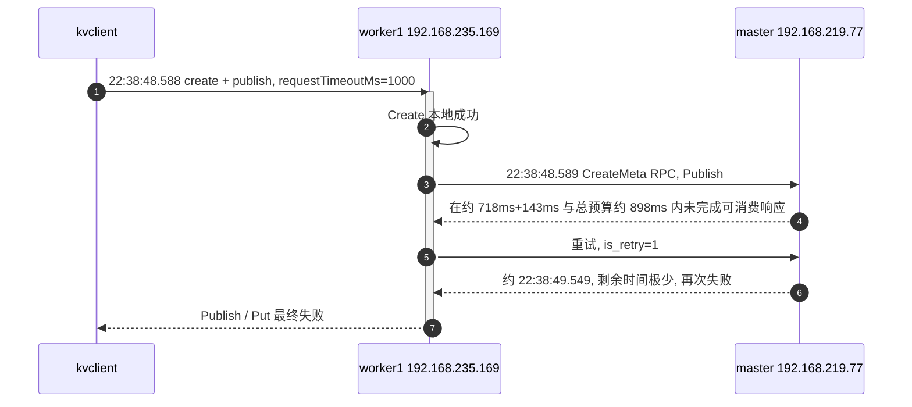

# 故障分析摘要（`logs-0425`）

本文档汇总基于 `worker1.log`、`worker2.log` 与仓库内 RPC / Worker 代码的推断。  
分析日期以会话为准；业务时间以日志为准：**2026-04-25 22:38:48–49**（`worker1` 关键 trace）。

**相关**：

- ZMQ `New gateway` / liveness / 为何频繁重建见同目录 [`ZMQ_GATEWAY_REBUILD.md`](./ZMQ_GATEWAY_REBUILD.md)。
- **Get 路径上 `client_rpc_get_*` 与 `worker_*` 延迟为何对不上**（计时边界、MsgQ 异步、ZMQ E2E）见 [`METRICS_CLIENT_WORKER_ALIGNMENT.md`](./METRICS_CLIENT_WORKER_ALIGNMENT.md)。

---

## 1. `worker1.log` 关键时间线

- **traceId**：`38857e0d-c86f-4417-a575-246b7d3eb2d0`
- **对象**：`T_worker1_kvclient_1_1012`
- **角色**：
  - kvclient：`zzz-worker1-kvclient-1` → 连接 **data worker** `192.168.235.169:31501`
  - data worker：`zzz-worker1-data-worker1`（`dsworker_worker1-...`）
  - **Master（哈希环解析）**：`192.168.219.77:31501`（`Worker and master are not collocated` → 走 `WorkerRemoteMasterOCApi` RPC）
- **请求预算**：`RecordMaybeExpiredShm` 中 `requestTimeoutMs=1000`

| 时间 (本地) | 事件 |
|-------------|------|
| 22:38:48.588 | kvclient：`Begin to create` / `put and seal`；指向 **192.168.235.169:31501** |
| 22:38:48.588 | worker：**Create 成功**（SHM/arena 分配等） |
| 22:38:48.589 | **Publish**；`Get masterHostAddress: 192.168.219.77:31501`；`Create meta to master[192.168.219.77:31501]` |
| 22:38:49.307 | `rpc_util`：`retryCount: 0`，`remainTimeMs: 180`（整体剩余时间已不多） |
| 22:38:49.451 | **RPC 失败**：`[RPC_RECV_TIMEOUT]`，`K_TRY_AGAIN`（如 queue 在 143ms 窗口内仍空）；`RetryOnError` 总时长约 **898ms**；两段 CreateMeta 计时约 **718ms + 143ms** |
| 22:38:49.451 | **第一次 Publish 失败**；`Total Publish` 约 **862ms**；access 中 `DS_POSIX_PUBLISH` 失败，`is_retry:0` |
| 22:38:49.453 | **第二次 Publish**（`is_retry:1`）再次 `Create meta to master` |
| 22:38:49.549 | 第二次失败：`remainTimeMs: 25` 量级，短窗口（约 **96ms**）内仍超时；`Total Publish` 约 **96ms** |
| 22:38:49.549 | kvclient：`Send Publish request error` / `Put object` 失败；`DS_KV_CLIENT_SET` 约 **961ms** |

**同 trace 的后续 INFO（行号在原始 INFO 中较靠后）**：

- `Message que ... service MasterOCService method 0 ... Elapsed: [~3.00]s`（多组 client id / gateway id）  
  → 与 **~1s 内放弃等待** 的客户端/Worker 超时不一致，**提示整条链路上某段处理/排队可能达到约 3s 量级**（**不等价于**「master 单点 CPU 恰好 3s」，见下文）。

---

## 2. 根因（基于现有日志的结论）

- **直接失败原因**：Worker → Master 的 **CreateMeta** 在 **剩余 RPC/请求时间预算**（约 **1s** 量级，与 `requestTimeoutMs=1000` 及 `RetryOnError` 日志一致）内 **未收到可消费的完整 ZMQ 响应**，底层为 **`K_TRY_AGAIN`** 等，在 `zmq_msg_queue` 的 `ClientReceiveMsg` 中映射为 **`[RPC_RECV_TIMEOUT] RPC unavailable`**。
- **与「慢」的关系**：同 trace 出现 **~3s** 量级的 `MasterOCService` 相关 `Message que` 耗时线索 → **全链路/服务端（含 master 处理与回包路径）可能显著慢于 1s**；客户端/Worker 侧 **先因 deadline 放弃**，随后 **`Message que` 日志**可能对应较晚完成的阶段或错误路径，**不能仅凭 worker1 端日志判定 master 内部是锁、RocksDB、etcd 还是纯网络**。

---

## 3. 时序图（Mermaid，便于在支持 Mermaid 的编辑器中渲染）

**读图注意**：`-->>` 上的文字表示 **从调用方看「未在预算内完成」**；不表示对端无处理（同 trace 存在 ~3s 量级线索）。

---

## 4. `worker2.log` 要点（`why-worker2-data-worker1`）

- 现象：**约每 1.5s** 出现 `zmq_stub_conn.cpp: New gateway created`；**`zmq_gateway_recreate_total`** 每 10s 增 **6–7**；**`zmq_event_disconnect_total` = 0**。
- 代码含义（`ZmqFrontend::WorkerEntry`）：**`liveness_ == 0`** 时 **重建本机 ZMQ 前端 `DEALER`**，并打 `New gateway`、累加 `zmq_gateway_recreate_total`。  
- **`UpdateLiveness(timeoutMs)`** 在 `GetConn` 时随 **RPC 超时** 收缩 **`maxLiveness_` 与 `heartbeatInterval_`**；短 `timeoutMs` 下可得到 **~500ms 心跳间隔 + 次少量级 liveness**，从而 **~1.5s 即耗尽**；若对端**长时间无入站帧**（`ZmqSocketToBackend` 才 `ResetLiveness`），会表现为 **周期性「判死」与重建**。
- **与 worker1 的关系**：`worker1.log` **不包含 worker2 主机名或 IP**，无法从 worker1 单份日志**直接**诊断 worker2；若二者 **共用同一 master 或同集群资源**，可能 **同因**（例如 master 慢/堵），但需 **master / worker2 本机** 证据。

---

## 5. 从 `worker1.log` 能看 / 不能看什么

| 问题 | 能否从 `worker1.log` 直接看出 |
|------|------------------------------|
| worker1 上 Create 是否成功 | 能：成功 |
| 失败点在哪 | 能：**Worker → 192.168.219.77 Master 的 CreateMeta / Publish** |
| **master 内部**具体问题（锁、DB、etcd、代码路径） | **不能**；无 master 进程日志 |
| **worker2** 具体问题 | **不能**；无 worker2 侧记录 |
| **慢** 是否与 master/全链路相关 | 仅能 **间接** 推测（~3s 线索 + 1s 超时） |

---

## 6. 建议的后续取证（未执行，便于现场排查）

- 在 **192.168.219.77** 上取 **同时间段** 的 **master** INFO/WARN/ERROR、`CreateMeta` / `MasterOCService` 相关日志与 CPU/IO。
- 若需关联 worker2：取 **同时间段** 的 `why-worker2` 全量日志与 ZMQ 对端（endpoint）配置。
- 对齐 **etcd / 扩缩容 / 大查询** 是否在窗口内加重 master。

---

## 7. 相关源码位置（便于对照）

- `worker_oc_service_publish_impl.cpp`：`CreateMetadataToMaster` → `workerMasterApi->CreateMeta`；`RequestingToMaster` 失败时对 RPC 超时的包装。
- `worker_master_oc_api.cpp`：`WorkerRemoteMasterOCApi::CreateMeta` 使用 `RetryOnErrorRepent` 与 `reqTimeoutDuration.CalcRealRemainingTime()`。
- `rpc_util.h`：`RetryOnError` 重试与 `ConstructErrorMsg`。
- `zmq_msg_queue.h`：`ClientReceiveMsg` 将 `K_TRY_AGAIN` 标为 `[RPC_RECV_TIMEOUT]`。
- `zmq_stub_conn.cpp`：`ZmqFrontend::WorkerEntry`（liveness、heartbeat、`New gateway created`），`GetConn` → `UpdateLiveness(timeoutMs)`。

---

## 8. 文件索引

- `worker1.log`：聚合的 worker1 + kvclient 检索结果（`zzz-worker1-*` 与 `192.168.235.169` / `192.168.219.77`）
- `worker2.log`：`why-worker2-data-worker1` 的 `New gateway` 与 metrics 片段

以上分析随日志与代码阅读整理，**若与线上其它窗口日志合并，以时间戳与 traceId 为准交叉验证**。
