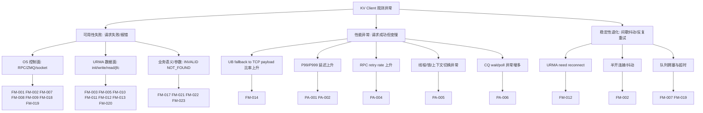

# 03 · 故障模式库（FM 清单 + 日志关键字 + URMA/OS 互斥定界）

## 对应代码

| 代码位置 | 作用 |
|---------|------|
| `include/datasystem/utils/status.h` | 错误码枚举（与 `../reliability/03-status-codes.md` 对齐） |
| `src/datasystem/common/rdma/urma_manager.cpp` | URMA 错误日志主源 |
| `src/datasystem/common/rpc/zmq/` | ZMQ/TCP 错误源（1001/1002 桶码） |
| `src/datasystem/common/util/fd_pass.cpp` | SCM_RIGHTS / UDS fd 交换 |
| `src/datasystem/worker/object_cache/service/worker_oc_service_get_impl.cpp` | Worker Get 路径日志 |
| `scripts/documentation/observable/kv-client-excel/sheet1_system_presets.py` | Excel Sheet1 预设源（与本文 FM 清单编号一一对应） |

> **分层约定**：syscall 传输层 **URMA 与 OS 互斥定界**；业务 Status / 参数校验为 **NEITHER**（不属两者）。

---

## 1. 故障树结构（推荐标准）

三层表达：**故障树（结构）+ FM 清单（证据）+ 告警清单（运营）**。故障树只描述"怎么分叉"，叶子节点一律落到 `FM-xxx`，避免图和表脱节。

### 1.1 主树（Mermaid）



### 1.2 落地规则（避免"画树好看但不好排障"）

- 每个叶子必须绑定一个或多个 `FM-xxx`，不能只写"网络问题 / 系统问题"
- 每个 `FM-xxx` 必须有日志关键字（见 § 3）和责任域（URMA / OS / NEITHER）
- 告警优先接性能叶子（`PA-001..007`），可用性告警在平台落地后补齐

### 1.3 Init / MCreate / MSet / MGet 的"三个关键接口"

按每条主流程固定三类接口：**控制面/RPC**、**OS/syscall**、**URMA/UMDK**。用于故障树叶子归因时快速判断先查哪一层。

| 流程 | 控制面 / RPC | OS / syscall | URMA / UMDK |
|------|--------------|---------------|--------------|
| **Init** | `ClientWorkerRemoteApi::Init`、`Connect`、`RegisterClient`、`GetSocketPath` | `socket/connect/send/recv`、`recvmsg(SCM_RIGHTS)`、`mmap`（UB 匿名池） | `ds_urma_init`、`ds_urma_get_device_by_name`、`ds_urma_create_context/jfc/jfs/jfr`、`ds_urma_import_jfr` |
| **MCreate** | `stub_->MCreate` / Worker `ProcessMCreate` | `open/pwrite/fsync`（若落盘），`sendmsg/recvmsg`（fd 传输） | `ds_urma_write`（若走 UB），`ds_urma_poll_jfc` |
| **MSet** | `stub_->MultiPublish` / `Publish`，`RetryOnError` | `socket send/recv/poll`，必要时 `mmap` / 内存复制 | `UrmaWritePayload`，`ds_urma_write`，`ds_urma_poll_jfc/wait_jfc` |
| **MGet** | `stub_->Get`，`RetryOnError`，Worker `ProcessGetObjectRequest` / `QueryMeta` | `socket send/recv/poll`，`mmap(MmapShmUnit)`，`recvmsg(SCM_RIGHTS)` | `PrepareUrmaBuffer`，`ds_urma_read/write`，`ds_urma_poll_jfc/wait_jfc/rearm_jfc` |

补充：

- 某次请求命中 `fallback to TCP/IP payload`，该次数据面按 **OS/RPC 路径** 排查，URMA 仅作旁证。
- 出现 `1004/1006` 且命中 `Failed to urma...` / `need to reconnect`，优先走 **URMA 分支**，不要与 `1001/1002` 的 RPC 问题混排。

---

## 2. 故障清单（FM-001..023）

> **责任域**：OS = 控制面 / socket / syscall；URMA = UMDK / 数据面；NEITHER = 业务语义 / 参数。错误码与 `../reliability/03-status-codes.md` 一一对应。

| 编号 | 故障模式 | 责任域 | 典型 Status / 内部码 | 典型现象 | 主要日志原文 / 模式（grep） |
|------|----------|--------|------------------------|----------|-----------------------------|
| **FM-001** | Init：Register / ZMQ 控制面不可达 | OS | `1001 K_RPC_DEADLINE_EXCEEDED`、`1002 K_RPC_UNAVAILABLE` | Init 失败、反复重连 | `Register client failed`；`rpc unavailable`；`deadline exceeded`；worker：`Register client failed because worker is exiting` |
| **FM-002** | RPC 已连上后 send/recv 抖动、半开连接 | OS | `1002 / 19 K_TRY_AGAIN` | 间歇超时、try again | `send / recv failed`；`unavailable`；`try again`；`timeout`；stub / zmq 路径 |
| **FM-003** | UB 初始化失败（UMDK 设备 / context / jfc 等）| URMA | `1004 K_URMA_ERROR` | Init 或握手前失败 | `Failed to urma init`；`Failed to urma get device`；`Failed to urma get eid list`；`Failed to urma create context`；`Failed to initialize URMA dlopen loader` |
| **FM-004** | 客户端 UB 匿名内存池 mmap 失败 | OS | `6 K_OUT_OF_MEMORY` | 分配池失败 | `Failed to allocate memory buffer pool for client`；`Failed to register memory buffer pool`；`K_OUT_OF_MEMORY` |
| **FM-005** | FastTransport / import jfr / advise jfr 失败 | URMA | 常 `1004` 或握手失败返回链 | UB 握手失败、回退 | `Fast transport handshake failed`；`Failed to import jfr`；`advise jfr`；`1004` |
| **FM-006** | SCM_RIGHTS 传 fd 异常（RecvPageFd / UDS） | OS | `K_UNKNOWN_ERROR / K_RUNTIME_ERROR` 等 | fd 无效、EOF | `Pass fd`；`SCM_RIGHTS`；`recvmsg`；`invalid fd`；`Unexpected EOF` |
| **FM-007** | 读路径：Get 请求未达或 ZMQ 超时 | OS | `1001 / 1002 / 19` | client 超时、worker 无对应 INFO | `Start to send rpc to get object`；`Process Get from client`；`RetryOnError` |
| **FM-008** | 读路径：Directory（`QueryMeta`）失败 | OS | `K_RUNTIME_ERROR` 等 | 元数据查不到、目录分片异常 | `Query from master failed`（日志原文仍为 master）；`QueryMetadataFromMaster` |
| **FM-009** | 读路径：W1→W3 拉对象数据失败 | OS | 依封装 | 元数据有、数据拉失败 | `Get from remote failed`；`Failed to get object data from remote`；`ObjectKey` |
| **FM-010** | 数据面：urma write / read 失败 | URMA | `5 / 1004` 等 | 读写到对端 UB 失败 | `Failed to urma write object`；`Failed to urma read object`；`urma_write`；`urma_read` |
| **FM-011** | CQ：poll / wait / rearm jfc 失败 | URMA | `1004` | 完成事件异常、停滞 | `Failed to wait jfc`；`Failed to poll jfc`；`Failed to rearm jfc`；`Polling failed with an error for requestId`；`CR.status` |
| **FM-012** | UB 连接状态不稳定 / 需重建 | URMA | `1006 K_URMA_NEED_CONNECT` | 需重连、抖动 | `URMA_NEED_CONNECT`；`remoteAddress`；`remoteInstanceId`；`remoteWorkerId`；`need reconnect`；`1006` |
| **FM-013** | JFS 重建策略（如 `CR.status=9` ACK timeout） | URMA | `1004` 等 | 自动 Recreate JFS | `URMA_RECREATE_JFS`；`URMA_RECREATE_JFS_FAILED`；`URMA_RECREATE_JFS_SKIP`；见 `urma_manager` 策略表 |
| **FM-014** | 客户端 UB Get 缓冲：超上限 / 分配失败 → 降级 TCP payload | NEITHER（功能仍可用，**性能**见 § 5） | 常无 URMA 错误码上抛 | 大对象走 TCP、延迟升高 | `UB Get buffer size ... exceeds max`；`fallback to TCP/IP payload`；`UB Get buffer allocation failed` |
| **FM-015** | UB payload 与应答尺寸不一致 | NEITHER | 业务返回链 | 解析失败、非法 payload | `UB payload overflow`；`Invalid UB payload size`；`Build UB payload rpc message failed` |
| **FM-016** | 客户端 SHM mmap 组装失败 | OS | 依 ToString | Get 响应处理失败 | `Failed for objectKey`；`Get mmap entry failed`；`mmap failed` |
| **FM-017** | 业务：对象不存在 | NEITHER | `K_NOT_FOUND` 等 | 正常语义失败（注意 KV Get 在 access log 中记为 `K_OK`） | `Can't find object`；`K_NOT_FOUND` |
| **FM-018** | etcd 不可用（租约 / 路由）| OS | `1002` 等 | W1 侧依赖失败 | `etcd is unavailable`；`etcd fail` |
| **FM-019** | 写路径：Publish / MultiPublish 控制面超时或不可用 | OS | `1001 / 1002 / 19` | 写入卡住、失败 | `Start to send rpc to publish object`；`publish object`；`MultiPublish`；`Publish` |
| **FM-020** | 写路径：UB 直发失败 | URMA | 依封装 | Put / MSet UB 失败 | `Failed to send buffer via UB`；`UrmaWritePayload`；`urma_write` |
| **FM-021** | 写路径：扩缩容 / 内存策略拒绝 | NEITHER | `K_SCALING(32) K_OUT_OF_MEMORY(6)` | 批次过大、集群状态 | `K_SCALING`；`MultiPublish` 返回；OOM 相关 |
| **FM-022** | 入参非法（HostPort、batch、offset 等） | NEITHER | `K_INVALID` | 未发起下游 | `Invalid`；`out of range`；`OBJECT_KEYS_MAX_SIZE_LIMIT` |
| **FM-023** | 业务 last_rc 触发部分 key 重试 | NEITHER | 混合 | 部分成功、重试风暴 | `last_rc`；`IsAllGetFailed`；对齐 worker `ReturnToClient` |

**说明**：**同一时间段排查时，FM-001/002 与 FM-003 不要混为"都是网络问题"**；先看 Status 与日志是否落在 URMA 固定字符串还是 ZMQ/errno 路径。

---

## 3. 日志与关键字清单

下列字符串用于 **现网 / ST 日志聚合** 或 **临时 grep**；具体文件与行号以 [`06-dependencies/urma.md`](06-dependencies/urma.md) 为准。

### 3.1 按关键字

| 类别 | 关键字或正则片段 | 关联故障编号 |
|------|------------------|--------------|
| ZMQ / RPC | `Register client failed`, `1001`, `1002`, `rpc unavailable`, `deadline exceeded`, `try again`, `send`, `recv`, `zmq_` | FM-001, 002, 007, 019 |
| URMA 初始化 | `Failed to urma init`, `get device by name`, `get eid list`, `create context`, `jfce`, `jfc`, `jfs`, `jfr`, `dlopen loader` | FM-003 |
| URMA 数据面 / CQ | `Failed to urma write`, `Failed to urma read`, `URMA_POLL_ERROR`, `Failed to wait jfc`, `Failed to rearm jfc`, `CR.status`, `requestId` | FM-010, 011 |
| URMA 连接 | `URMA_NEED_CONNECT`, `remoteAddress`, `remoteInstanceId`, `remoteWorkerId`, `need reconnect`, `1006` | FM-012 |
| URMA JFS 重建 | `URMA_RECREATE_JFS`, `URMA_RECREATE_JFS_FAILED`, `URMA_RECREATE_JFS_SKIP`, `newJfsId` | FM-013 |
| 握手 / JFR | `Fast transport handshake`, `import`, `jfr`, `advise jfr` | FM-005 |
| 降级（性能敏感）| `fallback to TCP/IP payload`, `UB Get buffer` | FM-014 |
| UB 逻辑错误 | `UB payload overflow`, `Invalid UB payload`, `Build UB payload rpc message failed` | FM-015 |
| fd / UDS | `Pass fd`, `SCM_RIGHTS`, `Unexpected EOF`, `invalid fd` | FM-006 |
| Directory | `Query from master failed` | FM-008 |
| 远程数据 | `Get from remote failed`, `Failed to get object data from remote` | FM-009 |
| 内存 / mmap | `memory buffer pool`, `mmap`, `Get mmap entry`, `K_OUT_OF_MEMORY` | FM-004, 016 |
| etcd | `etcd is unavailable` | FM-018 |

### 3.2 一键 grep 示例

```bash
# 广谱：RPC + URMA + 降级
grep -E 'Register client failed|1001|1002|Failed to urma|fallback to TCP/IP payload|Failed to poll jfc|Urma connect unstable|1006|Query from master failed' client.log worker.log

# 性能相关（与 § 5 告警信号一致）
grep -E 'fallback to TCP/IP payload|RPC timeout|Retry|poll jfc|wait jfc' worker.log sdk.log
```

---

## 4. Get / MGet 路径错误矩阵

按"一次 Get 请求可能经过的分支"，列 = **路径画像**，行 = **调用栈阶段**。

### 4.1 路径画像定义

| 列名 | 含义 |
|------|------|
| **P1** | 同机 + 客户端 SHM：入口 Worker **内存 / 缓存命中**，响应带 `store_fd≠-1`，客户端 `MmapShmUnit` |
| **P2** | 同机 + 无 SHM 或纯 payload：`shmEnabled_=false` 或走 `payload_info + RpcMessage` |
| **P3** | UB 主路径：客户端 `PrepareUrmaBuffer` 成功填 `urma_info`；Worker 侧远端 `urma_write/read/poll` 完成 |
| **P4** | UB 降级为 TCP payload：`PrepareUrmaBuffer` 失败仅打 WARNING，走 RPC payload |
| **P5** | 切流 / 跨机首跳：`GetAvailableWorkerApi` 指向**非本地** Worker，① RTT 变大（与 P1~P4 正交）|
| **P6** | etcd 续约超时阻断：入口 Worker `IsKeepAliveTimeout()` 为真时拒绝元数据访问（与 UB 正交）|
| **P7** | RH2D / `host_info`：响应 `has_host_info()`，客户端 `SetRemoteHostObjectBuffer`（`store_fd` 可能为 -1）|

真实请求是 **多条路径特征的组合**（例如 P5 + P3 = 跨机 + UB）。

### 4.2 关键阶段错误矩阵

**来源缩写**：INT = 数据系统内部；RPC = ZMQ / brpc；OS = mmap / socket；URMA = UMDK / `UrmaManager`；W透传 = Worker 填入 `last_rc` 客户端原样可见。

| 阶段 ID | 阶段说明 | P1 | P2 | P3 | P4 | P5 叠加 | P6 叠加 | P7 |
|---------|---------|----|----|----|----|---------|---------|----|
| C0 | `Get`: `IsClientReady` / `CheckValidObjectKey` / batch 上限 | ✓ | ✓ | ✓ | ✓ | ✓ | ✓ | ✓ |
| | **典型错误** | [INT] `K_INVALID / K_NOT_READY` — 参数、未就绪 — `object_client_impl.cpp` | 同左 | 同左 | 同左 | 同左 | 同左 | 同左 |
| C1 | `GetAvailableWorkerApi`（可切流）| ✓ | ✓ | ✓ | ✓ | ✓ | ✓ | ✓ |
| | 典型错误 | [INT] `1002` — 选路 / 连接失败 | 同左 | 同左 | 同左 | **概率上升**（RTT）| 同左 | 同左 |
| C3 | `PrepareUrmaBuffer`（仅 `USE_URMA && !shmEnabled_`）| — | — | ✓ | ✓（先失败再降级）| 叠加 | 叠加 | — |
| | 典型错误 | — | — | [URMA→INT] 池分配失败 → 常不返回错误：`LOG(WARNING) Prepare UB Get request failed ... fallback to TCP/IP payload` — `client_worker_base_api.cpp` | 同 P3 | UB 池 / 握手更易触发降级 | — | — |
| C4 | `signature + stub_->Get + RetryOnError` | ✓ | ✓ | ✓ | ✓ | ✓ | ✓ | ✓ |
| | 典型错误 | [RPC] `1002 / 1001 / 19` — `Start to send rpc to get object` — `client_worker_remote_api.cpp` | 同左 | 同左 | 同左 | 权重↑ | 同左 | 同左 |
| C5 | `FillUrmaBuffer`（UB 缓冲 → payloads）| — | — | ✓ | — | 叠加 | — | — |
| | 典型错误 | — | — | [INT] `K_RUNTIME_ERROR(5)` — `Invalid UB payload size / UB payload overflow / Build UB payload rpc message failed` | — | 同左 | — | — |
| C7a | **SHM 分支** `SetShmObjectBuffer → MmapShmUnit` | ✓ | — | —(若仍返回 SHM) | — | ✓ | ✓ | — |
| | 典型错误 | [OS/INT] `K_RUNTIME_ERROR` — **`Get mmap entry failed`** — `object_client_impl.cpp` | — | 远端 UB 成功时常见 payload；若仍发 SHM 则同 P1 | — | 同 P1 | 同 P1 | — |
| C7c | **payload 分支** `SetNonShmObjectBuffer / MemoryCopy` | — | ✓ | ✓ | ✓ | ✓ | ✓ | ? |
| | 典型错误 | [INT] `K_UNKNOWN_ERROR / K_RUNTIME_ERROR` — `payload_index exceeds / Copy data to buffer failed` | 同左 | 同左 | 同左 | 同左 | 同左 | 同左 |
| C8 | `last_rc` 与全 key 失败聚合 | ✓ | ✓ | ✓ | ✓ | ✓ | ✓ | ✓ |
| | 典型错误 | [W透传] `K_NOT_FOUND` 等 — `Cannot get objects from worker` — `GetBuffersFromWorker` 尾部 | 同左 | 同左 | 同左 | 同左 | 同左 | 同左 |
| W0 | Worker `serverApi->Read(req)` | ✓ | ✓ | ✓ | ✓ | ✓ | ✓ | ✓ |
| | 典型错误 | [RPC/INT] 读帧失败 — `serverApi read request failed` — `worker_oc_service_get_impl.cpp` | 同左 | 同左 | 同左 | 同左 | 同左 | 同左 |
| W2 | etcd 可用性检查（`RawGet` 前）| ✓ | ✓ | ✓ | ✓ | ✓ | **✓ 关键** | ✓ |
| | 典型错误 | [INT] `K_RPC_UNAVAILABLE(1002)` — `etcd is unavailable` — `worker_oc_service_get_impl.cpp`（`IsKeepAliveTimeout`）| 同左 | 同左 | 同左 | 同左 | **同左** | 同左 |
| W3 | `ProcessGetObjectRequest` / 线程池排队 | ✓ | ✓ | ✓ | ✓ | ✓ | ✓ | ✓ |
| | 典型错误 | [INT] `K_RUNTIME_ERROR` — `RPC timeout. time elapsed ...` — 同文件 | 同左 | 同左 | **更易触发** | **更易触发** | 负载高 | 同左 |
| W6 | 远端拉取 `GetObjectFromRemoteWorkerAndDump` | — | — | ✓ | ✓ | ✓ | ✓ | ✓ |
| | 典型错误 | [INT/URMA/RPC] `6 / 1002 / 3` — `Get from remote failed / GetFromRemote failed` — `worker_oc_service_get_impl.cpp`；URMA 来自 `UrmaManager::PollJfcWait / urma_write` 映射的 `K_URMA_ERROR / K_RUNTIME_ERROR` | — | ✓ | ✓ | etcd 差时放大 | ✓ | ✓ |

---

## 5. 告警清单

### 5.1 可用性告警（当前：**平台未统一，均为建议项**）

| 告警 ID | 告警名称 | 建议阈值 | 关联 FM |
|--------|---------|---------|---------|
| AA-001 | Init 失败率突增 | 单位时间 > 基线 3σ | FM-001, 003 |
| AA-002 | 读/写错误码突增（1001/1002/19/1004/1006） | 关联 metrics `ZMQ_SEND_FAILURE_TOTAL` 等 | FM-002, 007, 010, 012, 019 |
| AA-003 | etcd 不可用关键字 | `etcd is unavailable` 出现率 | FM-018 |

实际可用性告警在平台落地前按日志计数 + TraceID 汇聚做规则。

### 5.2 性能告警（建议项，侧重 SLO 退化）

| 建议告警 ID | 告警名称 | 建议信号 | 建议阈值思路 | 关联 |
|-------------|---------|---------|-------------|------|
| **PA-001** | 读延迟 P99 升高 | 端到端 Get / MGet 耗时 Histogram 或 Trace span | P99 较 7 日同时间段基线上升 ≥ X% 且持续 ≥ N 分钟 | FM-007, 010, 011 |
| **PA-002** | 写延迟 P99 升高 | Put / MSet Publish 耗时 | 同上 | FM-019, 020 |
| **PA-003** | UB 降级为 TCP payload 比率 | 日志计数 `fallback to TCP/IP payload` / 总 Get 请求 | 单位时间计数 > 基线 3σ | **FM-014**；CPU 拷贝放大 |
| **PA-004** | RPC 重试率上升 | `RetryOnError` 触发次数 + `1001/1002/19` 率；或 `ZMQ_SEND_TRY_AGAIN_TOTAL` 增速 | 重试率较基线翻倍且持续 N 分钟 | FM-001, 002, 007 |
| **PA-005** | Worker 上下文切换异常 | `pidstat -w` / cgroup `cswch` | 较基线持续高百分位 | 锁竞争、线程池、阻塞 syscall |
| **PA-006** | URMA CQ 等待异常 | 日志 `Failed to wait jfc / poll jfc` 频率 | 单位时间超过阈值 | FM-011、设备或链路抖动 |
| **PA-007** | 控制面与数据面时延背离 | client→W1 RPC span vs W1→W3 数据 span | 一侧正常一侧尖刺 → 分段告警 | 定界 |

**落地建议**：优先接 **PA-003、PA-004**（日志 / metrics 可计数）与 **PA-001、PA-002**（若有 Trace / APM）；主机指标 **PA-005** 作为辅助。

---

## 6. 维护说明

- 新增调用链行时：同步更新 `scripts/documentation/observable/kv-client-excel/sheet1_system_presets.py` 与本文 § 2（保持编号可追溯）
- URMA 枚举与源码日志增删：以 [`06-dependencies/urma.md`](06-dependencies/urma.md) 为单一事实来源，本文 § 3 做索引级同步
- FM-xxx 与 reliability `K_*` 码的对照：以 [`../reliability/03-status-codes.md`](../reliability/03-status-codes.md) 为准
