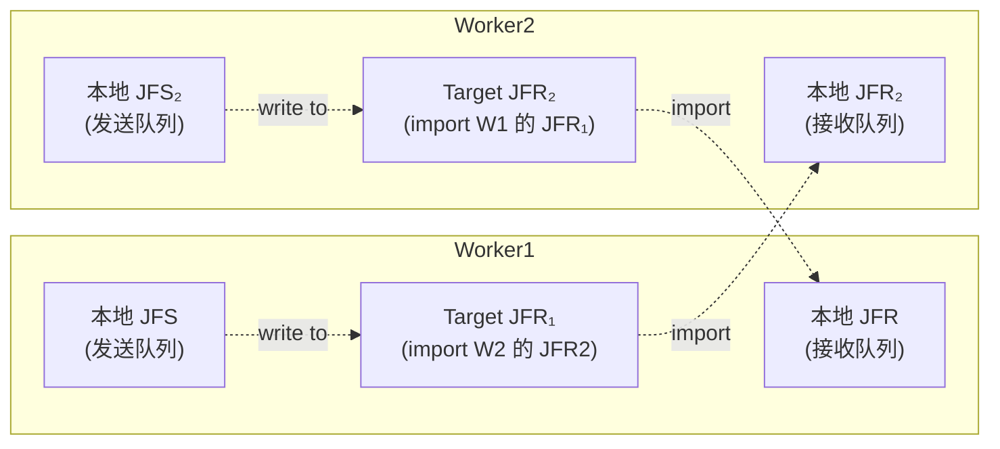

# URMA JFS / JFR / Target JFR 双机架构（简化版）

> 目标：理清 Worker1 与 Worker2 之间 JFS / JFR / Target JFR 的关联关系，以及建链 / 拆链时的操作时序。

---

## 1. 极简关系图

- **JFR**（Jetty For Receive）：本地接收队列，**由本端创建并持有**
- **JFS**（Jetty For Send）：本地发送队列，**由本端创建并持有**
- **Target JFR**（= target jetty）：**对端 JFR 的 import 句柄**，本端通过它向对端写数据

---

## 2. Worker1 / Worker2 行为摘要

### 2.1 建链（ImportRemoteJfr）

以 Worker1 为本端、Worker2 为远端为例：

| 步骤 | 本端（Worker1）操作 | 远端（Worker2）行为 |
|------|---------------------|---------------------|
| 1 | `UrmaResource::CreateJfs` → 创建本地 **JFS₁** | 被动接收（Worker2 已有自己的 JFS₂） |
| 2 | `ImportTargetJfr`（`ds_urma_import_jfr`）→ 创建 **Target JFR₁**（指向 W2 的 JFR₂） | — |
| 3 | `GetOrCreateLocalJfr`（`ds_urma_create_jfr`）→ 创建本地 **JFR₁** | 被动接收（Worker2 已有自己的 JFR₂） |
| 4 | 构造 `UrmaConnection`（JFS₁ + Target JFR₁）存入 `urmaConnectionMap_[connKey]` | — |

建链完成后：
- **Worker1 用 JFS₁ 通过 Target JFR₁ 向 Worker2 的 JFR₂ 写数据**
- **Worker2 用 JFS₂ 通过 Target JFR₂ 向 Worker1 的 JFR₁ 写数据**

### 2.2 拆链（RemoveRemoteResources）

| 步骤 | 操作 | 释放资源 |
|------|------|----------|
| 1 | 从 `urmaConnectionMap_` 删除 `UrmaConnection` | `UrmaConnection` 析构 → `tjfr_.reset()` → `ds_urma_unimport_jfr`（释放 Target JFR） |
| 2 | （可选）从 `localJfrMap_` 删除 `UrmaJfr` | `UrmaJfr` 析构 → `ds_urma_delete_jfr`（释放本地 JFR） |

> **JFS 随 UrmaConnection 析构一起释放**（`jfs_.reset()` → `ds_urma_delete_jfs`）。

### 2.3 Reconnect 行为

远端重启重连时，`ImportRemoteJfr` 检测到 JFR 元数据变化，调用 `UrmaConnection::Clear` 清空旧的 Target JFR 和 JFS，再重建。

---

## 3. 生命周期对照

| 资源 | 创建 API | 销毁 API | datasystem 持有位置 |
|------|----------|----------|---------------------|
| 本地 JFR | `ds_urma_create_jfr` | `ds_urma_delete_jfr` | `UrmaManager::localJfrMap_` |
| 本地 JFS | `ds_urma_create_jfs` | `ds_urma_delete_jfs` | `UrmaConnection`（独享） |
| Target JFR | `ds_urma_import_jfr` | `ds_urma_unimport_jfr` | `UrmaConnection::tjfr_` |

---

## 4. 代码索引（附录）

### 4.1 UMDK API（umdk/src/urma/lib/urma/core/include/urma_api.h）

| API | 约行号 |
|-----|--------|
| `urma_create_jfr` / `urma_delete_jfr` | 306–336 |
| `urma_import_jfr` / `urma_unimport_jfr` | 350–379 |
| `urma_create_jfs` / `urma_delete_jfs` | 206–230 |

### 4.2 yuanrong-datasystem 实现

| 内容 | 文件 | 约行号 |
|------|------|--------|
| `UrmaJfs::Create` / `~UrmaJfs` | `src/datasystem/common/rdma/urma_resource.cpp` | 174–217 |
| `UrmaJfr::Create` / `~UrmaJfr` | 同上 | 232–272 |
| `UrmaTargetJfr::Import` / `~UrmaTargetJfr` | 同上 | 274–296 |
| `UrmaConnection::Clear`（reset JFS/TJFR） | 同上 | 468–477 |
| `BuildRemoteJfr`（组装 `urma_rjfr_t`） | `src/datasystem/common/rdma/urma_manager.cpp` | 74–84 |
| `GetOrCreateLocalJfr` | 同上 | 511–530 |
| `ImportRemoteJfr`（建链主流程） | 同上 | 922–958 |
| `ImportTargetJfr` | 同上 | 988–996 |
| `RemoveRemoteResources`（拆链） | 同上 | 1344–1367 |
| `UrmaJfs` / `UrmaJfr` / `UrmaTargetJfr` / `UrmaConnection` 类定义 | `src/datasystem/common/rdma/urma_resource.h` | 253 / 322 / 357 / 464 |

### 4.3 UDMA 用户态实现（参考）

- `umdk/src/urma/hw/udma/udma_u_jfr.c`：`udma_u_create_jfr`、`udma_u_delete_jfr`、`udma_u_import_jfr_ex`、`udma_u_unimport_jfr`
