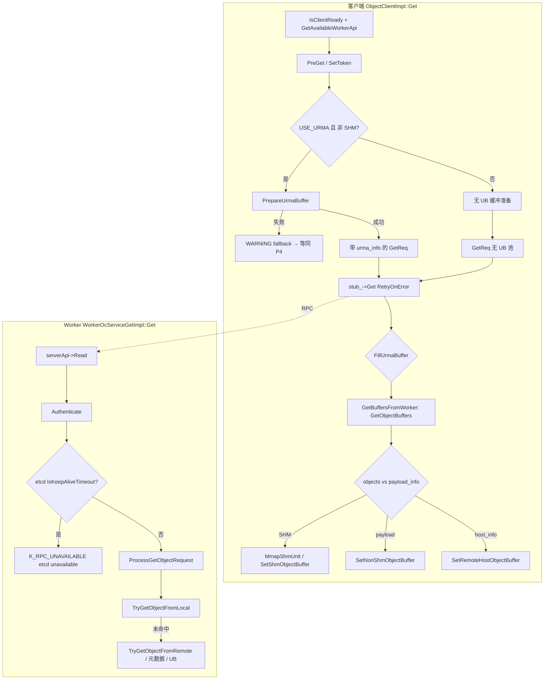

# KV `Get` / `MGet`：路径树 × 错误来源矩阵（内部 / OS / URMA / RPC）

本文按 **一次 Get 请求可能经过的分支**，用 **列 = 关键路径画像**、**行 = 调用栈阶段** 组织；单元格写 **是否经过** 及 **该阶段可能出现的错误（来源 + Status + 消息/日志）**。证据均来自 **`yuanrong-datasystem`** 与 `docs/flows/sequences/kv-client/`。

**读路径时序步骤①～⑥** 见：[kv_client_read_path_normal_sequence.puml](../flows/sequences/kv-client/kv_client_read_path_normal_sequence.puml)。

---

## 0. 路径列（Path Profile）定义

| 列名 | 含义（与代码/时序关系） |
|------|-------------------------|
| **P1** | **同机 + 客户端 SHM**：入口 Worker **内存/缓存命中**，响应带 **`store_fd`≠-1**，客户端 **`MmapShmUnit`**（≈ ① + ⑥，②③④⑤ 极短或没有） |
| **P2** | **同机 + 无 SHM 或纯 payload**：`shmEnabled_=false` 或对象走 **`payload_info` + RpcMessage**（① + ⑤，无 ⑥ mmap） |
| **P3** | **UB 主路径**：客户端 **`PrepareUrmaBuffer` 成功** 填 `urma_info`；Worker 侧远端 **`urma_write`/read/poll** 完成；客户端 **`FillUrmaBuffer`** 把 UB 内存封进 `payloads`（① + ②③④⑤ 全开） |
| **P4** | **UB 降级为 TCP payload**：`PrepareUrmaBuffer` **失败**仅打 WARNING，走 **RPC payload**（仍可能跨 Worker，但数据面不经 UB 缓冲池） |
| **P5** | **切流 / 跨机首跳**：`GetAvailableWorkerApi` 指向 **非本地** Worker，① **RTT 变大**（与 P1～P4 正交，可叠加） |
| **P6** | **etcd 续约超时阻断**：入口 Worker **`IsKeepAliveTimeout()`** 为真时 **拒绝元数据访问**（与是否 UB 正交） |
| **P7** | **RH2D / `host_info`**：响应 **`has_host_info()`**，客户端 **`SetRemoteHostObjectBuffer`**（`store_fd` 可能为 **-1** 的特殊分支） |

**说明**：真实请求是 **多条路径特征的组合**（例如 **P5+P3** = 跨机 + UB）。表中用 **✓** 表示「该阶段在此路径画像下**通常会执行**」；**—** 表示不执行或极少执行；**?** 表示依赖运行时标志（`USE_URMA`、`shmEnabled_`、对象是否在本地等）。

---

## 1. 树状总览（Mermaid）

> 仅表达 **主要分叉**，细节以 §2 矩阵为准。



---

## 2. 路径 × 阶段错误矩阵（核心表）

**图例（单元格）**  
- **—**：该路径在此阶段基本不触发或跳过。  
- **✓**：会执行；若本行「典型错误」非空，则 **仅当失败时出现**。  
- **错误行**：`[来源]` `Status` — `消息关键词` — `文件:线索`

**来源缩写**：**INT**=数据系统内部逻辑；**RPC**=ZMQ/brpc 等框架/连接；**OS**=mmap/socket/errno 等系统调用语义（经封装后多为 `K_RUNTIME_ERROR`）；**URMA**=UMDK `urma_*` / `UrmaManager`；**W透传**=Worker 填入 `last_rc` 客户端原样可见。

| 阶段 ID | 阶段说明（调用栈） | P1 同机SHM | P2 同机payload | P3 UB主路径 | P4 UB降级payload | P5 跨机首跳(叠加) | P6 etcd阻断(叠加) | P7 RH2D/host |
|---------|-------------------|------------|----------------|-------------|------------------|-------------------|------------------|--------------|
| **C0** | `ObjectClientImpl::Get`：`IsClientReady` / `CheckValidObjectKey` / batch 上限 | ✓ | ✓ | ✓ | ✓ | ✓ | ✓ | ✓ |
| | 典型错误 | [INT] `K_INVALID` / `K_NOT_READY` — 参数、未就绪、重组锁 — `object_client_impl.cpp` | 同左 | 同左 | 同左 | 同左 | 同左 | 同左 |
| **C1** | `GetAvailableWorkerApi`（可切流） | ✓ | ✓ | ✓ | ✓ | ✓ | ✓ | ✓ |
| | 典型错误 | [INT] `1002` 等 — 选路/连接失败 — 与 `ListenWorker` 联动 | 同左 | 同左 | 同左 | **概率上升**（① RTT） | 同左 | 同左 |
| **C2** | `PreGet` / `SetTokenAndTenantId` | ✓ | ✓ | ✓ | ✓ | ✓ | ✓ | ✓ |
| | 典型错误 | [INT] `K_INVALID` — `subTimeoutMs` / offset 参数 — `client_worker_base_api.cpp` `PreGet` | 同左 | 同左 | 同左 | 同左 | 同左 | 同左 |
| **C3** | `PrepareUrmaBuffer`（**仅** `USE_URMA && !shmEnabled_`） | — | — | ✓ | ✓(先失败再降级) | 叠加 | 叠加 | — |
| | 典型错误 | — | — | [URMA→INT] 池分配失败 → 常 **不返回错误**：`LOG(WARNING)` **`Prepare UB Get request failed ... fallback to TCP/IP payload`** — `client_worker_base_api.cpp` | 同左（失败即 P4） | 网络差时 **UB 池/握手**更易触发降级 | 与 UB 无关 | — |
| **C4** | `signature` + `stub_->Get` + `RetryOnError` | ✓ | ✓ | ✓ | ✓ | ✓ | ✓ | ✓ |
| | 典型错误 | [RPC] `1002`/`1001`/`19` — `Start to send rpc to get object` 后失败 — `client_worker_remote_api.cpp` `Get` | 同左 | 同左 | 同左 | **同左，权重↑** | 同左 | 同左 |
| **C4b** | 对 `rsp.last_rc` 的 **重试判定**（`IsRpcTimeoutOrTryAgain` / OOM 全失败） | ✓ | ✓ | ✓ | ✓ | ✓ | ✓ | ✓ |
| | 典型错误 | [W透传] `1001`/`19`/`6` — Worker 侧超时/OOM 等被客户端 **再重试** — 同文件 `Get` lambda | 同左 | 同左 | 同左 | 同左 | 同左 | 同左 |
| **C5** | `FillUrmaBuffer`（UB 缓冲 → `payloads`） | — | — | ✓ | — | 叠加 | — | — |
| | 典型错误 | — | — | [INT] `K_RUNTIME_ERROR(5)` — `Invalid UB payload size` / `UB payload overflow` / `Build UB payload rpc message failed` — `client_worker_base_api.cpp` | — | 同左 | — | — |
| **C6** | `GetBuffersFromWorker`：响应 **计数校验** | ✓ | ✓ | ✓ | ✓ | ✓ | ✓ | ✓ |
| | 典型错误 | [INT] `K_RUNTIME_ERROR`/`K_UNKNOWN_ERROR` — `Sum overflow` / `response count ... does not match` — `object_client_impl.cpp` | 同左 | 同左 | 同左 | 同左 | 同左 | 同左 |
| **C7a** | **SHM 分支** `SetShmObjectBuffer` → `MmapShmUnit` | ✓ | — | —(若仍返回 SHM 则 ✓) | — | ✓ | ✓ | — |
| | 典型错误 | [OS/INT] `K_RUNTIME_ERROR` — **`Get mmap entry failed`**；`LookupUnitsAndMmapFd` 失败链 — `object_client_impl.cpp` `MmapShmUnit` | — | 远端 UB 成功时常见 **payload** 主路径；若 Worker 仍发 SHM 则同 P1 | — | 同 P1 | 同 P1 | — |
| **C7b** | **`store_fd==-1`**（占位失败，不 mmap） | ? | ? | ? | ? | ? | ? | ✓ |
| | 典型错误 | [INT] **不抛 Status**：`failedObjectKey` 记录 — `GetObjectBuffers` — `object_client_impl.cpp` |  |  |  |  |  | RH2D/特殊对象 |
| **C7c** | **payload 分支** `SetNonShmObjectBuffer` / `MemoryCopy` | — | ✓ | ✓ | ✓ | ✓ | ✓ | ? |
| | 典型错误 | [INT] `K_UNKNOWN_ERROR`/`K_RUNTIME_ERROR` — `payload_index exceeds` / `Copy data to buffer failed` — `object_client_impl.cpp` | 同左 | 同左 | 同左 | 同左 | 同左 | 同左 |
| **C7d** | **offset 读** `SetOffsetReadObjectBuffer` | ? | ? | ? | ? | ? | ? | ? |
| | 典型错误 | [INT] `K_RUNTIME_ERROR` — `read offset ... out of range`；`MmapShmUnit` 同上 — `object_client_impl.cpp` |  |  |  |  |  |  |
| **C8** | **`last_rc` 与全 key 失败聚合** | ✓ | ✓ | ✓ | ✓ | ✓ | ✓ | ✓ |
| | 典型错误 | [W透传] `K_NOT_FOUND` 等 — `Cannot get objects from worker` — `GetBuffersFromWorker` 尾部 — `object_client_impl.cpp` | 同左 | 同左 | 同左 | 同左 | 同左 | 同左 |
| **W0** | Worker `serverApi->Read(req)` | ✓ | ✓ | ✓ | ✓ | ✓ | ✓ | ✓ |
| | 典型错误 | [RPC/INT] 读帧失败 — **`serverApi read request failed`** — `worker_oc_service_get_impl.cpp` | 同左 | 同左 | 同左 | 同左 | 同左 | 同左 |
| **W1** | Worker `Authenticate` | ✓ | ✓ | ✓ | ✓ | ✓ | ✓ | ✓ |
| | 典型错误 | [INT] 认证失败 — **`Authenticate failed.`** — 同上 | 同左 | 同左 | 同左 | 同左 | 同左 | 同左 |
| **W2** | 元数据链路上的 **etcd 可用性**（示例：`RawGet` 前） | ✓ | ✓ | ✓ | ✓ | ✓ | **✓ 关键** | ✓ |
| | 典型错误 | [INT] `K_RPC_UNAVAILABLE(1002)` — **`etcd is unavailable`** — `worker_oc_service_get_impl.cpp`（`IsKeepAliveTimeout`） | 同左 | 同左 | 同左 | 同左 | **同左** | 同左 |
| **W3** | `ProcessGetObjectRequest` / 线程池排队超时 | ✓ | ✓ | ✓ | ✓ | ✓ | ✓ | ✓ |
| | 典型错误 | [INT] `K_RUNTIME_ERROR` — **`RPC timeout. time elapsed ...`** — 同上 `Get` | 同左 | 同左 | **更易触发** | **更易触发** | 负载高时触发 | 同左 |
| **W4** | **本地命中** `TryGetObjectFromLocal` | ✓主 | ✓主 | ? | ? | ? | ? | ? |
| | 典型错误 | [INT] `K_NOT_FOUND` — `not exist in memory` / `expired` — `worker_oc_service_get_impl.cpp` | 同左 | 未命中则进 W5 | 同左 | 同左 | 同左 | 同左 |
| **W5** | **QueryMeta / Master** | — | — | ✓ | ✓ | ✓ | ✓ | ✓ |
| | 典型错误 | [INT] `K_RUNTIME_ERROR` — **`Query from master failed`**；迁移相关 `K_TRY_AGAIN` 等 — 同文件 | — | ✓ | ✓ | ✓ | etcd 差时放大 | ✓ |
| **W6** | **远端拉取** `GetObjectFromRemoteWorkerAndDump` / `GetObjectRemote*` | — | — | ✓ | ✓ | ✓ | ✓ | ✓ |
| | 典型错误 | [INT/URMA/RPC] `6`/`1002`/`3` — **`Get from remote failed`** / **`GetFromRemote failed`** — `worker_oc_service_get_impl.cpp`；其中 **URMA** 来自 `UrmaManager::PollJfcWait`/`urma_write` 等映射的 `K_URMA_ERROR`/`K_RUNTIME_ERROR` | — | ✓ | ✓（数据面可能无 URMA） | ✓ | ✓ | ✓ |

---

## 3. 关键代码证据（节选）

### 3.1 客户端：`Get` → `PrepareUrma` → `stub_->Get` → `FillUrmaBuffer`

```233:276:/home/t14s/workspace/git-repos/yuanrong-datasystem/src/datasystem/client/object_cache/client_worker_api/client_worker_remote_api.cpp
Status ClientWorkerRemoteApi::Get(const GetParam &getParam, uint32_t &version, GetRspPb &rsp,
                                  std::vector<RpcMessage> &payloads)
{
    ...
#ifdef USE_URMA
    ...
    PrepareUrmaBuffer(req, ubBufferHandle, ubBufferPtr, ubBufferSize);
#endif
    ...
    getStatus = stub_->Get(opts, req, rsp, payloads);
    ...
#ifdef USE_URMA
    RETURN_IF_NOT_OK(FillUrmaBuffer(ubBufferHandle, rsp, payloads, ubBufferPtr, ubBufferSize));
#endif
```

### 3.2 UB 准备失败仅 WARNING 降级（非必然 URMA 返回码到 API）

```66:87:/home/t14s/workspace/git-repos/yuanrong-datasystem/src/datasystem/client/object_cache/client_worker_api/client_worker_base_api.cpp
void ClientWorkerBaseApi::PrepareUrmaBuffer(...)
{
    if (IsUrmaEnabled() && !shmEnabled_) {
        Status ubRc = UrmaManager::Instance().GetMemoryBufferHandle(ubBufferHandle);
        ...
        if (ubRc.IsError()) {
            LOG(WARNING) << "Prepare UB Get request failed: " << ubRc.ToString() << ", fallback to TCP/IP payload.";
            ubBufferHandle.reset();
            ...
        }
    }
}
```

### 3.3 客户端 SHM：`MmapShmUnit` / `Get mmap entry failed`

```1649:1662:/home/t14s/workspace/git-repos/yuanrong-datasystem/src/datasystem/client/object_cache/object_client_impl.cpp
Status ObjectClientImpl::MmapShmUnit(...)
{
    ...
    RETURN_IF_NOT_OK(mmapManager_->LookupUnitsAndMmapFd("", shmBuf));
    mmapEntry = mmapManager_->GetMmapEntryByFd(shmBuf->fd);
    CHECK_FAIL_RETURN_STATUS(mmapEntry != nullptr, StatusCode::K_RUNTIME_ERROR, "Get mmap entry failed");
```

### 3.4 Worker：etcd 不可用短路

```1583:1586:/home/t14s/workspace/git-repos/yuanrong-datasystem/src/datasystem/worker/object_cache/service/worker_oc_service_get_impl.cpp
    CHECK_FAIL_RETURN_STATUS(!etcdStore_->IsKeepAliveTimeout(), K_RPC_UNAVAILABLE, "etcd is unavailable");
    RETURN_IF_NOT_OK(etcdStore_->RawGet(etcdKey, res, 0, reqTimeoutDuration.CalcRemainingTime()));
```

### 3.5 Worker：Get 超时日志

```148:151:/home/t14s/workspace/git-repos/yuanrong-datasystem/src/datasystem/worker/object_cache/service/worker_oc_service_get_impl.cpp
            if (elapsed >= timeout) {
                LOG(ERROR) << "RPC timeout. time elapsed " << elapsed << ", subTimeout:" << subTimeout
                           << ", get threads Statistics: " << threadPool_->GetStatistics();
                LOG_IF_ERROR(serverApi->SendStatus(Status(K_RUNTIME_ERROR, "Rpc timeout")), "Send status failed");
```

---

## 4. 与旧 Excel 材料的关系

- 粗粒度 **Init/MCreate/MSet/MGet** 见：[workbook/kv-client/kv-client-Sheet1-调用链-错误与日志.md](./workbook/kv-client/kv-client-Sheet1-调用链-错误与日志.md)。  
- 本文 **专精 Get**，覆盖 **分支级错误来源**，可作为 **Sheet1 的 Get 展开附件**。

---

## 5. 修订记录

| 日期 | 说明 |
|------|------|
| 2026-04-09 | 初版：路径列 × 阶段矩阵 + Mermaid + 代码引用 |
