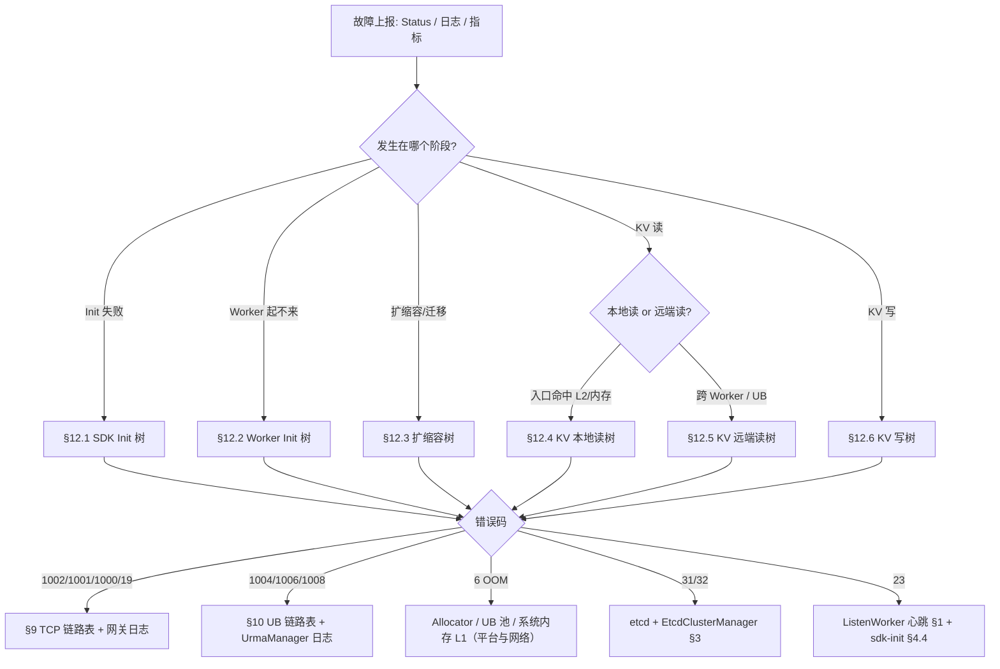
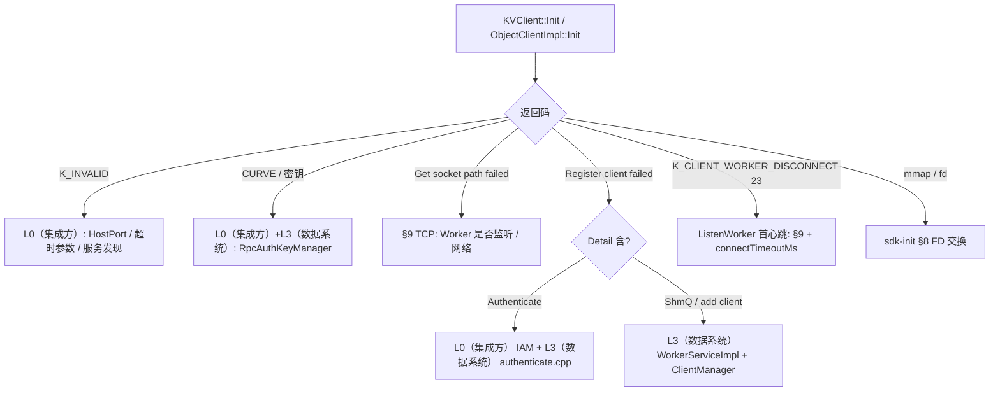
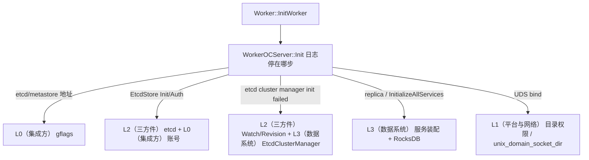
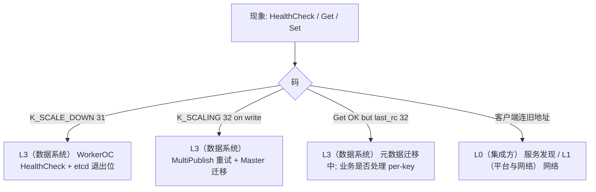
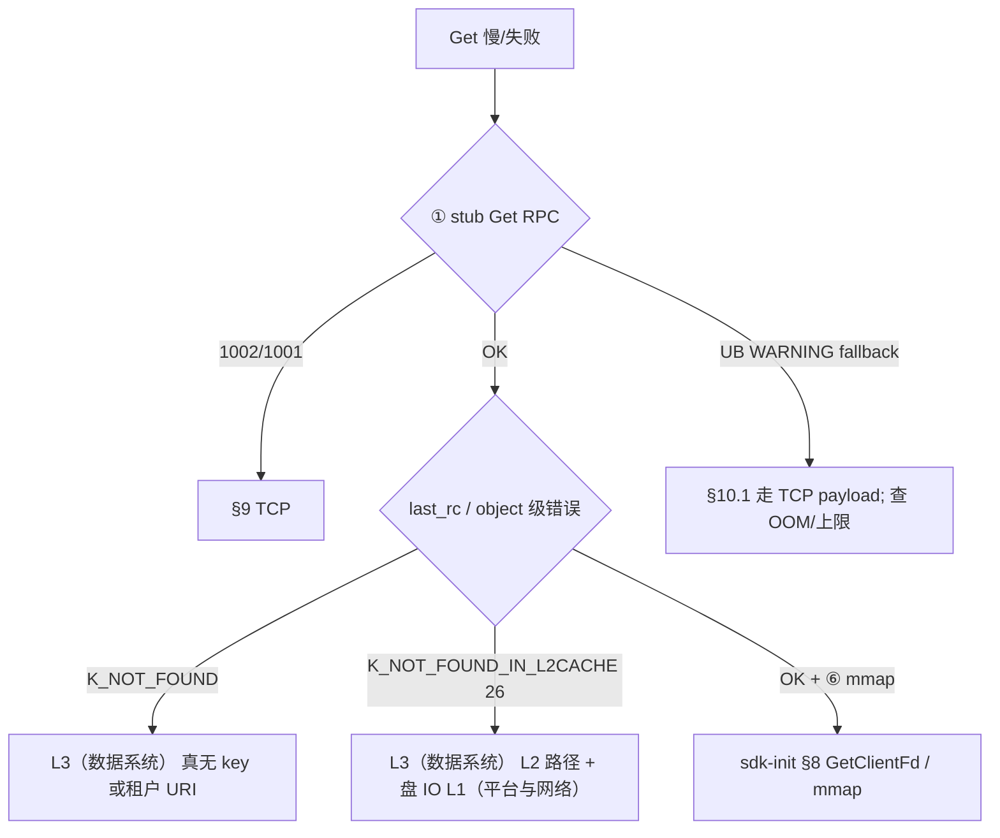
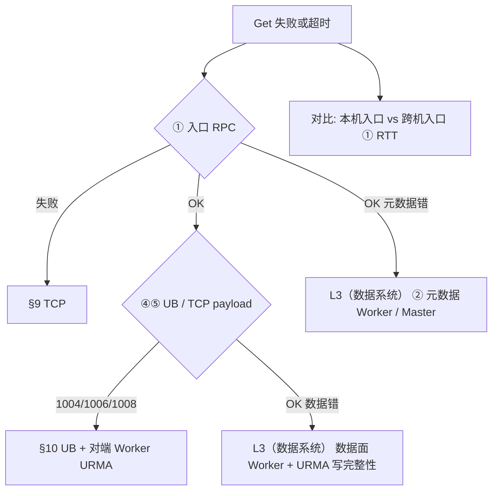
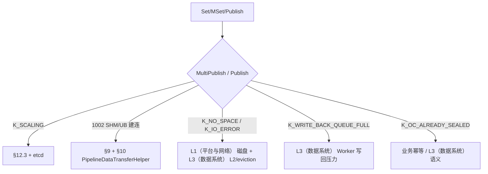

# KV / Worker 场景：故障现象、分类、定位定界与责任边界

本文与 **`docs/flows/sequences/kv-client/`** 下 PlantUML 时序图一致，用于 **自证清白**：区分 **集成方 / 平台网络 / 三方件** 与 **数据系统** 责任，并在数据系统内落到 **链路或模块**。

**配套**：

- SDK Init 详版：[sdk-init-定位定界.md](./archive/sdk-init-定位定界.md)（历史归档）
- Worker 启动故障详版：[worker-启动故障-定位定界.md](./archive/worker-启动故障-定位定界.md)（历史归档）
- 序列图目录：[docs/flows/sequences/kv-client/README.md](../flows/sequences/kv-client/README.md)
- KV Client 调用链 × URMA/TCP（文档 + 工作簿证据包）：[kv-client/README.md](./kv-client/README.md)

**深度展开**（本文 **§9～§12**）：TCP(ZMQ) 与 UB(URMA) 的 **错误码 → 日志 → 源码位置**，以及 **总体 + 分场景排查树**（Mermaid）；无法渲染 Mermaid 时可直接读图中节点文字作检查清单。

---

## 0. 责任边界怎么画

| 层级 | 含义 | 典型归属 |
|------|------|----------|
| **L0（集成方）** | 业务进程配置、超时、并发、是否自建本地缓存、K8s 探针与资源限额 | 业务 / 集成团队 |
| **L1（平台与网络）** | 节点互通、安全组、DNS、端口监听、磁盘挂载、内核参数、宿主机 OOM | 平台 / SRE / 网络 |
| **L2（三方件）** | etcd 可用性与性能、共享存储（若有）、观测系统 | 中间件 / 平台（视部署约定） |
| **L3（数据系统）** | Worker / Master / SDK 逻辑、RPC、SHM/URMA、元数据与数据面协同 | 数据系统团队 |
| **L3（数据系统）内子模块** | 见文末 **§8 模块索引**，用于「是数据系统问题时的细分」 | 研发内部分工 |

**自证要点**：用 **同一时间线** 对齐 **客户端 `Status::ToString()` / 访问日志**、**入口 Worker 日志**、**etcd 事件**（若可拿）；避免仅凭 `K_RPC_UNAVAILABLE` 定责到单一侧（见 [sdk-init-定位定界.md §10](./archive/sdk-init-定位定界.md)）。

---

## 0.1 方案必须回答的四个问题（评审检查清单）

## A. 感知和定界流程（依赖 URMA/硬件/通信链路）

**客户先看哪些指标**
- SLI：`success_rate`、读/写 `p99`
- 错误码分布：`1002/1001/1000/19`（TCP/RPC），`1004/1006/1008`（UB/URMA），`25/14`（etcd）
- 资源与链路：重传率、连接失败率、Worker 心跳状态、etcd 访问成功率

**定界流程（5 步）**
1. 先看影响面：全局、单 AZ、单 Worker、单客户端。
2. 看码桶：先分 TCP/RPC、UB、etcd、资源、生命周期。
3. 看请求是否到达入口 Worker（有无入口日志）。
4. 看分段耗时（①~⑥）定位慢点/断点。
5. 输出结论：责任层级 + 数据系统内部模块 + 恢复动作。

**依赖哪些服务/数据源**
- 指标平台（Grafana）
- 日志平台（客户端日志、Worker 日志、第三方访问日志）
- 控制面（etcd 健康与租约）
- 可选：网络/OS 现场工具（抓包、perf/ftrace）

## B. 自证清白（返回哪些指标和错误码，如何返回，精度保证）

**返回/暴露方式**
- 接口返回：`StatusCode + msg`（SDK API 直接返回）
- 日志返回：接口日志、运行日志、第三方访问日志（附时间窗和关键字段）
- 指标返回：错误码计数、成功率、p99、分段时延、重试次数

**最小自证证据包（一次事件）**
- 事件时间窗（起止时间）
- 影响范围（集群/AZ/Worker/client）
- 错误码分布（TopN）
- 入口 Worker 是否收到请求（有/无入口日志）
- 分段耗时（至少入口 RPC、跨 Worker、UB 段）
- 依赖侧健康（etcd、网络重传、资源）

**精确度保证**
- 统一 trace_id / request_id 贯穿 SDK 与 Worker
- 日志时间同步（同一时区与毫秒级时间戳）
- 同一时间窗做多源对齐（日志、指标、控制面）
- 同时满足“状态码 + 日志 + 分段耗时”三证合一才下定责结论

**分布式快速定位示例**
- `1002` 突增 -> 查入口 Worker 有无 Get/Publish 入口日志：
  - 无入口：优先 L1（平台与网络）
  - 有入口且内部超时：优先 L3（数据系统）再下钻模块
- `1006` 突增 + UB 段变慢：优先 UB/URMA 依赖链路，记录端点对做自证

## C. KVC 软件故障梳理（识别 -> 恢复）

**识别维度**
- 启动类：Init 链路失败（etcd、参数、UDS、服务装配）
- 读路径：入口超时、远端拉取失败、L2 未命中、UB fallback
- 写路径：multi publish moving、master 交互失败、L2 落盘失败
- 生命周期：`K_SCALE_DOWN`、`K_SCALING`、心跳异常
- 资源类：`K_OUT_OF_MEMORY`、`K_NO_SPACE`、fd/mmap 异常

**恢复策略模板**
- 链路类：重试 -> 切流/降级（UB->TCP）-> 隔离实例
- 控制面类：etcd 恢复后自动收敛，必要时人工重启
- 存储类：降级运行 + 告警，修复后恢复可靠性等级
- 软件内部类：按模块止血（限流/降级）+ 发布修复

## D. 测试演练（验证定位定界能力）

**演练目标**
- 证明“能感知、能定界、能恢复、能复盘”
- 验证“非我方责任”可被证据链证明

**用例构造建议**
- TCP 故障：注入超时/断连/重传，验证 `1002/1001` 与入口日志分叉
- UB 故障：注入 `1006`、completion 异常、fallback 触发，验证性能与功能分离
- etcd 故障：降可用、watch 延迟、租约异常，验证 `25/14` 与扩缩容影响
- 存储故障：IO 慢/失败/空间不足，验证 `K_IO_ERROR/K_NO_SPACE` 与降级策略
- 软件故障：模拟 master 交互失败、moving 持续，验证 `K_SCALING` 与重试上限

**演练验收项**
- 1 分钟内给出责任域初判
- 3 分钟内给出模块级定位
- 5 分钟内给出恢复动作并执行
- 产出复盘：证据包、误判点、规则优化项

---

## 1. SDK 初始化（`KVClient::Init` → `ObjectClientImpl::Init`）

### 1.1 故障现象与分类

| 现象 | 故障分类 | 优先排查 | 责任边界（默认） |
|------|----------|----------|------------------|
| 返回 `K_INVALID`（地址/超时参数） | 配置类 | ConnectOptions、服务发现 | **L0（集成方）** |
| `CreateClientCredentials` / CURVE 失败 | 安全通道配置 | 密钥、是否启用 Curve | **L0（集成方） + L3（数据系统）**（密钥分发约定） |
| `Get socket path failed` / `K_RPC_*` | 网络或 Worker 未就绪 | 端口、防火墙、Worker 进程 | **L1（平台与网络）** 或 **L3（数据系统）**（未启动） |
| `Register client failed` + `Authenticate failed` | IAM | Token/AK-SK/租户 | **L0（集成方） + L3（数据系统）** |
| `Cannot receive heartbeat from worker` (23) | 注册后心跳路径 | `connectTimeoutMs`、Worker 负载 | **L1（平台与网络） + L3（数据系统）** |
| FD 交换 / `mmap` 失败（业务前已部分在 Init 后路径） | SHM/UDS/内核 | 见 SDK Init 手册 §8 | **L1（平台与网络） + L3（数据系统）** |

### 1.2 数据系统内链路（若判为 L3（数据系统））

`ObjectClientImpl::Init` → `RpcAuthKeyManager` → `InitClientWorkerConnect` → `ClientWorkerRemoteCommonApi::Connect`（`GetSocketPath` / UDS 握手 / `RegisterClient`）→ `ListenWorker` → `WorkerOCService_Stub` 建链。

**证据**：同 [sdk-init-定位定界.md](./archive/sdk-init-定位定界.md) §2–§4、§8。

---

## 2. Worker 初始化（`Worker::InitWorker` → `WorkerOCServer::Init`）

### 2.1 主顺序（用于定界卡在哪一步）

代码主链（节选逻辑顺序）：

1. 日志、密钥 `LoadAllSecretKeys`
2. `WorkerOCServer` 构造
3. **`WorkerOCServer::Init`**：etcd/metastore 地址校验 → `EtcdStore::Init` / `Authenticate` → **`EtcdClusterManager` 构造** → `ClientManager::Init` → `ConstructClusterStore` → `ConstructClusterInfo` → **`etcdCM_->Init`** → `CreateAllServices` → `InitReplicaManager` → **`InitializeAllServices`**
4. `WorkerOCServer::Start`、后置处理

参考：`src/datasystem/worker/worker.cpp`（`InitWorker`）、`src/datasystem/worker/worker_oc_server.cpp`（`Init`）。

### 2.2 故障现象与分类

| 现象 | 故障分类 | 优先排查 | 责任边界 |
|------|----------|----------|----------|
| `Neither etcd_address nor metastore_address is specified` | 配置 | gflags / 部署模板 | **L0（集成方）** |
| `EtcdStore` 初始化/认证失败 | etcd 连接或账号 | etcd 端点、证书、用户密码 | **L2（三方件）** 为主，配置错误为 **L0（集成方）** |
| `etcd cluster manager init failed` | 控制面一致性 | etcd Revision、Watch、时钟 | **L2（三方件） + L3（数据系统）**（`EtcdClusterManager`） |
| `replica manager init failed` / `InitializeAllServices` 失败 | 多副本/服务装配 | 依赖服务、本地 RocksDB | **L3（数据系统）** |
| `WorkerServiceImpl::Init` UDS 目录创建/bind 失败 | 本地文件系统权限 | `unix_domain_socket_dir`、SELinux | **L1（平台与网络）** |
| `ClientManager`/事件循环 Init 失败 | 本机 fd/epoll | ulimit、内核 | **L1（平台与网络） + L3（数据系统）** |

### 2.3 数据系统内模块

- **控制面**：`EtcdStore`、`EtcdClusterManager`、`HashRing`
- **进程基础**：`ClientManager`、`memory::Allocator`、`WorkerServiceImpl`（通用 RPC + SHM 监听）
- **业务面**：`InitializeAllServices` 链路上的 OC / Stream / ClusterStore 等

---

## 3. Worker 扩缩容

### 3.1 时序与错误码（与序列图一致）

参阅 **`docs/flows/sequences/kv-client/scaling_scale_down_sequences.puml`**：

| 客户端路径 | 典型码 | 行为要点 |
|------------|--------|----------|
| `HealthCheck` | `K_SCALE_DOWN` (31) / `Worker is exiting now` | `EtcdClusterManager::CheckLocalNodeIsExiting()` 为真 |
| `MultiPublish` 等 | `K_SCALING` (32) | 客户端 **`RetryOnError` 含 K_SCALING**，会重试 |
| `Get` | 顶层常 OK，`last_rc` 可能含 32 | **不按 K_SCALING 做 RPC 重试**；错误可能在 per-object |

### 3.2 故障现象与分类

| 现象 | 故障分类 | 优先排查 | 责任边界 |
|------|----------|----------|----------|
| 缩容时大量 `K_SCALE_DOWN` | 预期行为 | 客户端退避、切流 | **L0（集成方）** 集成策略；**L3（数据系统）** 确认退出语义 |
| 长时间 `K_SCALING` 后仍失败 | 迁移未完成或 Master 慢 | etcd 上的 ring/元数据、Master 负载 | **L2（三方件） + L3（数据系统）** |
| 缩容后客户端仍连旧 IP | 服务发现滞后 | K8s Service / 自研发现 | **L0（集成方） + L1（平台与网络）** |
| etcd Watch 延迟导致脑裂感 | 控制面延迟 | etcd 性能、网络 | **L2（三方件） + L1（平台与网络）** |

### 3.3 数据系统内模块

- **退出与调度**：`EtcdClusterManager`（`CheckLocalNodeIsExiting`、节点表、Watch）
- **读写在迁**：`WorkerOCServiceImpl` / Meta 链路（`K_SCALING` 产生点）
- **客户端切流**：`ListenWorker`、跨节点 `SwitchWorker`（与 [kv_client_read_path_switch_worker_sequence.puml](../flows/sequences/kv-client/kv_client_read_path_switch_worker_sequence.puml) 一致）

---

## 4. SDK 读取 KV（`KVClient::Get` / `ObjectClientImpl::GetWithLatch`）

**说明**：`KVClient` 直接持有 `ObjectClientImpl`，**无内置 KV 进程内缓存**；每次 Get 都会走客户端就绪检查与 Worker RPC（除非集成方在业务层自建缓存）。

### 4.1 子场景定义（建议对外口径）

| 子场景 | 含义 | 时序图对应 |
|--------|------|------------|
| **A. 集成方本地缓存命中** | 业务未调用 SDK | 无时序图；**非数据系统路径** |
| **B. 入口 Worker 内存命中** | 对象在入口 Worker 热表，无需拉远端盘或远端 Worker | 正常序列中 ① 后 Worker 内结束，无 ③④⑤ 或极短 |
| **C. 入口 Worker L2（磁盘缓存）命中** | Primary copy 从 L2 读（`GetDataFromL2CacheForPrimaryCopy` 等路径） | 仍在 ① 内向客户端 ⑥；**可能涉及本地文件 IO** |
| **D. 远端缓存 / 远端 Worker 拉取** | 需跨 Worker 元数据 + 数据面 + URMA/TCP | [kv_client_read_path_normal_sequence.puml](../flows/sequences/kv-client/kv_client_read_path_normal_sequence.puml) 步骤 **②～⑤** |

请求侧开关：`GetReqPb` 由 `PreGet` 设置 `no_query_l2cache`（与 `queryL2Cache` 相反），影响 **C** 是否参与。

### 4.2 与时序图步骤对照（正常路径）

| 步骤 | 参与者 | 典型故障 | 责任边界 | 数据系统模块 |
|------|--------|----------|----------|--------------|
| ① Client→入口 Worker | TCP/ZMQ + `Get` RPC | `K_RPC_UNAVAILABLE`、超时 | **L1（平台与网络） / L3（数据系统）** | `ClientWorkerRemoteApi::Get`、`WorkerOCServiceImpl::Get` |
| ② 入口→元数据 Worker | Worker 间 RPC | 元数据超时、Master/路由 | **L3（数据系统）** | Worker-Master / 元数据查询链 |
| ③ 入口→数据 Worker | 触发拉取 | 路由错误、对端宕机 | **L3（数据系统）** | `GetObjectFromAnywhere` 等 |
| ④ 数据→入口 URMA | UB 写 | `K_URMA_*`、`K_RDMA_*` | **L1（平台与网络）（网卡/驱动）+ L3（数据系统）** | URMA Manager、传输层 |
| ⑤ TCP 响应 / 控制面 | 与 ④ 配合 | 超时、错包 | **L1（平台与网络） + L3（数据系统）** | 同上 + Stub |
| ⑥ SHM 返回客户端 | mmap/偏移 | fd、映射失败 | **L1（平台与网络） + L3（数据系统）** | `MmapManager`、见 SDK Init 手册 §8 |

切流后首跳跨机： [kv_client_read_path_switch_worker_sequence.puml](../flows/sequences/kv-client/kv_client_read_path_switch_worker_sequence.puml) — **① 即跨机**，超时更敏感（**L1（平台与网络）** 权重上升）。

### 4.3 常见错误码与定界提示

| 码 | 常见含义 | 倾向 |
|----|----------|------|
| `K_NOT_FOUND` (3) | Key 不存在 | **L3（数据系统）** 数据/元数据一致性或正常未写入 |
| `K_NOT_FOUND_IN_L2CACHE` (26) | L2 未命中需其他路径 | **L3（数据系统）** 缓存策略与后端 |
| `K_TRY_AGAIN` / `K_RPC_DEADLINE_EXCEEDED` / `K_RPC_UNAVAILABLE` | 可重试或链路 | **L1（平台与网络） + L3（数据系统）**，见 SDK Init 手册 §10 |
| `K_OUT_OF_MEMORY` (6) | Worker/客户端分配失败 | **L1（平台与网络）（资源）+ L3（数据系统）**（Arena/URMA 池） |
| `K_SCALING` (32) | 集群在迁移 | **L2（三方件）+L3（数据系统）**；Get 可能只在 `last_rc` |
| `K_CLIENT_WORKER_DISCONNECT` (23) | 连接/心跳失效 | **L1（平台与网络） + L3（数据系统）** |

活动图总览：[kv_client_e2e_flow.puml](../flows/sequences/kv-client/kv_client_e2e_flow.puml)（`IsClientReady`、`GetBuffersFromWorker`、`ProcessGetResponse`）。

---

## 5. SDK 写入 KV（Set / MSet / Publish 链）

### 5.1 主路径

与 [kv_client_e2e_flow.puml](../flows/sequences/kv-client/kv_client_e2e_flow.puml) 写分区一致：`Create` / `MemoryCopy` / `Publish`（或 `MultiPublish`），数据经 **SHM 或 URMA** 到 Worker，元数据经 RPC 提交 Master/集群。

### 5.2 故障现象与分类

| 现象 | 故障分类 | 优先排查 | 责任边界 |
|------|----------|----------|----------|
| `K_RPC_UNAVAILABLE` 在 SHM/URMA 建连 | 传输层 | 同读路径 UB/SHM | **L1（平台与网络） + L3（数据系统）** |
| `K_SCALING` 长时间失败 | 迁移阻塞 | etcd、Master、队列 | **L2（三方件） + L3（数据系统）** |
| `K_NO_SPACE` / `K_IO_ERROR` | 磁盘与 spill | 本地盘、L2 目录、权限 | **L1（平台与网络） + L3（数据系统）**（`Persistence`/eviction） |
| `K_WRITE_BACK_QUEUE_FULL` (2003) | 写回反压 | Worker 负载、盘速 | **L3（数据系统）** 为主 |
| `K_INVALID` | 参数/租户 | key、tenant、size | **L0（集成方）** |

### 5.3 数据系统内模块

- **客户端**：`ClientWorkerRemoteApi`（Set/MultiPublish）、`ClientWorkerBaseApi`（UB 发送）
- **Worker**：`WorkerOCServiceImpl` 写路径、元数据提交、`WorkerOcEvictionManager`（L2/盘）
- **扩缩容**：`scaling_scale_down_sequences.puml` 中 **B** 段 MultiPublish 重试语义

---

## 6. 可能导致 Worker 异常的外部因素（三方件 / 系统接口）

| 依赖 | Worker 中典型触点 | 异常现象 | 责任边界 |
|------|-------------------|----------|----------|
| **etcd** | `EtcdStore`、`EtcdClusterManager::Init`、Watch、KeepAlive | 启动失败、节点状态错误、扩缩容卡顿 | **L2（三方件）** 为主；配置错为 **L0（集成方）** |
| **文件系统** | RocksDB、L2 spill、`unix_domain_socket_dir`、日志与 liveness 文件 | `K_IO_ERROR`、`K_NO_SPACE`、UDS 创建失败 | **L1（平台与网络）** 为主；逻辑错为 **L3（数据系统）** |
| **网络** | 全链路 RPC、跨 Worker、URMA | `K_RPC_*`、连接重置 | **L1（平台与网络）** |
| **内存/大页** | jemalloc Arena、`mmap`、URMA 注册 | `K_OUT_OF_MEMORY`、UB 初始化失败 | **L1（平台与网络）（限额）+ L3（数据系统）** |

---

## 7. 汇总表：场景 → 日志级联证据 → 责任

| 场景 | SDK 侧看什么（错误码/日志） | Worker 侧看什么（级联日志） | 看哪个流程段 | 非数据系统 | 数据系统内优先模块 |
|------|-----------------------------|------------------------------|--------------|------------|---------------------|
| SDK Init | `K_INVALID`、`Get socket path failed`、`Register client failed`、`Cannot receive heartbeat from worker` | 是否出现 `RegisterClient` 入口；是否有 `Authenticate failed`、`worker add client failed`、`GetShmQueueUnit` 失败 | Init 链路（`Init -> Connect -> RegisterClient -> 首次心跳`） | 配置、网络、IAM | `WorkerServiceImpl`、`ClientWorkerRemoteCommonApi` |
| Worker Init | 启动前探活失败、SDK 连接报 `1002` | `WorkerOCServer::Init` 停在哪一步；`etcd cluster manager init failed`、`replica manager init failed`、UDS bind/目录错误 | Worker 启动主链（`InitWorker -> WorkerOCServer::Init`） | etcd、磁盘、gflags | `WorkerOCServer::Init`、`EtcdClusterManager` |
| 扩缩容 | `K_SCALE_DOWN(31)`、`K_SCALING(32)`、Get 场景 `last_rc=32` | HealthCheck 退出日志、MultiPublish moving/重试日志、etcd Watch/Revision 延迟 | 扩缩容链路（健康检查 -> 迁移 -> 切流） | 发现、调度 | `EtcdClusterManager`、`ListenWorker` 切流 |
| KV 读 | `1002/1001/19`、`1004/1006/1008`、`K_NOT_FOUND`、`K_NOT_FOUND_IN_L2CACHE`、`last_rc`，以及 UB fallback WARNING | 入口 `Get` 是否收到；`RPC timeout. time elapsed...`；远端拉取失败（如 `Get from remote...`）；L2 读盘相关错误 | 时序 ①～⑥（先看 ①，再看 ②～⑤，最后 ⑥） | 网络、集成超时 | `Get` 链、L2、跨 Worker 拉取 |
| KV 写 | `K_SCALING`、`1002`、`K_NO_SPACE/K_IO_ERROR`、`K_WRITE_BACK_QUEUE_FULL` | `Publish/MultiPublish` 入口日志；`The cluster is scaling, please try again.`；`Fail to create all the objects on master`；L2 落盘失败日志 | 写链路（Create/Copy -> Publish/MultiPublish -> 元数据提交/落盘） | 磁盘配额 | 写路径、eviction、Master 元数据 |

> 使用方式：同一 `trace_id/request_id` 下，先看 SDK 侧错误码与消息，再在对应 Worker 入口方法查“是否收到 + 卡在哪段 + 下游是否失败”，最后按流程段回溯到 §9（TCP）/§10（UB）/§12（分场景树）。

---

## 8. 数据系统内部模块索引（便于研发内部分派）

| 模块 / 路径关键词 | 职责 |
|-------------------|------|
| `WorkerServiceImpl` | 通用 Worker 服务：RegisterClient、GetSocketPath、GetClientFd、Heartbeat |
| `WorkerOCServiceImpl` / `worker_worker_oc_service_impl` | Object Cache RPC：Get/Set/Publish、HealthCheck |
| `EtcdClusterManager` | 成员、缩容退出、HashRing、与 etcd 的 Watch/KeepAlive |
| `EtcdStore` | etcd 客户端封装、认证 |
| `ClientManager` | 客户端连接、心跳注册、fd 映射 |
| `memory::Allocator` / `ArenaGroup` | 共享内存与 UB 等物理/逻辑分配 |
| `UrmaManager` | UB 传输初始化与缓冲池（客户端侧为主；与 Worker 协同） |
| `MmapManager` / `ShmMmapTableEntry` | 客户端侧 fd 接收与 mmap |
| `ClientWorkerRemoteApi` | 客户端到 Worker 的 Get/Set/MultiPublish 与重试 |
| `ListenWorker` | 心跳、Worker 丢失回调、切流触发 |
| `WorkerOcEvictionManager` / L2 | 磁盘缓存、驱逐、`K_NO_SPACE` 相关 |
| `KVClient` / `ObjectClientImpl` | SDK 聚合与就绪检查 |

---

## 9. TCP（ZMQ + 底层 socket）链路：错误码 → 日志 → 代码证据

**范围**：客户端到入口 Worker 的 **RPC 控制面**（含 `Get`/`Publish`/`Heartbeat`/`RegisterClient` 等），payload 可走 UB，但 **元指令与响应帧**仍依赖该链路。

### 9.1 SDK 侧可见错误码（节选）

| 码 | 典型 `Status` 消息形态 | 常见触发 |
|----|------------------------|----------|
| `K_RPC_UNAVAILABLE` (1002) | `The service is currently unavailable! ...`（由网关包装） | 后端处理失败、路由失败、连接未就绪 |
| `K_RPC_UNAVAILABLE` (1002) | `Network unreachable` | ZMQ 前端 `ZMQ_POLLOUT` 不可用（`zmq_stub_conn.cpp` `SendHeartBeats`） |
| `K_RPC_UNAVAILABLE` (1002) | `Timeout waiting for SockConnEntry wait` / `Remote service is not available within allowable <n> ms` | 连接建立超时 |
| `K_RPC_DEADLINE_EXCEEDED` (1001) | RPC 超时 | 对端慢、网络 RTT、超时参数过小 |
| `K_RPC_CANCELLED` (1000) | 如 `bytesReceived is 0`（对端关闭读侧） | 连接半开、对端退出 |
| `K_TRY_AGAIN` (19) | `Socket receive error. err EAGAIN/...` | 非阻塞读暂不可读（`UnixSockFd::ErrnoToStatus`） |
| `K_TRY_AGAIN` / `K_RPC_UNAVAILABLE` | `Connect reset. fd <n>. err ...` | `ECONNRESET`/`EPIPE`（`unix_sock_fd.cpp`） |

**Get 重试集合**（仅当 `stub_->Get` 返回这些码或 `last_rc` 满足条件时会 `RetryOnError`）：

```36:38:/home/t14s/workspace/git-repos/yuanrong-datasystem/src/datasystem/client/object_cache/client_worker_api/client_worker_remote_api.cpp
const std::unordered_set<StatusCode> RETRY_ERROR_CODE{ StatusCode::K_TRY_AGAIN, StatusCode::K_RPC_CANCELLED,
                                                       StatusCode::K_RPC_DEADLINE_EXCEEDED,
                                                       StatusCode::K_RPC_UNAVAILABLE, StatusCode::K_OUT_OF_MEMORY };
```

### 9.2 运行期日志（客户端 / 网关侧）

| 日志形态 | 含义 | 代码位置 |
|----------|------|----------|
| `LOG(INFO) << rc.ToString() << ... Message que ... service ... method ...` | 前端把后端错误包装成 1002 回客户端 | `ZmqFrontend::BackendToFrontend` 失败分支 |
| `ReportErrorToClient(..., K_RPC_UNAVAILABLE, "The service is currently unavailable! %s", ...)` | 明确向客户端上报 1002 | `zmq_stub_conn.cpp` |
| `recv failed with rc: ...`（VLOG） | 底层 socket `recv` 非 EAGAIN 类错误 | `UnixSockFd::RecvNoTimeout` |
| `ZMQ recv msg unsuccessful` → 常映射 **1002** | ZMQ 层收包失败 | `zmq_socket_ref.cpp` |

### 9.3 代码证据（关键跳转）

- **连接超时 1002**：`zmq_stub_conn.cpp`：`Timeout waiting for SockConnEntry wait`、`Remote service is not available within allowable %d ms`。
- **网关统一 1002**：`ZmqFrontend::BackendToFrontend` 内 `ReportErrorToClient(..., K_RPC_UNAVAILABLE, FormatString("The service is currently unavailable! %s", msg), ...)`（约 226–228 行）。
- **心跳发送侧 Network unreachable**：`ZmqFrontend::SendHeartBeats`：`CHECK_FAIL_RETURN_STATUS(events & ZMQ_POLLOUT, K_RPC_UNAVAILABLE, "Network unreachable")`（约 268–270 行）。
- **Socket errno → Status**：`UnixSockFd::ErrnoToStatus`（`unix_sock_fd.cpp` 约 55–63 行）。

### 9.4 TCP 链路定界提示

- **消息里带 `Connect reset` / `EPIPE` / `ECONNRESET`**：优先 **对端关闭、网络中间设备 RST、Worker 崩溃**（L1（平台与网络） + L3（数据系统））。
- **只有 `The service is currently unavailable` + 较长 elapsed**：到 **入口 Worker 日志**查同 `trace_id`/方法索引，看是 **业务返回**还是 **下游 Worker 超时**（L3（数据系统）内部分）。
- **与 UB 无关**：纯 TCP 问题通常发生在 **`stub_->Get` 之前或之中**；若 `Get` OK 而后续数据异常，再查 **§10 UB**。

---

## 10. UB（URMA）链路：错误码 → 日志 → 代码证据

**范围**：**无 SHM** 且启用 URMA 时，大数据面优先走 **UB**；控制面仍为 **§9 TCP**。读路径：`PrepareUrmaBuffer` → `stub_->Get`（请求中带 `urma_info`）→ **`FillUrmaBuffer`** 把 UB 内存封成 `payloads`。

### 10.1 SDK 侧：分配失败（降级，不一定返回错误）

| 现象 | 日志 | 代码 |
|------|------|------|
| 单次 Get 仍成功但走 TCP payload | `UB Get buffer size ... exceeds max ..., fallback to TCP/IP payload.` | `ClientWorkerBaseApi::PrepareUrmaBuffer` |
| 缓冲分配失败 | `UB Get buffer allocation failed (size ...): <Status>. fallback to TCP/IP payload.` | 同上，`GetMemoryBufferHandle` / `GetMemoryBufferInfo` 失败 |

```76:97:/home/t14s/workspace/git-repos/yuanrong-datasystem/src/datasystem/client/object_cache/client_worker_api/client_worker_base_api.cpp
        uint64_t maxGetSize = UrmaManager::Instance().GetUBMaxGetDataSize();
        if (requiredSize > maxGetSize) {
            LOG(WARNING) << "UB Get buffer size " << requiredSize
                         << " exceeds max " << maxGetSize << ", fallback to TCP/IP payload.";
            return;
        }
        Status ubRc = UrmaManager::Instance().GetMemoryBufferHandle(ubBufferHandle, requiredSize);
        ...
        if (ubRc.IsError()) {
            LOG(WARNING) << "UB Get buffer allocation failed (size " << requiredSize
                         << "): " << ubRc.ToString() << ", fallback to TCP/IP payload.";
```

### 10.2 SDK 侧：`FillUrmaBuffer` 硬错误

| 码 | 消息 | 说明 |
|----|------|------|
| `K_RUNTIME_ERROR` (5) | `Invalid UB payload size for object ...` | `data_size` 非法 |
| `K_RUNTIME_ERROR` (5) | `UB payload overflow, object ...` | 累计负载超过 UB 缓冲 |
| `K_RUNTIME_ERROR` (5) | `Build UB payload rpc message failed`（`RETURN_IF_NOT_OK_PRINT_ERROR_MSG`） | `CopyBuffer` 失败 |

（`client_worker_base_api.cpp` `FillUrmaBuffer` 约 101–128 行。）

### 10.3 `UrmaManager` 常见码（客户端/共用）

| 码 | 典型消息 | 代码线索 |
|----|----------|----------|
| `K_URMA_ERROR` (1004) | `UrmaManager initialization failed` / `Failed to urma init` / `Failed to poll jfc` 等 | `urma_manager.cpp` |
| `K_URMA_NEED_CONNECT` (1006) | `No existing connection requires creation.` | `CheckUrmaConnectionStable` 无连接 |
| `K_URMA_NEED_CONNECT` (1006) | `Urma connect has disconnected and needs to be reconnected!` | instanceId 不匹配 |
| `K_URMA_NEED_CONNECT` (1006) | `Urma connect unstable, need to reconnect!` | 连接不稳定 |
| `K_URMA_TRY_AGAIN` (1008) | `Urma jfs is invalid` 等 | 可重试场景 |
| `K_OUT_OF_MEMORY` (6) | `Failed to allocate memory buffer pool for client` | `InitMemoryBufferPool` 中 `mmap(MAP_ANONYMOUS)` 失败 |
| `K_INVALID` (2) | `UB Get buffer size is 0` | `GetMemoryBufferHandle` |

```1174:1188:/home/t14s/workspace/git-repos/yuanrong-datasystem/src/datasystem/common/rdma/urma_manager.cpp
Status UrmaManager::CheckUrmaConnectionStable(const std::string &hostAddress, const std::string &instanceId)
{
    ...
    if (!res) {
        RETURN_STATUS(K_URMA_NEED_CONNECT, "No existing connection requires creation.");
    }
    ...
        RETURN_STATUS(K_URMA_NEED_CONNECT,
                     "Urma connect has disconnected and needs to be reconnected!");
    ...
    RETURN_STATUS(K_URMA_NEED_CONNECT, "Urma connect unstable, need to reconnect!");
}
```

### 10.4 UB 与 TCP 的层次关系（自证）

1. **先确认 §9**：`stub_->Get` 是否 OK、`last_rc` 是否触发重试。  
2. **若 Get OK 且使用了 UB**：查是否有 **WARNING fallback**；无 fallback 而数据错 → **FillUrmaBuffer / 对端 URMA 写**。  
3. **`K_URMA_NEED_CONNECT`**：通常需 **握手重连**（与 `ExchangeJfr` / 连接表相关）；偏 **驱动、网络、或 Worker 侧 URMA 状态**（L1（平台与网络） + L3（数据系统））。

---

## 11. 总体排查路径树

下列 **树状结构** 用于任意故障的 **入口分流**；细化到各场景见 **§12**。



**纯文本等价（无 Mermaid 时）**：`故障` → 判阶段（Init / Worker 起 / 扩缩容 / KV 读本地 / KV 读远端 / KV 写）→ 看 `Status` 码 → `1000–1002/19` 走 **§9**；`1004/1006/1008` 走 **§10**；`6` 看内存与 UB 池；`31/32` 看 etcd 与迁移；`23` 看首心跳 → 再回到对应 **§12.x** 子树。

---

## 12. 分场景排查路径树（逐个打开）

### 12.1 SDK 初始化



**证据汇总**：[sdk-init-定位定界.md](./archive/sdk-init-定位定界.md) 全文。

### 12.2 Worker 初始化



**证据**：`worker_oc_server.cpp` `Init` 顺序；`etcd_cluster_manager.cpp` `Init`。

### 12.3 Worker 扩缩容



**证据**：[`scaling_scale_down_sequences.puml`](../flows/sequences/kv-client/scaling_scale_down_sequences.puml)。

### 12.4 KV 读（本地命中：入口 Worker 内存或 L2）

**定义**：时序图 [`kv_client_read_path_normal_sequence.puml`](../flows/sequences/kv-client/kv_client_read_path_normal_sequence.puml) 中 **②③④⑤ 极短或不存在**；数据主要在 **① 入口处理 + ⑥ SHM 返回**。



### 12.5 KV 读（远端：跨 Worker + UB）

**定义**：正常序列 **②③④⑤** 全开；切流见 [`kv_client_read_path_switch_worker_sequence.puml`](../flows/sequences/kv-client/kv_client_read_path_switch_worker_sequence.puml)。



### 12.6 KV 写



**证据**：`ClientWorkerRemoteApi::Publish` / `MultiPublish`；`ClientWorkerBaseApi::PipelineDataTransferHelper`（UB Put 流水线）。

---

## 13. 修订记录

| 日期 | 说明 |
|------|------|
| 2026-04-08 | 初版 + 增补：§9 TCP、§10 UB（错误码/日志/代码证据）；§11～§12 Mermaid 排查树；对齐 `docs/flows/sequences/kv-client` |
