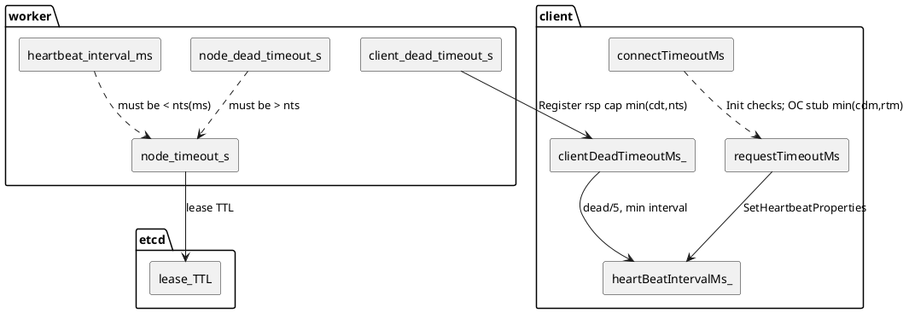
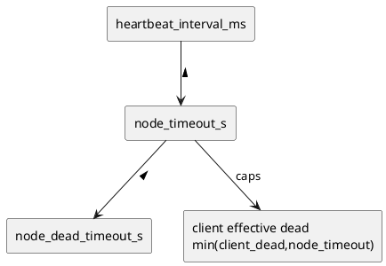

# 超时参数与时延预算

> 整合原 `timeout-params-restart-vs-scale-down.md`（参数语义与被动缩容 vs 原地重启）与 `get-latency-timeout-sensitive-analysis-5ms-20ms.md`（短超时 Get 的重试行为）两篇。

## 对应代码

| 代码位置 | 作用 |
|---------|------|
| `src/datasystem/common/util/gflag/common_gflag_define.cpp` | `node_timeout_s` / `node_dead_timeout_s` / `auto_del_dead_node` / `passive_scale_down_ring_recheck_delay_ms` 等 |
| `src/datasystem/worker/cluster_manager/etcd_cluster_manager.cpp` | `EtcdClusterManager::Init` 的启动校验 |
| `src/datasystem/common/util/validator.h` | `ValidateNodeTimeout`、`NODE_TIMEOUT_LIMIT=1` |
| `src/datasystem/common/kvstore/etcd/etcd_keep_alive.cpp` | `heartbeat_interval_ms` |
| `src/datasystem/worker/cluster_manager/cluster_node.h` | `ClusterNode::DemoteTimedOutNode` |
| `src/datasystem/worker/client_manager/client_info.cpp` | `client_dead_timeout_s`、`ClientInfo::IsClientLost` |
| `src/datasystem/worker/worker_service_impl.cpp` | Register rsp 对 client 有效 dead 取 `min(client_dead_timeout_s, node_timeout_s)` |
| `src/datasystem/client/client_worker_common_api.h` / `.cpp` | `MIN_HEARTBEAT_TIMEOUT_MS`、`SetHeartbeatProperties` |
| `src/datasystem/common/rpc/rpc_constants.h` | `RPC_MINIMUM_TIMEOUT = 500ms` |
| `src/datasystem/client/object_cache/client_worker_api/client_worker_remote_api.cpp` | OC stub 超时使用 `min(clientDeadTimeoutMs_, requestTimeoutMs)` |
| `src/datasystem/common/util/rpc_util.h` | `RetryOnError` 间隔 `1,5,50,200,1000,5000 ms`；`minOnceRpcTimeoutMs=50ms` |

---

## 1. Worker / 集群 / etcd 侧参数

| 参数 | 默认值 | 语义 | 硬约束 / 校验 | 配置建议 |
|------|-------|------|--------------|---------|
| `node_timeout_s` | 60 | etcd lease TTL（秒）；与 keep-alive 续约强相关；过短易触发 key 删除与集群 remove 事件 | 启动：`EtcdClusterManager::Init` 要求 `node_timeout_s * 1000 > heartbeat_interval_ms`；`ValidateNodeTimeout`：`>= NODE_TIMEOUT_LIMIT(1)` 且避免乘 1000 溢出 | 缩短"故障发现"时同步减小 `heartbeat_interval_ms`；为原地重启留足：进程起来 + InitRing + 续约成功 的典型时间 |
| `node_dead_timeout_s` | 300 | 故障隔离 / 判死更长窗口；与 `node_timeout_s` 共同刻画"失联后多久做更激进动作"（`ClusterNode::DemoteTimedOutNode`；keep-alive 失败与 Put 拒绝） | `node_dead_timeout_s > node_timeout_s`（启动 + 热更 `WorkerValidateNodeDeadTimeoutS`） | `dead - node` 差值应覆盖典型重启 + ring 收敛；只改小 `dead` 而不改 `node` 可能违反校验或挤压安全窗 |
| `heartbeat_interval_ms` | 1000 | etcd 续约 / 心跳相关间隔 | 必须小于 `node_timeout_s × 1000` | 与 `node_timeout_s` 联动调小 |
| `auto_del_dead_node` | true | 是否自动从 hash ring 剔除死节点 | 与 `node_dead_timeout_s` 等共同影响是否 SIGKILL / 禁止写 etcd | 排障时可临时关闭以观察；生产需明确 SLA |
| `passive_scale_down_ring_recheck_delay_ms` | **0** | 仅本地被动 SIGKILL 前：若 >0 且非集中式 master，sleep 后再读 etcd 环；若本机在环上为 ACTIVE 且不在 `del_node_info`，`UpdateRing` 并放弃 SIGKILL | 无额外校验；0 = 与旧行为一致 | 需要更稳的"误杀防护"时可设 1–3s 量级；会增加最坏情况下退出延迟 |

详细的被动缩容 / 闪断误杀分析见 [etcd-isolation-and-recovery.md](etcd-isolation-and-recovery.md)。

---

## 2. Client / 心跳 / RPC 侧参数

| 参数 | 语义 | 约束 | 配置建议 |
|------|------|------|---------|
| `client_dead_timeout_s` | Worker 判定 client 失活（`ClientInfo::IsClientLost`） | 非 UT：`>= 3` 秒且上限防 ms 溢出 | 与业务心跳频率、网络抖动匹配 |
| **下发给 client 的有效 dead** | Register 响应：`min(client_dead_timeout_s, node_timeout_s)` | client 侧感知的 dead **不超过** `node_timeout_s` | 调小 `node_timeout_s` 会自动压低 client 侧 effective dead，心跳会更密 |
| `MIN_HEARTBEAT_TIMEOUT_MS` 等 | Client 侧心跳 RPC 超时、间隔上下界（与 `SetHeartbeatProperties` 中 `clientDead/3`、`dead/5` 等组合） | 老 worker 返回 0 时退化为 15s 等 | 与 `requestTimeoutMs` 一起考虑 |
| `RPC_MINIMUM_TIMEOUT` (500 ms) | `ClientWorkerRemoteCommonApi::Init` 要求 `connectTimeoutMs >= 500` | 硬下限 | connect 过短会直接 Init 失败 |
| `requestTimeoutMs` | 总超时驱动 `SetRpcTimeout`，影响单次 RPC deadline 拆分 | 允许 0 的检查在 Init 中为 `>= 0` | 长任务需足够大；过短易误判与重试风暴 |
| `connectTimeoutMs` | 建连 / Register 握手超时 | `>= 500` | 按 RTT 与重试设；不必等同 request |
| **OC stub 超时**（`ClientWorkerRemoteApi::Init`） | `clientDeadTimeoutMs_ > 0` 时，stub 使用 `min(clientDeadTimeoutMs_, requestTimeoutMs)`（变量名虽为 connect，实现与 request 取小） | 心跳 / 短 RPC 不会长于该上界 | `requestTimeoutMs` 过小会连带压短 stub 超时 |

### 2.1 "limit" 类常量

- `NODE_TIMEOUT_LIMIT`（`validator.h` = 1）：`node_timeout_s` 合法下限（秒），不是业务上的"推荐最小隔离时间"。
- **client_dead**：无单独 `*_limit` 常量；下限由 validator 与 `min(client_dead, node_timeout)` 共同约束。

---

## 3. 参数联动（PlantUML）

### 3.1 超时参数与角色关系

### 3.2 配置联动（简化依赖）

---

## 4. Get 短超时（5ms / 20ms）行为分析

### 4.1 关键实现前提

基于 `RetryOnError` / `RetryOnErrorRepent` 与 Get 主链路：

1. **重试继续条件硬门槛**：`RetryOnError` 要求剩余时间满足 `minOnceRpcTimeoutMs = 50ms`；若 `remainTimeMs < 50ms`，不会进入下一轮重试。
2. **首轮调用仍会执行**：即使总超时只有 5ms / 20ms，首轮 RPC 仍会发起（单次 rpc timeout 至少设 1ms）。
3. **Worker 远端拉取额外刹车**：`TryGetObjectFromRemote` 中，若 `remainTimeMs <= 100ms`，停止继续 retry，并将待重试对象转入失败集合返回。
4. **超时预算为全链路共享递减**：`reqTimeoutDuration.CalcRealRemainingTime()` 在 worker 内多层调用共享，master 查询、remote worker 拉取都消耗同一预算。

### 4.2 timeout = 5ms

| 维度 | 行为 |
|------|------|
| 重试次数 | **几乎等价于"无重试"**，常态 1 次尝试 |
| 原因 | 首轮执行后剩余时间几乎必然 < 50ms |
| 成功路径 | 只适用于极高概率本地命中；worker → master / remote worker 几乎没有可用时间窗 |
| timeout 返回 | 正常返回 `K_RPC_DEADLINE_EXCEEDED` 或链路上最后错误 |
| 残余流量 | 可能存在少量 in-flight 子请求尾巴；**不会重试风暴**，垃圾流量风险低但非零 |

### 4.3 timeout = 20ms

| 维度 | 行为 |
|------|------|
| 重试次数 | 与 5ms 类似，**仍接近无重试**，常态 1 次 |
| 原因 | 20ms 显著低于 50ms 门槛 |
| 成功路径 | 略好于 5ms，但本质仍是"单次快速尝试"；远程链路成功率依赖极佳网络和负载 |
| timeout 返回 | 能快速返回 |
| 残余流量 | 比大 timeout 更小 |

### 4.4 对业务的直接影响

1. 5ms / 20ms 下，Get 更像"快速失败策略"而不是"重试容错策略"。
2. 端到端成功率更依赖本地缓存命中率，而非网络恢复能力。
3. 超时返回的确定性较强（快速收敛），但 remote get 成功窗口显著缩小。
4. 不会形成大量重试垃圾流量，仅可能有少量一次性 in-flight 收尾流量。

### 4.5 建议配置

| 超时 | 行为类型 | 适用场景 | 风险 |
|------|----------|----------|------|
| 5ms | 单次快速失败 | 强本地命中、对尾延迟极端敏感 | 远程成功率极低 |
| 20ms | 近似单次尝试 | 本地优先、可接受少量超时 | 远程链路不稳定 |
| ≥ 80 ~ 100ms | 可进入有限重试窗口 | 需要兼顾成功率与时延 | 尾延迟更高 |

**建议**：

- 超低延迟 + 明确降级 → 5ms / 20ms
- 尽量成功并可承受一次重试 → **超时至少跨过 50ms 门槛，实践上推荐 ≥ 80 ~ 100ms**

---

## 5. "被动缩容隔离 vs 原地重启"的判断不一致

**问题本质**：系统把多种物理现实（进程崩溃、网络分区、lease 到期、主动 EXITING、ring 迁移中间态）映射到有限几个离散决策（对账、迁移、从环剔除、SIGTERM / SIGKILL、认为重启等）。信号来自 **etcd 多键**（cluster 表、ring 单 key）+ 各节点本地 watch 缓存，且存在事件重排 / 延迟（如 `tmpClusterEvents_` 在环未 workable 时缓存 cluster 事件）。

**直接影响**（工程上）：

- 元数据与主副本决策不一致：部分节点走"正常缩容结束"清理，部分走"崩溃中缩容"强通知，导致迁移 / 主切换 / 客户端重连节奏不一致。
- 可用性与数据风险窗口：误判可能拉长隔离时间，或相反过早剔除 / 误杀仍在恢复中的进程。
- 排障困难：同一时刻不同节点日志对"同一地址"叙述不同（restart vs passive），若无统一 revision / trace 难以对齐。

### 5.1 仓库已做的部分缓解

- `VoluntaryExitRemoveLooksLikeCrashDuringScaleDown`（`etcd_cluster_manager.cpp`）：EXITING + remove 分支分类时，分布式场景下**优先同步读 etcd 环**再 fallback 本地环。
- `worker_incarnation`（`hash_ring.proto`）+ `InitRing` 赋值：为"同地址重新入环"提供世代字段（老数据为 0）；尚未全链路统一使用，属可扩展点。
- `passive_scale_down_ring_recheck_delay_ms`：本地被动 SIGKILL 前的 etcd 环二次确认（默认关）。

### 5.2 修改建议（按侵入性递增）

1. **单一权威 + 顺序**：凡触发迁移 / 主变更 / 剔除的决策，以 `HashRingPb` + `mod_revision` 为准；cluster 表只做辅助。
2. **显式世代 / epoch 全链路使用**：在 add 事件、RPC `GetClusterState`、日志中携带并比较 `(addr, incarnation)`，将"重启 vs 新实例 vs 被动剔除"收敛为可比较三元组。
3. **强副作用前仲裁**：在 `RemoveDeadWorkerEvent` / `ChangePrimaryCopy` / SIGKILL 等路径前，增加可配置宽限 + 再读环或多副本 `GetClusterState` 对账（`ReconcileClusterInfo` / `CompareHashRingWorkersForClusterReconcile` 可作为范式）。
4. **协议 / 运维约束**：规定 EXITING 与 ring 上 LEAVING / `del_node_info` 的因果顺序，减少"先 EXITING 后崩"造成的歧义窗口。
5. **可观测性**：结构化日志携带 `cluster_mod_rev + ring_mod_rev + 本地分类结果 + worker_incarnation`，缩短分歧复盘成本。

---

## 6. 核心问题复述

1. **Get timeout 能否正常返回？** 能。当前实现有明确超时预算控制和返回路径。
2. **timeout 返回时是否会有垃圾流量？** 可能有少量 in-flight 请求收尾，但不会长时间持续放大；5ms / 20ms 场景通常更少。
