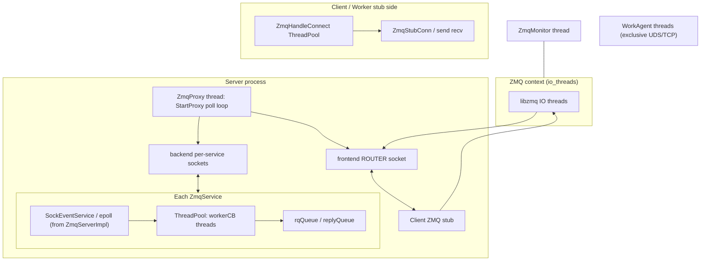

# 日志、Perf、ZMQ 与 KV 路径 — 机制说明与可观测性设计要点

本文基于 `yuanrong-datasystem` 源码（`src/datasystem/common/log`、`common/perf`、`common/rpc/zmq`、KV 客户端与 `ObjectClientImpl`）整理，用于回答性能影响、改进建议与定位定界思路。

---

## 1. 当前日志打印机制（与 OS / 三方件的关系）

### 1.1 主路径：`LOG` → `LogMessage` → spdlog

- **入口宏**（`log.h`）：`LOG(severity)` 在 `FLAGS_minloglevel <= severity` 时才构造日志对象，低于阈值的调用**不会**走后续格式化（短路在 `if` 条件上，但需注意 `LOG_IMPL` 仍在 `if` 的 then 分支里才求值）。
- **消息构建**（`log_message_impl.cpp`）：
  - 使用 **thread_local** 缓冲 `g_ThreadLogData`（约 30KB），向 `ostream` 写入正文，避免每条日志堆分配（仍有一次性格式化成本）。
  - `Init()`：`GetMessageLogger()`、`AppendLogMessageImplPrefix()`（含 `getpid`、`syscall(__NR_gettid)`、`Trace::GetTraceID()` 等）。
  - 析构时 `Flush()`：`logger_->log(sourceLoc_, level_, string_view)` → spdlog。
- **spdlog 后端**（`logger_context.cpp`）：
  - **异步**（默认 `FLAGS_log_async`，客户端可用 `DATASYSTEM_LOG_ASYNC_ENABLE`）：`async_logger` + **全局** `init_thread_pool(maxAsyncQueueSize, asyncThreadCount)`，其中 `asyncThreadCount = 2`（见 `logging.cpp` `InitLoggingWrapper`），溢出策略 **`overrun_oldest`**（队列满时丢最旧）。
  - **定时刷盘**：`flush_every(seconds(FLAGS_logbufsecs))`（默认 10s），影响**后台写文件频率**，与业务线程解耦但仍占用 IO 线程。
  - **文件 sink**：`rotating_file_sink_mt`，内部涉及 **打开/写/轮转** 等，最终落到 **`write()` 等系统调用**；`realpath` 在创建 logger 时解析日志目录。
  - **同步模式**（`log_async=false`）：`flush_on(logLevel)`，同线程上每次满足级别可能触发 flush，**延迟与抖动最大**。
- **stderr**：可选 `stderr_color_sink_mt`，`write` 到 fd=2，通常也是阻塞型字符设备或管道。

### 1.2 特殊路径：`WriteLogToFile`（同步 open/write/close）

- `logging.cpp` 中 `Logging::WriteLogToFile`：每次 **`open(O_APPEND)` → `write` → `close`**，用于故障写入等场景；与异步 spdlog 主路径不同，**典型延迟高**（多次 syscall + 路径解析成本），易在异常风暴时放大。

### 1.3 Access 日志（与主业务日志并行）

- `AccessRecorder`（`access_recorder.cpp`）：在 `FLAGS_log_monitor` 下将耗时、错误码等交给 `AccessRecorderManager`，由 **LogManager 后台线程**周期性 `SubmitWriteMessage`（见 `log_manager.cpp`），属于**另一条异步写文件/监控管道**，同样受磁盘与实现细节影响。

### 1.4 与 mmap / URMA 的关联（间接）

- 常规 **`LOG` 不直接调用 mmap**；mmap 出现在 **共享内存对象、传输层**等业务代码中。
- **URMA**：业务与传输栈中有 `CLIENT_URMA_HANDSHAKE`、`URMA_WRITE_*` 等 **Perf 锚点**（`perf_point.def`），日志侧仅在相关模块打点时与 URMA 同线程交错执行；**无**专用 “URMA 日志 API”，关联方式是 **同请求上下文 + TraceID**。

### 1.5 滚动、压缩与按量/按天清理（spdlog + LogManager）

代码里**没有**对当前正在写的日志 fd 做 `truncate(2)`；**单文件写满**时由 **spdlog `rotating_file_sink_mt`** 按大小轮转，历史文件名规则以所用 spdlog 版本为准。

| 环节 | 实现位置 | 行为摘要 |
|------|-----------|----------|
| **按大小切分** | `logger_context.cpp` + `logging.cpp` | 活跃文件为 `{log_dir}/{log_filename}.INFO.log`、`.WARNING.log`、`.ERROR.log`；超过 `FLAGS_max_log_size`（MB）则轮转。`maxFiles` 设为 `HIGHEST_SPDLOG_MAX_FILE_NUM`（200000），**禁用 spdlog 按个数删旧文件**，只保留分裂能力；删旧由 LogManager 负责。 |
| **后台任务周期** | `log_manager.cpp` `RunTimerTask` | 默认间隔 `LOG_ROLLING_COMPRESS_SECS`（30s，`logging.h`），每 10ms  tick 直到满间隔后执行 `DoLogBackgroundTask`。 |
| **压缩** | `DoLogFileCompress`（`FLAGS_log_compress`） | Glob 匹配未压缩历史：`basename.<SEVERITY>.*[0-9].log`。若有文件：先 **sleep 1s**（注释：配合 filebeat 1s 轮询）。每 severity **每轮最多 3 个**（`PER_OPERATION_NUM`）：`CompressFile` → `*.log.gz`，再 **删除原 `.log`**。若本轮发生过压缩，返回 `K_TRY_AGAIN`，**立刻再跑一轮**（不等到 30s）。 |
| **删旧（滚动清理）** | `DoLogFileRolling` | Glob 列出历史（若开启压缩则模式含 `\.gz`），按 **修改时间**排序。若 `FLAGS_max_log_file_num > 0` 且超出个数，或 `FLAGS_log_retention_day > 0` 且文件过旧，则 **unlink 最旧文件**。`max_log_file_num == 0` 且 `log_retention_day == 0` 时对本模式匹配文件**不删**。同逻辑通过 `FetchLogWithPattern` 覆盖 access / request / client access / resource 等日志。 |

`DoLogBackgroundTask` 顺序：**压缩 → 滚动删除 → Access 监控写**（`DoLogMonitorWrite`）。

---

## 2. 日志对性能的影响（有据结论）

| 因素 | 机制依据 | 对热路径的影响 |
|------|-----------|----------------|
| 是否打印 | `FLAGS_minloglevel` | 未达级别：不进入 `LogMessage` 主体（需保持判断在热路径外或接受分支预测失败成本） |
| 格式化 | thread_local 缓冲 + ostream | **微秒级**常见；大字符串、复杂 `FormatString` 更重 |
| 异步入队 | `async_logger` + 有界队列 | 热路径主要是 **内存拷贝入队 + 原子操作**；队列满时 **丢旧日志**（`overrun_oldest`），一般不无限阻塞，但 **丢观测** |
| 刷盘 | `flush_every` + 轮转 | 落在 **2 个异步线程**，可抢磁盘带宽、引起 **iowait**；与 KV 线程间接资源争用 |
| 同步模式 | `flush_on` | **同线程**等文件 IO，**最易拖慢 RPC/KV** |
| 多 sink | 文件 + stderr | stderr 同步时可能明显变慢 |
| `PerfPoint` 嵌在日志路径 | `LOG_MESSAGE_*`、`APPEND_LOG_MESSAGE_PREFIX` 等 | 每条日志额外 **steady_clock + 原子统计**（见下节） |

**结论（回答「离散 vs 组件聚合」）**：

- 异步日志已将 **阻塞写盘** 从多数业务线程剥离，但 **每条** `LOG(INFO)` 仍有：条件判断、前缀字段、stream 格式化、入队拷贝。**调用链上多处离散 INFO** 会线性放大 **CPU + 队列压力**，并在高压下提高 **丢日志概率**（`overrun_oldest`）。
- **按组件/请求聚合一条结构化日志**（或在 debug 通道打 span）通常比同一语义拆 5～10 条 INFO **更省**：更少次 ostream 格式化、更少队列项。是否与 tracing 系统对齐取决于你们是否已有 trace id（当前前缀已带 Trace）。

---

## 3. 针对 INFO / ERROR 的建议（与现有能力对齐）

### 3.1 INFO 采样（入口处）

代码已具备基础能力，可组合使用：

- **`FLAGS_v` / `VLOG`**：细粒度 verbose；注意 `VLOG_IS_ON` 宏定义与 `VLOG` 使用方式以源码为准。
- **`LOG_EVERY_N` / `LOG_EVERY_T` / `LOG_FIRST_N`**（`log.h`）：适合 **周期性、风暴削峰**。
- **入口采样**：在 `KVClient::MCreate/MSet/Get` 或 `ObjectClientImpl` 最外层增加 **确定性采样**（如 `trace_id % N == 0` 或随机 `sample_rate`），与 **TraceGuard** 配合，保证一条请求内可选「全量子日志」或「仅入口一条」。

### 3.2 ERROR 打爆

- 当前 **无全局 ERROR 限流**；风暴时：`async` 仍要格式化入队，同步路径或 stderr 可能 **阻塞**；`WriteLogToFile` 类路径 **open/write/close** 成本极高。
- 建议：**令牌桶 / 滑动窗口** 限流、`LOG_FIRST_N`+汇总、严重错误单独计数指标（metrics）+ **低频**日志；避免在 tight loop 里 `LOG(ERROR)`。

---

## 4. 「写日志慢」何时出现、对 KV 读写的影响

**慢的表现来源**：

1. **同步日志**或 **`flush_on`** 触发频繁 `fsync` 类行为（取决于 spdlog/sink 配置与 libc）。
2. **磁盘饱和**：`iowait` 高，异步线程仍排队，队列持续高水位 → 丢日志 + **内存带宽与 cache 压力**。
3. **队列反压**：`overrun_oldest` 下业务线程不无限阻塞，但 **高负载时观测缺失**，易误判。
4. **stderr 管道阻塞**：下游消费慢时，写 stderr 的线程阻塞。
5. **`WriteLogToFile`**：每次完整 open/write/close — **异常处理路径要特别避免高频调用**。

**对 KV 的影响**：

- **mcreate/mset/mget** 均在客户端线程执行 `LOG(INFO)`（如 `MCreate`/`MultiCreate`/`Set(buffer)`），与 **RPC、memcpy、URMA** 同线程交错；异步模式下通常为 **CPU 与队列争用**，极端情况下增加 **尾延迟**。
- **Worker 侧**同样如此；若 Worker 使用同步日志，**延迟会直接叠在请求路径上**。

---

## 5. Perf 机制总结

### 5.1 实现（`perf_manager.cpp` / `perf_manager.h`）

- **`PerfPoint` RAII**：构造记 `steady_clock::now()`，析构（或 `Record`）算纳秒差，调用 `PerfManager::Add`。
- **`Add`**：`fetch_add` 更新 count/total；**max/min 用 CAS 循环**更新（多线程并发打同 key 时，CAS 重试会带来额外开销，通常仍 **远小于** 一次网络或 IO）。
- **`ENABLE_PERF` 关闭**：空操作，**零统计开销**（析构空函数）。
- **`Tick()`**（约每秒在 client perf 线程 / worker main 循环）：
  - 计算各 key 的 **tick 内 QPS（maxFrequency）**；
  - **每 60 秒** `LOG(INFO)` 打印聚合 JSON（**注意：Perf 自身会触发日志**）。

### 5.2 与「采样请求下 P99 观测」的差距（回应同事挑战）

- 当前聚合指标是 **count、totalTime、avg、min、max、maxFrequency**，**没有 P99 / 分位数**，也 **没有单请求分段轨迹**。
- **采样请求**时：应用层可只对 **1/N** 请求打 **嵌套 PerfPoint** 或对接 **OpenTelemetry/自研 trace**，在存储侧算 P99；现有 `PerfManager` 更适合 **全局热点** 与 **粗粒度对比**（例如 `KV_CLIENT_MCREATE_BUFFERS` vs `WORKER_MULTI_CREATE_*`）。

### 5.3 性能打点开销量级（合理性）

- **单次 `PerfPoint`**：`steady_clock::now()` 两次 + 若干原子操作：常见 **数百 ns 到 ~1 µs** 量级（视 CPU、竞争而定）。
- **嵌套在日志内的 PerfKey**（`LOG_MESSAGE_INIT`、`GET_MESSAGE_LOGGER`、`APPEND_LOG_MESSAGE_PREFIX`、`LOG_MESSAGE_FLUSH`）：会把 **日志成本**单独记账，便于对比「业务段 vs 日志段」；若 `ENABLE_PERF` 打开且 **日志极多**，这些 key 的 count 会很大，CAS 竞争略增。
- **整体判断**：在 **RPC/URMA/大块 memcpy** 主导的 KV 路径上，**适量** `PerfPoint` 合理；应避免在 **极高频循环**（如 per-element 内层）无差别打点，应用 **聚合后 RecordElapsed** 或采样。

### 5.4 KV / ZMQ / URMA 相关锚点（节选）

- KV 客户端：`KV_CLIENT_MCREATE_BUFFERS`、`KV_CLIENT_MSET_BUFFERS`、`KV_CLIENT_GET_*`、`CLIENT_MSET_*`、`CLIENT_MGET_*`、`CLIENT_MULTI_CREATE_*` 等（见 `perf_point.def`）。
- ZMQ：`ZMQ_*`、`ZMQ_ADAPTOR_LAYER_*`、`ZMQ_*_RPC` 等。
- URMA：`URMA_*`、`FAST_TRANSPORT_TOTAL_EVENT_WAIT` 等。

---

## 6. 三板斧：定位 / 定界

1. **OS / 存储**：`iostat -x`、磁盘延迟、inode；对可疑进程 `strace -c -e write,fdatasync,openat` 看 syscall 占比；关注 **日志目录所在文件系统**。
2. **进程内**：`FLAGS_minloglevel`、`FLAGS_log_async`、`FLAGS_log_async_queue_size`、`FLAGS_logbufsecs`；`ENABLE_PERF` 打开后看 **`LOG_MESSAGE_*` 与业务 key 的 avg/max**；用 **TraceID** 关联单次请求日志。
3. **网络 / URMA**：对慢请求看 `URMA_WRITE_*`、`URMA_WAIT_*`、`ZMQ_NETWORK_TRANSFER_*` 是否同步变长；与对端 worker 同 key 对照。

---

## 7. ZMQ 线程与角色（便于定界）

下面为逻辑视图；具体 fd/队列数以配置为准。

**定界提示**：

- **前端无响应**：先看 **Proxy 线程** `poll` + `ZmqFrontendToSvc`。
- **某 service 卡**：看该 service 的 **ThreadPool** 队列与 **HWM**。
- **连接闪断 / 重连**：**ZmqSockConnHelper**、`ZmqMonitor`。
- **独占连接**：**WorkAgent** 池与 `ProcessAccept` 路径。

---

## 8. KV：`mcreate` / `mset` / `mget` 逻辑链（客户端视角）

### 8.1 `mcreate`（`KVClient::MCreate` → `ObjectClientImpl::MCreate` → `MultiCreate`）

1. `TraceGuard`、`PerfPoint(KV_CLIENT_MCREATE_BUFFERS)`、`AccessRecorder`（可选写 access 日志）。
2. `MCreate`：`LOG(INFO)` 打印 keys → `MultiCreate`。
3. `MultiCreate`：构造参数 → `GetAvailableWorkerApi` → 若需 shm / URMA / existence 检查则 **`workerApi->MultiCreate`（RPC）**；否则可能仅本地分配。
4. `useShmTransfer` 为真时：`MutiCreateParallel` → 子步骤含 **mmap/shm 单元**、**Buffer::Create**、**ref 计数** 等（多段 `PerfKey::CLIENT_MULTI_CREATE_*`）。

### 8.2 `mset_buffer`（`KVClient::MSet(buffers)` → `ObjectClientImpl::MSet`）

1. `PerfPoint(KV_CLIENT_MSET_BUFFERS)`、`AccessRecorder`。
2. 校验 buffer、封装的 `ObjectBufferInfo` → **`workerApi->MultiPublish`**（RPC）→ `HandleShmRefCountAfterMultiPublish`。

### 8.3 `mset`（key+value，`MSet(keys, vals, ...)` NTX 路径摘要）

1. `CLIENT_MSET_INPUT_CHECK` → `GetAvailableWorkerApi`。
2. `MultiCreate`（分配或映射可写缓冲）→ `MemoryCopyParallel`（可选并行 memcpy）→ **`MultiPublish`** → `CLIENT_MSET_POST_PROCESS`。

### 8.4 `mget` / `get`

1. `KVClient::Get` / `Get(keys)`：`PerfPoint(KV_CLIENT_GET_BUFFER` 或 `GET_MUL_BUFFERS)` + `AccessRecorder`。
2. `impl_->Get`：内部走 **worker RPC**、元数据与 **H2D / 管道读** 等（`CLIENT_MGET_*`、`KV_CLIENT_MGET_H2D` 等 perf 点）。

---

## 9. 建议的后续工程项（可选）

- 在 **入口** 统一 **采样开关** + **单次请求 debug 开关**（避免链路上重复 INFO）。
- 将 **P99** 交给 **metrics/trace**；`PerfManager` 保留为 **编译期可选** 的粗粒度剖面。
- 评估暴露 **async 队列深度**（若 spdlog 版本支持或自行包装）用于告警。
- ERROR 路径 **限流 + 聚合** + 指标 **`error_events_total{code}`**。

---

*文档版本：与仓库源码走查一致；若上游调整 `log.h` / spdlog 初始化参数，请以代码为准。*
