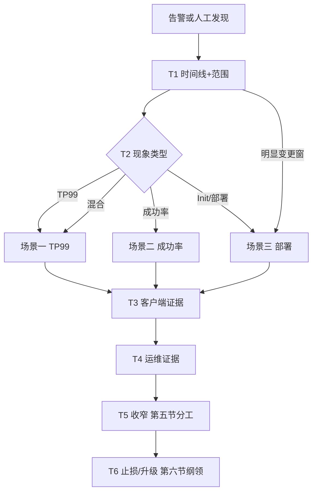
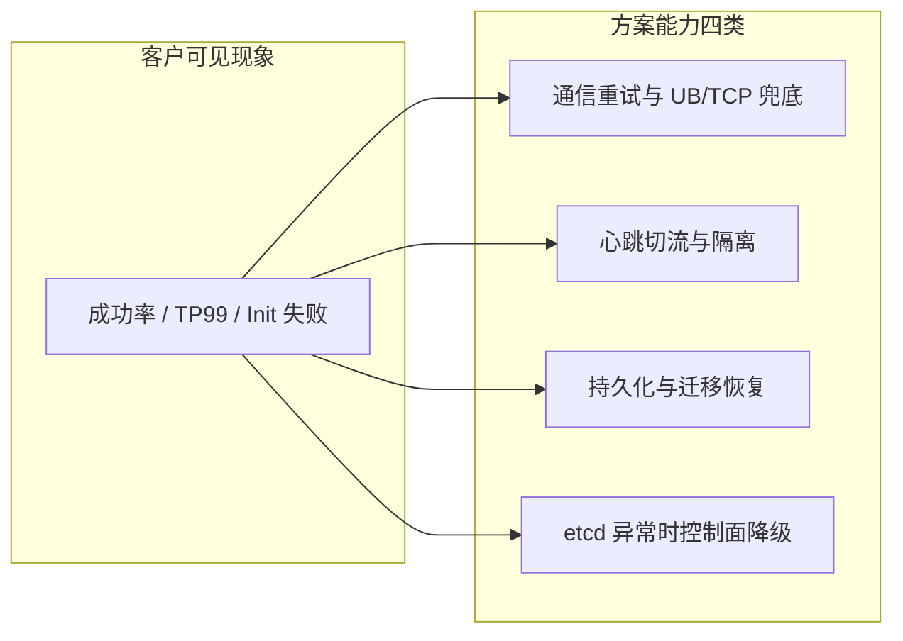
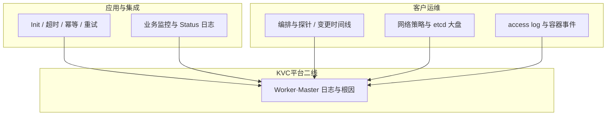
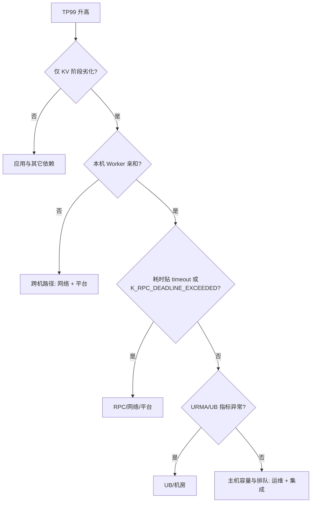
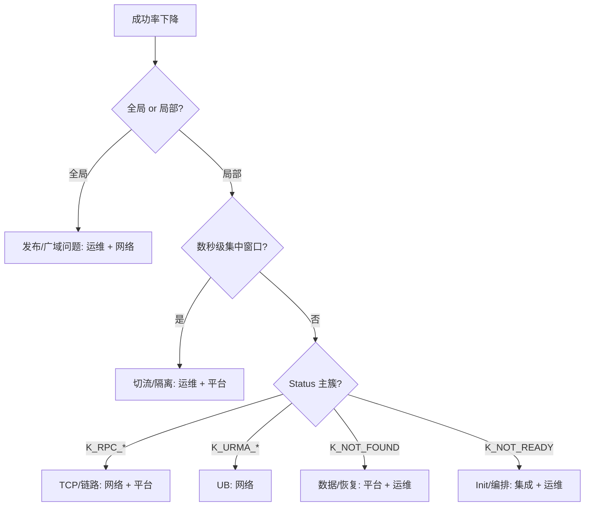
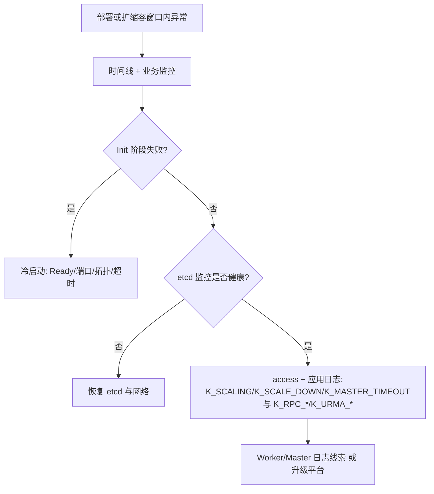

# KVC 客户视角总览（All-in-One）

本文从 **第一节（业务语境与 Case 映射）** 起为 **自洽主干**：业务语境、方案原则、access/码表、分工、定界纲领、依赖、与 Case 编号映射、TP99/成功率/部署三场景及粗算。**多角色对齐、测试覆盖映射、代码—设计横切闭环** 已拆至配套篇 [KV_CLIENT_CUSTOMER_ALLINONE_ROLES.md](./KV_CLIENT_CUSTOMER_ALLINONE_ROLES.md)。

---

## 1. 业务语境与现象口径

典型链路：**负载均衡 → 业务请求处理实例（集成 SDK）→ KVC Worker（分布式缓存）**。

| 业务类型 | 对失败的敏感度（示例） |
|----------|------------------------|
| **精排等强依赖 KV 的路径** | 单次读失败常推高 **端到端（E2E）失败率** |
| **召排等弱依赖子路径** | 可能仍「请求成功」，但 **TP99 / Prefill 长尾** 变差 |

客户观测应同时保留：**业务 SLI**（成功率、TP99、E2E）与 **SDK 返回的 Status**；二者 **不能互相等同为根因**。

仓库中的 **《业务场景与故障 / 可靠性 Case 清单》**（下称 **Case 清单**）用 **编号** 固化 **业务流程（1～11）**、**故障模式（1～53）** 与 **关键读写路径（步骤 1～6）**。本 All-in-One 的 **故障检测与定位定界** 与 Case 清单 **一一可对读**：下按 **部署 / 读写路径 / 扩缩容与恢复** 三类聚类给出 **入口映射**（同一 Case 可跨类，便于从现象选入口）；Case 清单中的 **可靠性设计表、时间粗算** 与本文 **第二节（方案原则）、第十一节（粗算）** 同故事线。

### 1.1 业务流程 Case（1～11）按聚类 → 本文排障入口

**聚类一：部署**（拓扑、Ready、Init、本机是否有 Worker）

| Case | 场景（与 Case 清单「业务流程」表一致） | 典型异常信号 | **检测 / 定位优先读本文** |
|------|----------------------------------------|--------------|---------------------------|
| **1** | 业务部署，**本机有** Worker | Init 成功但偶发长尾 | **「场景三·分层观测」**（先后序）；**场景一（TP99/时延）**、**场景二（成功率）** |
| **2** | 业务部署，**本机无** Worker | Init 失败、**`K_RPC_DEADLINE_EXCEEDED` / `K_RPC_UNAVAILABLE`**（`1001` / `1002`）、跨机超时 | **「场景三·冷启动」**、**场景一（TP99/时延）**、**第五节**·拓扑 |
| **3** | **仅 Worker** 部署 | 业务先起导致 Init 失败 | **「场景三·冷启动」**、**「场景三·分层观测」** L2 Ready/端口 |
| **6** | 业务节点 **无 Worker**，跨节点读 | 同 Case 2，路径更长 | **「场景三·冷启动」**、**场景一（TP99/时延）** |

**聚类二：读写路径**（亲和、跨机、数据是否命中本节点）

| Case | 场景 | 典型异常信号 | **检测 / 定位优先读本文** |
|------|------|--------------|---------------------------|
| **1** | 业务部署，**本机有** Worker | 偶发长尾、成功率波动 | **场景一（TP99/时延）**（勿误把本机当跨机）；**场景二（成功率）** |
| **4** | 业务 **本节点** KVCache | 与本机链路相关抖动 | **场景一（TP99/时延）**、**场景二（成功率）** |
| **5** | 本节点未命中，**跨节点读** | TP99 升、超时增多 | **场景一（TP99/时延）**（跨机路径）、**第四节**·`K_RPC_*` 簇 |
| **6** | **无 Worker**、跨节点读 | 超时与失败更敏感 | **场景一**、**第四节**；编排见 **聚类一·Case 6** |

**聚类三：扩缩容与恢复**（变更窗、元数据、故障隔离与数据回填）

| Case | 场景 | 典型异常信号 | **检测 / 定位优先读本文** |
|------|------|--------------|---------------------------|
| **7 / 8** | 业务实例 **扩 / 缩** | 与变更窗对齐的 SLI 波动 | **场景三（部署与扩缩容）**、**场景二（成功率）** 局部/全局 |
| **9 / 10** | KV Worker **扩 / 缩** | **`K_SCALING` / `K_SCALE_DOWN` / `K_MASTER_TIMEOUT`**（`32` / `31` / `25`）、etcd 告警 | **场景三**、**第四节**、**第七节** etcd |
| **11** | Worker 故障 **自动恢复** | 秒级坑后回升、**`K_NOT_FOUND`（`3`）** 批量 | **场景二（成功率）**、**第二节** 切流与恢复、**第十一节** 粗算 |

### 1.2 故障模式 Case（1～53）→ 现象簇与本文章节

Case 清单将故障分为 **类别 + 编号**；客户侧通常先看到 **SLI** 或 **第四节 · 4.3 码表主簇**，再反查基础设施。下表按 **大类** 合并编号，指向 **本文检测与定界主入口**（细项仍以 Case 清单枚举为准）。

| 故障大类（Case 清单中的类别与编号范围） | 客户侧常见现象 | **排查主入口** | 与 **第四节 · 4.3 码表** 的关联 |
|----------------------------------------|----------------|----------------|-------------------------|
| **主机 / OS**（1～3） | 多实例同时断、成功率陡降 | **场景二（成功率）** 全局/时间线；**第七节（周边依赖）** | `K_RPC_DEADLINE_EXCEEDED` / `K_RPC_UNAVAILABLE`（`1001`/`1002`）、`K_CLIENT_WORKER_DISCONNECT`（`23`） |
| **主机资源**（4～9） | TP99 升、OOM、无明确 URMA | **场景一（TP99/时延）** 步骤 5；**场景二（成功率）** | `K_RPC_DEADLINE_EXCEEDED`（`1001`）、`K_RUNTIME_ERROR`（`5`）、`K_NOT_READY`（`8`） |
| **时间跳变**（10～11） | 租约/元数据类异常（依环境） | **场景二（成功率）** + 主机时钟工单 | `K_MASTER_TIMEOUT`（`25`）、非定常码 |
| **容器**（12～16） | Pod 重启、NotReady | **场景三（部署与扩缩容）**、**场景二（成功率）** | `K_NOT_READY`（`8`）、`K_CLIENT_WORKER_DISCONNECT`（`23`）、Init 失败 |
| **进程**（17～24） | Worker/SDK 挂死、反复重启 | **场景二（成功率）** 秒级窗；**场景三（部署与扩缩容）** | `K_CLIENT_WORKER_DISCONNECT`（`23`）、`K_RPC_UNAVAILABLE`（`1002`） |
| **UB 端口 / 芯片 / 交换机**（25～31，39～42） | **`K_URMA_*`**、**TP99 长尾**、成功率可不明显掉 | **场景一（TP99/时延）**、**第七节（周边依赖）** UB | **`K_URMA_ERROR` / `K_URMA_NEED_CONNECT` / `K_URMA_TRY_AGAIN`（`1004`/`1006`/`1008`）** |
| **TCP 网卡**（32～38） | **`K_RPC_DEADLINE_EXCEEDED` / `K_RPC_UNAVAILABLE`**、与交换机同步 | **场景一、场景二**、**第七节（周边依赖）** TCP | `1001`、`1002` |
| **etcd**（43～48） | 扩缩容卡、隔离延迟；读写或仍部分可用 | **「场景三·分层观测」 L3**、**第二节（方案原则）** K4 | `K_SCALING`（`32`）、`K_MASTER_TIMEOUT`（`25`）、现象「糊」 |
| **分布式网盘 / 二级存储路径**（49～53） | 恢复慢、读失败 | **第七节（周边依赖）** 二级存储、**场景二（成功率）** | `K_NOT_FOUND`（`3`）、`K_RUNTIME_ERROR`（`5`） |

**用法**：DryRun / 工单中可同时写 **「业务流程 Case x + 故障模式 Case y」**，便于与 **「场景一」至「场景三」** 步骤对照，避免只写口语化描述。

### 1.3 关键读写路径（步骤 1～6）与定界关注点

与 Case 清单 **「关键读写路径」** 一致。时序见 **PlantUML**（与 cases 表 **步骤 1～6** 一一对应）：

| 图 | 文件 |
|----|------|
| **正常**：入口为本机 Worker1 | [diagrams/kv_client_read_path_normal_sequence.puml](./diagrams/kv_client_read_path_normal_sequence.puml) |
| **切流后**：入口变为跨机 Worker2 | [diagrams/kv_client_read_path_switch_worker_sequence.puml](./diagrams/kv_client_read_path_switch_worker_sequence.puml) |

**定界摘要**（与图中序号一致）

| 路径 | 客户侧通常 **直接**可见 | ②～⑤ 收窄依赖 |
|------|-------------------------|----------------|
| **正常** | ① 本机 TCP、⑥ SHM 与 **整次** access **耗时/code**、业务 SLI | **`K_RPC_*`（`1001`/`1002`）**、**`K_URMA_*`**、Worker 日志；见 **场景一（TP99/时延）**、**第七节（周边依赖）** |
| **切流** | 同上，但 **① 已为跨机** | **Init、connectTimeout、网络策略** 更敏感；**「场景三·冷启动」**、**场景一（TP99/时延）**；对端 **IP:Port**（若错误信息携带）助定点 |

### 1.4 客户侧排障主流程（表格式纲领）

下列 **顺序执行**；任一步已能解释现象可 **提前结束** 或 **并行** 收集证据。

| 步骤 | 动作 | 输入 / 产出 | 下一跳（本文） |
|------|------|-------------|----------------|
| **T1** | **登记时间与范围** | 变更单、发布窗、告警起止、**全局 vs 少数实例** | 有部署/扩缩容 → **场景三（部署与扩缩容）** |
| **T2** | **区分现象类型** | **仅 TP99**、**仅成功率**、**两者**、**Init 起不来** | TP99 → **场景一（TP99/时延）**；成功率 → **场景二（成功率）**；Init → **「场景三·冷启动」** |
| **T3** | **拉客户端证据** | **Status**、**access log** 聚合、`grep` 主簇 **code** | 对照 **第四节 · 4.3～4.4**；Get 注意 **「第三节·Get 与 NOT_FOUND 陷阱」** |
| **T4** | **拉运维证据** | Pod/主机、**nc 端口**、**etcd 大盘**、网络策略 | **第七节（周边依赖）**、**「场景三·分层观测」** |
| **T5** | **收窄责任面** | 按 **「场景一」/「场景二」** 表更新「谁优先动作」 | **第五节（三方分工）** |
| **T6** | **止损与升级** | 限流/降级/临时 timeout；工单打包 **第六节（定界纲领）** | **KVC 平台二线** |



---

## 2. 整体应对与分类原则（可靠性方案摘要）

下列概括 **KVC 故障处理与数据可靠性方案** 中客户需要建立预期的部分（通信、组件、数据、控制面四类）。

| 大类 | 方案在做什么（摘要） | 客户侧应建立的预期 |
|------|----------------------|-------------------|
| **通信（TCP / UB）** | 在时延预算内 **有限重试**；UB 支持 **多平面切换**；必要时 **TCP 兜底** | **短 timeout**（例如毫秒级 SLA）时，可能 **早于硬件侧完成检测/切换** 就超时失败；精排与召排对成功率、长尾的体感不同 |
| **组件（Worker 与 SDK）** | SDK 与 Worker **心跳**（量级约 **2s**，可调）→ **秒级** 内触发 **切流**；etcd 租约侧支持 **故障隔离**（整体检测+隔离窗口常取 **2～3s** 量级） | 隔离与切流窗口内可能出现 **局部失败或长尾**；窗口过后应随新路由 **恢复** |
| **数据可靠性** | 异步写 **二级存储**；故障后 **分片迁移、预加载恢复** | **未落盘数据可能丢失**；恢复未完成前可能出现 **部分读失败** |
| **etcd 等控制面** | **全集群 etcd 不可用** 时系统 **降级**：各组件可 **缓存已知的集群信息**，在方案前提下 **尽量维持已有数据面读写**；**扩缩容、故障隔离** 等依赖 etcd 的能力 **受阻** | 变更期若 etcd 异常，应 **优先恢复 etcd 与网络**；勿期望仅靠调大应用 timeout 解决控制面卡住 |



---

## 3. 客户端可观测：Status 与 Access Log

### 3.1 Access log 启用与路径

- 通常依赖客户端 **`log_monitor`** 类开关（以实际版本为准）。
- 默认文件名形如 **`ds_client_access_<pid>.log`**，目录由 **`log_dir`** 配置；部分环境可用环境变量覆盖日志名。

### 3.2 单行格式（与实现一致）

```text
<code> | <handleName> | <microseconds> | <dataSize> | <reqMsg> | <respMsg>
```

| 字段 | 含义 |
|------|------|
| **code** | 整型 **StatusCode**（见 **第四节 · 4.3** 主要码表） |
| **handleName** | 访问点，如 **`DS_KV_CLIENT_GET`**、**`DS_KV_CLIENT_SET`** 等 |
| **microseconds** | 该次 API **客户端侧耗时** |
| **dataSize** | 与 API 相关（如 value 长度、批量 key 数等） |
| **reqMsg** | 请求参数摘要（常含 **timeout**、key 等） |
| **respMsg** | **`Status::GetMsg()`**，错误时多为英文短语或拼接信息 |

### 3.3 必读：Get 与 `K_NOT_FOUND` 的 access 陷阱

多条 **Get / Read** 路径会把 **`K_NOT_FOUND` 记成 access 里的 `code = 0`（OK）**，避免把「业务语义未找到」记成错误；但 **`respMsg` 仍可能带未找到相关信息**。

**结论**：**`K_OK`（`0`）| `DS_KV_CLIENT_GET` 不等于「读成功且 key 一定存在」**；也可能表示 **key 不存在**。链路类错误 **不会** 被改成 `0`，仍会体现为 **`K_RPC_DEADLINE_EXCEEDED` / `K_RPC_UNAVAILABLE`（`1001`/`1002`）**、**`K_URMA_*`** 等。

---

## 4. 异常报错归类与协作（与第二节四类能力对应）

**说明**：**同一 `StatusCode` 常对应多种根因**（同码多因）；定界需结合 **耗时是否贴 timeout**、**`respMsg`**、**是否变更窗口**、**网络与 UB 指标** 等。**枚举名与数值** 与 `include/datasystem/utils/status.h` 一致；写法对齐 [ppt_material.md](./ppt_material.md) 幻灯片 03。

### 4.1 异常报告怎么归类（工单 / 会议前先对齐）

先按 **报告类型** 归类，再协商 **应用与集成** 与 **客户运维** 各提供什么、谁先动；**KVC 平台二线** 在证据包齐或责任面交叉时接入。

| 报告类型 | 典型输入 | **应用与集成** | **客户运维** |
|----------|----------|----------------|--------------|
| **A. SLI 类** | 网关/APM：**成功率、TP99、E2E**；按实例或 Predictor 分桶 | 拆 **精排 / 召排 / KV 子阶段**；补 **SDK `Status` 全文 + Trace**；access 按 **`DS_KV_CLIENT_*` + 第一列** 聚合 | 对齐 **变更单、滚动批次、LB 健康检查**；拉 **多实例 access**、**Pod/主机事件** |
| **B. Status / access 主簇类** | 已能给出 **主簇 `StatusCode`** 或 access **code** 分布 | 提供 **时间段、实例列表、抽样行**（含 **`respMsg`、`timeout`**）；Get 注明是否已排除 **`K_OK` 陷阱** | **`nc` Worker 端口**、**网络策略**、**etcd 大盘**截图；单 Worker 异常时 **摘流 / cordon / 污点**（依集群规范） |
| **C. 部署 / 变更窗类** | Init 失败、滚动中陡变、与发布同窗 | **启动日志**（常早于 access）、**Init 与首调顺序**、拓扑配置（**忌本机无 Worker 仍 localhost**） | **Ready 探针、先后序**、**回滚 / 暂停变更**、时间线共享 |
| **D. 扩缩容 / 恢复类** | `K_SCALING` / `K_SCALE_DOWN` / `K_MASTER_TIMEOUT` 增多或恢复后 **`K_NOT_FOUND` 批量** | **有界重试、幂等写**；**勿**对终端用户暴露 **31/32** 语义 | **LB 切离退出节点**、扩容与恢复窗口对齐；etcd 异常时 **先恢复控制面** |

### 4.2 观测盲区（主簇里缺某一类错误时）

| 现象 | **应用与集成** | **客户运维** |
|------|----------------|--------------|
| 业务成功率已跌，access 里 **`K_OK`（`0`）** 仍占多数（尤其 **Get**） | 按 **第三节**：未找到可能映射为 `0`；改看 **`Status` / `respMsg` / 业务码** | 确认 **`log_monitor`、路径、pid**；协助 **多实例** 同窗拉取 |
| 监控有失败，access **几乎没有对应码** | 是否 **非 KV 阶段**先失败；补 **Trace 贯穿 SDK** | **集中日志延迟 / 采样**；Proxy → Pod 链路是否丢日志 |
| 只见 **`K_RPC_UNAVAILABLE`（`1002`）**，不见 **`K_URMA_*`** | **禁止**据此认定「一定非 UB」；展开 **`respMsg` 关键词** + **耗时与 timeout** | 并行拉 **UB 指标** 与 **Worker URMA 日志** |

### 4.3 客户端可见 `StatusCode`（按类 · KV 常用）

| 分类 | 数值 · `StatusCode` | 主要对应 **第二节** 哪类 | 第一层含义（非最终根因） |
|------|---------------------|---------------------------|---------------------------|
| **成功与 access 陷阱** | `0` · `K_OK` | 可观测口径 | 成功；**Get 可能与「未找到」并存** — 必看 **`Status` / `respMsg`**（见第三节） |
| **就绪与连接** | `8` · `K_NOT_READY` | 集成顺序 | **未 `Init`**、关闭中、记录器未就绪 |
| | `23` · `K_CLIENT_WORKER_DISCONNECT` | 组件切流 | **断连 / 心跳失败**；常与秒级窗对齐 |
| | `21` · `K_SHUTTING_DOWN` | 集成顺序 | 进程 **正在关闭**，不宜继续业务流量 |
| **业务语义与内部错误** | `3` · `K_NOT_FOUND` | 数据 / 语义 | **键或资源不存在**；部分 Get 在 access 中记为 **`K_OK`** |
| | `5` · `K_RUNTIME_ERROR` | 平台 / 集成 | 内部异常；**必须看 `respMsg` 全文** |
| **版本与元数据路径** | `28` · `K_CLIENT_WORKER_VERSION_MISMATCH` | 发布 | Client 与 Worker **二进制不一致** |
| | `25` · `K_MASTER_TIMEOUT` | 控制面 / 拓扑 | **Master / 元数据路径** 不可达或会话异常 |
| **扩缩容相关（非终端用户操作项）** | `31` · `K_SCALE_DOWN` | 控制面 + 变更 | **缩容 / 节点退出**；探活、切流侧常见 |
| | `32` · `K_SCALING` | 控制面 + 变更 | **扩缩容 / 元数据迁移**；写路径常配合 SDK 重试 |
| **RPC 与可重试** | `19` · `K_TRY_AGAIN` | 通信 / 服务端忙 | **可重试**；可能与扩缩容窗重叠但不绑定 |
| | `1001` · `K_RPC_DEADLINE_EXCEEDED` | 通信 + 预算 | **RPC 超时**（预算耗尽） |
| | `1002` · `K_RPC_UNAVAILABLE` | 通信 | **传输/等待类总桶**；**不能**单凭此码等同 URMA 根因 |
| **URMA 路径** | `1004` · `K_URMA_ERROR` | 通信（UB） | UB/URMA **错误** |
| | `1006` · `K_URMA_NEED_CONNECT` | 通信（UB） | **需重连 / 会话** |
| | `1008` · `K_URMA_TRY_AGAIN` | 通信（UB） | **可再试**（瞬时） |
| **冷启动（现象）** | （无单一码） | 部署拓扑 + 通信 | **Init 失败、几乎无 access 行**：建链 / 配置 / Ready |

**定界 `K_RPC_UNAVAILABLE`（`1002`）**：需与 **`K_URMA_*`**、**耗时是否贴 timeout**、**UB 指标** 交叉（同 [ppt_material.md](./ppt_material.md)）。

### 4.4 按类协商：谁做什么（收窄与升级）

| 分类（与上表对齐） | **应用与集成** | **客户运维** | **KVC 平台二线** |
|-------------------|----------------|--------------|------------------|
| **`K_OK` 陷阱 / `K_NOT_FOUND`** | 用 **业务码、`Status`、`respMsg`** 定义真失败；监控 **KV 子阶段** 与精排/召排拆开 | 确认 access **落盘与口径**；勿仅用 access 第一列算「读失败率」 | 数据面 / 分片是否就绪 |
| **就绪与连接**（`K_NOT_READY`、`K_CLIENT_WORKER_DISCONNECT`、`K_SHUTTING_DOWN`） | **`Init` 早于首调**；**Trace**；跨机 **超时留足**；勿 **localhost** 糊弄远端 | **Pod/探针、滚动批次**；**`nc` 端口**；**LB 摘掉退出中节点** | Worker 侧心跳与切流日志 |
| **`K_RUNTIME_ERROR` 等内部** | 保留 **`respMsg` 全文**；可复现的 **请求抽样**（脱敏） | 同窗 **Worker / requestout**；**容量与发布** 窗 | 根因与缺陷 |
| **版本与元数据**（`K_CLIENT_WORKER_VERSION_MISMATCH`、`K_MASTER_TIMEOUT`） | 对齐 **发布单**；元数据失败时 **勿无限重试打爆** | **etcd / Master** 监控与网络分区 | 元数据与会话疑难 |
| **扩缩容语义**（`K_SCALE_DOWN`、`K_SCALING`） | **勿**对用户暴露为硬错误；**有界重试**、**幂等写** | **探活、切流、回滚**；与迁移窗对齐时间线 | 迁移与缩容流程 |
| **`K_TRY_AGAIN`、`K_RPC_*`** | **`timeout` 与 access 耗时**；有界重试 | **链路、安全组、对端负载** | Worker 负载与队列 |
| **`K_URMA_*`** | 是否与 **UB 告警同窗**；TCP 降级走 **变更控制** | **UB 端口 / 平面 / 交换机** | URMA 路径疑难 |
| **冷启动 / Init** | **启动日志、拓扑、超时** | **Ready、`nc`、服务发现** | 建链与 SHM/UDS 疑难 |

---

## 5. 应用与集成 vs 客户运维 vs 平台二线

| 事项 | **应用与集成** | **客户运维**（含平台运维执行编排） | **KVC 平台二线**（Worker/Master/研发协同） |
|------|----------------|-----------------------------------|-------------------------------------------|
| **初始化** | **`Init` 早于首调 KV**；`ShutDown` 后不再调 API；**跨机** 时 **`connectTimeoutMs` / `requestTimeoutMs` 留足** | **Worker Ready 先于业务** 或允许业务 **重试 Init**；**本机无 Worker** 时必须配 **可达远端或服务发现**，忌 **localhost** | 建链、SHM/UDS 等疑难日志分析 |
| **容错** | **有界退避重试**；写 **幂等**；**勿**把 **`K_SCALE_DOWN` / `K_SCALING`（`31`/`32`）** 做成对用户分支 | 扩缩容时 **LB/服务发现** 摘掉 **退出中** 节点；维护 **变更时间线** | 根因、缺陷、协议增强 |
| **可观测** | 业务日志打 **Status 全文**、**TraceID**；业务监控 **KV 阶段成功率/TP99** | 拉 **access log**、**主机/容器事件**、**etcd 监控大盘** | **Worker/Master** 定点日志、内部指标 |
| **工单升级** | 提供 **复现时间段、码分布、抽样日志、实例列表** | 提供 **发布单、网络变更、etcd 事件** | 在已锁定节点上深挖 |



---

## 6. 定位定界纲领（几句话）

1. **先分清口径**：告警是 **业务 SLI** 还是 **SDK Status**，不要用一个代替另一个当根因。  
2. **先时间与范围**：**全局** 还是 **少数实例**；是否与 **发布、etcd、网络维护** 同一窗口。  
3. **自上而下收窄**：**业务监控** → **应用日志里的 Status** → **`ds_client_access_*.log`** →（有权限再）**Worker/Master 日志** → **网络与 UB、etcd 指标**；能解释现象则 **不必** 下钻到 etcd 内部数据结构或 CAS。  
4. **接受不确定性**：**同码多因**、**客户端看不见远端每一跳** 时，**打包证据升级** 优于全集群无差别 grep。  
5. **止损与修复并行**：限流、降级、临时调大 timeout（**会换尾延迟**）可与 **工单、回滚** 同时进行。

---

## 7. 对周边组件的依赖

| 组件 | 依赖要点 | 异常时客户常见感知 |
|------|----------|-------------------|
| **KVC Worker** | 进程存活、与业务机 **IP:Port 可达** | **`K_CLIENT_WORKER_DISCONNECT`（`23`）**、**`K_RPC_DEADLINE_EXCEEDED` / `K_RPC_UNAVAILABLE`**、切流窗口内失败 |
| **UB / URMA** | 端口、平面、Jetty、切换时延（硬件感知常 **百毫秒量级**） | **`K_URMA_ERROR` / `K_URMA_NEED_CONNECT` / `K_URMA_TRY_AGAIN`（`1004`/`1006`/`1008`）**、**TP99 长尾**（有时成功率不明显掉） |
| **TCP / 网卡 / 安全组** | 跨机路由、策略放行 | **`K_RPC_DEADLINE_EXCEEDED`（`1001`）、`K_RPC_UNAVAILABLE`（`1002`）** |
| **etcd 集群** | 多数派、leader、延迟与错误率 | **扩缩容/隔离卡住**；数据面在降级语义下 **可能仍可部分读写** |
| **Master / 元数据路径** | 与 Worker 协同、版本一致 | **`K_MASTER_TIMEOUT`（`25`）、`K_SCALING`（`32`）** 等 |
| **二级存储** | 带宽与可用性 | 恢复阶段 **读失败**、未落盘数据 **丢失风险** |
| **负载均衡与实例池** | 健康检查、后端列表 | 精排 **E2E** 与召排 **长尾** 表现分化 |

**Worker 周期资源行（`resource.log`）**：在 **`log_monitor` 开启** 且 **`log_monitor_exporter=harddisk`** 时，Worker 按间隔落盘 **`{log_dir}/resource.log`**，含 **共享内存/Spill、活跃 Client 数、Object Cache 对象数与体量、各 RPC 线程池排队、etcd 异步队列与请求成功率、OBS（若启用）、Stream Cache 相关槽位、OC 命中拆分（mem/disk/l2/remote/miss）** 等。与 [官方日志附录](https://pages.openeuler.openatom.cn/openyuanrong-datasystem/docs/zh-cn/latest/appendix/log_guide.html) 对照阅读时，**管道字段顺序以本仓库 `res_metrics.def` 为准**（附录表格为概要）。**哪些指标利于 TP99/成功率/etcd 定界、与源码采集函数的对应** 见 [details/worker_resource_log_triage.md](./details/worker_resource_log_triage.md)。建议与 **`ds_client_access_*.log`**、Worker **`requestout.log`（按请求 etcd/OBS）** 在同一时间轴上对照。

---

## 8. 场景一：读写路径 TP99 / 时延增大

### 8.1 检测

- 业务或网关：**KV 子阶段 TP99**、Prefill / 端到端长尾。  
- access log：同一 **handleName** 的 **microseconds** 分布；是否 **贴近 reqMsg 里的 timeout**。  
- Status：**`K_RPC_DEADLINE_EXCEEDED`（`1001`）**、**`K_URMA_*`** 是否与长尾同现。

### 8.2 定界步骤（表）

| 步骤 | 观测 | 倾向结论 | 谁优先动作 |
|------|------|----------|------------|
| 1 | 是否 **仅 KV 阶段** 变差 | 否 → 先排 **非 KV** 的业务逻辑与其它依赖 | **应用与集成** |
| 2 | 部署形态：**本机 Worker** vs **跨机** | 跨机 → 路径更长、对网络更敏感 | **网络与机房** + **KVC 平台** |
| 3 | 耗时 **贴 timeout**、码 **`K_RPC_DEADLINE_EXCEEDED`（`1001`）** | RPC **预算耗尽** | **网络与机房** + **KVC 平台**；集成评估 timeout 是否合理 |
| 4 | **`K_URMA_*`** 或 UB 侧告警/指标 | UB **平面、拥塞、切换** | **网络与机房** |
| 5 | 主机 **CPU 打满、排队** | **非** 典型网络单因 | **客户运维**（规格）+ **应用与集成**（并发模型） |
| 6 | **`resource.log`** 中 **RPC 线程池 waiting↑、SHM rate 顶格** | **服务端排队或内存压力** 推高尾延迟 | **KVC 平台** + **客户运维**（容量）；详见 [worker_resource_log_triage.md](./details/worker_resource_log_triage.md) |

### 8.3 简图



### 8.4 临时措施（示例）

| 定界倾向 | 集成可做什么 | 运维 / 平台可做什么 |
|----------|--------------|---------------------|
| 网络 / UB | 有界重试；评估是否临时调大 timeout（**尾延迟上升**） | 抓包、端口与交换机工单；UB 指标 |
| 切流窗口 | 观察是否在 **数秒内** 自动恢复 | 少做无关变更；对齐 Worker 事件 |
| 容量 | 限流非关键读 | **扩容**、滚动缓解热点 |

---

## 9. 场景二：请求成功率下降

### 9.1 检测

- **精排**：E2E 或 KV 读失败率。  
- **召排**：可能独立看 **KV Get 成功率**。  
- access log：按 **handleName** 聚合 **code**；**牢记 「第三节·Get 与 NOT_FOUND 陷阱」 Get 的 0 陷阱**。

### 9.2 定界步骤（表）

| 步骤 | 观测 | 倾向结论 | 谁优先动作 |
|------|------|----------|------------|
| 1 | **全局** vs **少数实例/批次** | 全局 → **发布、广域网络、etcd 大事件** | **客户运维** + **网络与机房** |
| 2 | 失败是否集中在 **数秒级窗口** | 与 **心跳、隔离、切流** 一致 | **客户运维** + **KVC 平台** |
| 3 | 码簇 **`K_RPC_DEADLINE_EXCEEDED` / `K_RPC_UNAVAILABLE`（`1001`/`1002`）** | **TCP/链路/传输** | **网络与机房** + **KVC 平台** |
| 4 | 码簇 **`K_URMA_*`** | **UB 路径** | **网络与机房** |
| 5 | **`K_NOT_FOUND`（`3`）** 批量且 **非**「key 本就不存在」 | **恢复中、分片未就绪** | **KVC 平台** + **客户运维** 观察扩容/恢复 |
| 6 | **`K_NOT_READY`（`8`）** | **Init 顺序**、探针过早流量 | **应用与集成** + **客户运维** |
| 7 | **`resource.log`**：**etcd 成功率掉、队列积压**；**`remote/miss` 命中结构突变**（OC） | **控制面** 或 **多跳读/冷缓存** | **客户运维**（etcd）+ **KVC 平台**；见 [worker_resource_log_triage.md](./details/worker_resource_log_triage.md) |

### 9.3 简图



### 9.4 临时措施（示例）

| 定界倾向 | 集成可做什么 | 运维 / 平台可做什么 |
|----------|--------------|---------------------|
| 网络 / UB 硬故障 | 业务若可 **降级不读 KV** 可临时打开 | 网络工单；侧翼验证链路 |
| Worker / 恢复 | 观察 **设计内自愈窗口**；超窗则升级 | 提供 Trace、时间窗、锁定 Worker |
| 发布失误 | — | **回滚**、暂停变更、扩容 |

---

## 10. 场景三：运维部署与扩缩容失败（含冷启动）

### 10.1 检测

- 与 **变更工单、滚动批次、etcd 维护窗** 时间对齐。  
- 进程 **CrashLoop**、**Init 失败**；写路径 **`K_SCALING`（`32`）** 增多；探活 **`K_SCALE_DOWN`（`31`）**；**etcd 监控** 告警。

### 10.2 分层观测（从上到下，能停则停）

| 层级 | 谁来看 | 具体看什么 |
|------|--------|------------|
| **编排与业务监控** | 客户运维 / 集成 | **变更时间线**；**KV 成功率/P99**；进程是否 **反复重启** |
| **客户端落盘** | 集成 | **access log** 的 **code** 分布；**Init** 期 **应用日志** 里的 **Status**（冷启动常 **早于** access） |
| **实例与网络** | 客户运维 | **Worker/Master/业务 Pod** Ready；业务机 **`nc -vz WorkerIP Port`**；**安全组/网络策略** |
| **etcd** | 平台运维 | **成员健康、leader、错误率/延迟**；**不必** 一线判断 ring 的 CAS |
| **Worker/Master 日志** | 平台二线 | ERROR/WARN 中含 **scale、migrate、voluntary、scaling、meta、moving** 等词（作线索） |
| **实现级** | 研发 | etcd 内数据对比、源码、抓包；仅上层无结论时 |

### 10.3 冷启动（本机可无 Worker）

| 步骤 | 观测 | 操作 |
|------|------|------|
| 1 | 业务是否 **因 Init 退出** | 看 **退出码**、启动日志 **Status** |
| 2 | **Worker 是否 Ready、端口可达** | **探针**、**nc** |
| 3 | **地址配置** | **本机无 Worker** 时 **禁止** 只配 localhost；服务发现是否 **空/旧 IP** |
| 4 | **超时** | 跨机 **connect 超时** 是否过短 |
| 5 | 仍失败 | **打包 Status + 时间线** 升级 **KVC 平台** |

### 10.4 运行中变更（etcd 健康后的客户端信号）

- **etcd 不健康**：优先 **恢复 etcd**；预期 **扩缩容与隔离受阻**，数据面可能仍部分可读（第二节·方案原则）。  
- **etcd 健康** 仍异常：看 **`K_SCALING` / `K_SCALE_DOWN` / `K_MASTER_TIMEOUT`（`32`/`31`/`25`）** 与 **`K_RPC_*` / `K_URMA_*`（`100x`）**；在 **涉事 Worker/Master** 拉日志关键词；无结论则升级。

### 10.5 简图



### 10.6 扩缩容产品语义（给集成）

扩缩容设计目标是 **元数据重定向、业务不中断**。**`K_SCALE_DOWN` / `K_SCALING`（`31`/`32`）** 不应做成 **对终端用户的业务分支**；**`31`** 侧重点是 **LB/探活切离退出节点**；**`32`** 在写路径上通常由 SDK **重试**，集成保证 **超时与幂等** 即可。

---

## 11. 单点故障与监控桶的粗算（可选沟通用）

在 **单 Worker 节点** 故障到 **被隔离完成前**（常取 **约 2～3s** 量级），工程上可用 **2/N** 近似全局读写影响面，**N** 为 Worker 节点数。若监控统计周期为 **T_monitor**（如 **5s**），该周期内与此次单点相关的失败占比可 **粗算**为：

**约 (2/N) × (T_剔除 / T_monitor)**  

（例：N=64，T_剔除=3s，T_monitor=5s → 约 **1.875%** 量级。）  
**注意**：仅为 **容量与告警沟通** 的数量级，**不替代**线上真实曲线。

---

## 12. 修订记录

- v1：外链版提纲。  
- v2：**自洽完整版**：去掉对外链依赖；展开 Status/access/码表/三场景/分层观测/粗算；责任用 **应用与集成、客户运维、网络与机房、KVC 平台** 等全称表述；图内节点不再使用 A/B/C/D 代号。  
- v3：**多角色对齐**（迁至 [KV_CLIENT_CUSTOMER_ALLINONE_ROLES.md](./KV_CLIENT_CUSTOMER_ALLINONE_ROLES.md)）。  
- v4：**流程表与 Case 对齐**：**「第一节·业务流程与排查入口」～「第一节·客户侧排障主流程」** 补充业务流程 **1～11**、故障模式 **大类→场景一至场景三、第四节**、关键读写 **步骤 1～6** 定界表、客户侧 **T1～T6 主流程表** 与简图；与仓库 **Case 清单** 编号可对读。  
- v5：原「第零章·多角色对齐」整章拆出为 **ROLES** 配套篇。  
- v6：**「第一节·关键读写路径」** 关键读写路径改为 **PlantUML 时序图**（`diagrams/kv_client_read_path_*_sequence.puml`），表改为摘要。  
- v7：**业务流程 Case** 按 **部署 / 读写路径 / 扩缩容与恢复** 三聚类拆表；**第四节** 改为 **异常报告归类（4.1）+ 观测盲区（4.2）+ 码表（4.3，对齐 ppt_material）+ 按类协商（4.4）**；全文错误码统一 **数值 · `StatusCode`** 写法并更新故障大类表、场景图节点与第七节组件表。
