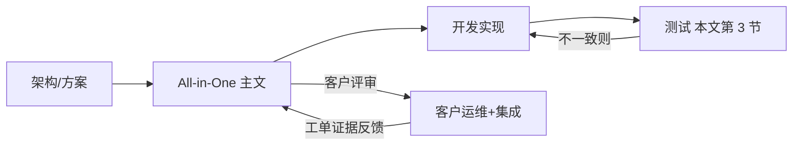

# KVC 客户视角 All-in-One：多角色对齐与横切闭环

本文是 [KV_CLIENT_CUSTOMER_ALLINONE.md](./KV_CLIENT_CUSTOMER_ALLINONE.md) 的 **配套篇**：主文从 **第一节（业务语境与 Case 映射）** 起聚焦 **现象、原则、码表、场景排障**；**谁读主文哪一段、各角色交付什么、测试如何覆盖主文场景、代码与设计如何与主文同步** 集中在本页。

**修订与对齐顺序**（本页约束各角色）：**客户（运维 + 业务集成与运行）→ 开发 → 测试 → 架构师 → 周边组件团队（URMA、OS、网络、etcd 等）→ PM**。其中 **与客户对齐为首要**。

---

## 1. 客户（优先对齐）

| 子角色 | 建议精读主文章节 | **需与 KVC 方共同确认（认同口径）** | **运行侧交付（排障时）** |
|--------|------------------|--------------------------------------|---------------------------|
| **客户运维** | **第一节 1.1～1.4**（与 Case 编号映射、主流程表）、**第二～七节**、**场景三（部署与扩缩容）**、**第十一节（粗算）** | etcd/Worker **就绪顺序**、变更窗与 **SLI** 口径；**不承诺**「毫秒 SLA 下必躲过 UB 检测窗」 | **变更时间线**、Pod/主机事件、**etcd 与网络监控**截图、**access log** 拉取、**nc/探针**、工单中可填 **业务流程/故障模式 Case 编号** |
| **业务集成与运行** | **第一节 1.3**（读写步骤与观测边界）、**第三～五节**、**场景一（TP99）～场景二（成功率）**、**「场景三·冷启动」**、**「场景三·扩缩容产品语义」** | **Init 顺序**、**timeout/重试**、**31/32 不当用户错误**；Get **access 码 0** 的语义（主文 **「第三节·Get 与 NOT_FOUND 陷阱」**） | 应用日志里 **Status 全文**、**TraceID**、业务监控 **KV 阶段** 成功率/TP99、复现 **时间段与实例列表** |

**客户内部分工口诀**：运维管 **拓扑、发布、基础设施大盘**；集成管 **SDK 用法、业务语义、应用日志与 SLI 拆分**。

---

## 2. 开发（KVC / SDK / Worker / Master）

| 事项 | 要求 |
|------|------|
| **与主文一致** | **`StatusCode` 语义**、**access log 行格式**（主文 **「3.2 单行格式（与实现一致）」**）、**Get 路径 NOT_FOUND→access 记 0**（主文 **「第三节·Get 与 NOT_FOUND 陷阱」**）、**31/32 产品语义**（主文 **「场景三·扩缩容产品语义」**）须与实现 **一致**；若实现变更，**同步改主文** 与对外 Release Note。 |
| **可观测** | **Init 失败**、关键路径错误应在客户端日志中 **可读到 Status/msg**；避免仅内部码无客户可见信息。 |
| **接口稳定** | 对外文档、控制台、报错提示中的 **码值与英文 msg** 与 `status.h` / 实际返回 **对齐**。 |

---

## 3. 测试（建议覆盖映射）

测试用例应能 **回放主文场景**，至少覆盖下列族（可在自动化或固定 DryRun 中落地）：

| 主文场景 | 建议覆盖要点 |
|----------|----------------|
| **场景一（TP99/时延）** | 仅 KV 劣化 vs 非 KV；**本机 / 跨机**；耗时 **贴 timeout**、**1001**；**URMA/UB** 相关码与长尾；主机 **CPU 饱和** |
| **场景二（成功率）** | **全局 vs 局部**；**数秒级切流/隔离窗**；**1001/1002**、**URMA 簇**；**NOT_READY**；Get **NOT_FOUND 与 access 0** 陷阱 |
| **场景三（部署与扩缩容）** | **Init 失败**（Worker 未就绪、错地址、短超时）；**本机无 Worker 连远端**；**etcd 不健康** 时行为；写路径 **32**、探活 **31**、**25**；Worker 日志关键词线索（主文 **「场景三·分层观测」**） |
| **第二节（方案四类）** | 通信重试与兜底、心跳切流、持久化恢复窗口、etcd 降级时 **读写与扩缩容预期** |
| **第一节 1.1～1.2 与 Case 清单** | 每个 **业务流程 Case 1～11**、**故障模式大类** 至少各 **1 条** 用例或 DryRun 字段对齐（工单可填 Case 编号） |

**验收**：任一 **已承诺** 的客户可见行为，均应有 **用例或 DryRun 记录** 对应；发现与主文矛盾时，**以是否发布为准** 修订主文或修缺陷。

---

## 4. 架构师

| 事项 | 说明 |
|------|------|
| **方案与主文** | 主文 **第二节** 四类能力与 **可靠性方案** 正文一致；变更方案时 **同步更新主文** 客户预期列。 |
| **SLI 与边界** | 精排/召排差异（主文 **第一节**）、**短 timeout vs 硬件/平台检测时延** 等 **不承诺项** 写入 **对外架构说明**，避免 PM/销售过度承诺。 |
| **可观测性缺口** | 同码多因、远端多跳不可见等 **硬约束**（主文 **第六节**）进入 **需求 backlog**，而非要求客户仅靠文档解决。 |

---

## 5. 周边组件团队（URMA、OS、TCP/网络、etcd 运维等）

| 团队 | 与主文的接口 |
|------|----------------|
| **URMA / UB** | 向客户与 KVC **提供** 可对接的 **指标与告警名**（端口、平面、Jetty、切换事件）；重大变更 **维护窗公告**。 |
| **OS / 主机** | 重启、OOM、时钟跳变、磁盘与 fd 等事件 **可关联到时间线**（主文 **第七节**、**场景二（成功率）**）。 |
| **网络 / 机房** | 安全组、交换机、跨 AZ 与 **TCP 统计** 支撑 **场景一 / 场景二** 表中「网络与机房」列的收窄。 |
| **etcd 运维** | **quorum/leader/延迟** 大盘与告警 **与客户运维可见口径对齐**（主文 **「场景三·分层观测」** L3）。 |

---

## 6. PM（产品 / 交付）

| 事项 | 说明 |
|------|------|
| **对外承诺** | 以主文 **第二节·客户预期** + **第七节·依赖** 为 **能力边界**；主文 **第六节** 为 **定界上限**（不能要求客户单靠码定根因）。 |
| **验收与赋能** | 客户能按主文 **第五节、第六节** 操作即交付合格的一阶；深度根因依赖 **KVC 平台与周边工单** 属正常。 |
| **版本材料** | 大版本附带 **「与 All-in-One 主文差异」**（若有）：新增码、改 access 行为、改 Init 要求。 |

---

## 7. 横切：代码 · 设计 · 主文 · 测试（闭环）

| 检查项 | 开发自检 | 测试核对 | 主文是否需改 |
|--------|----------|----------|----------------|
| 码表（主文 **第四节**）与 `status.h` | ✓ | 抽样 RPC | 版本变更时 |
| access 格式（主文 **「3.2 单行格式（与实现一致）」**） | ✓ | 落盘一行解析 | 字段变更时 |
| Get NOT_FOUND→0（主文 **「第三节·Get 与 NOT_FOUND 陷阱」**） | ✓ | 专用用例 | 行为变更时 |
| 31/32 语义（主文 **「场景三·扩缩容产品语义」**） | ✓ | HealthCheck / 写路径 | 产品变更时 |
| Init 失败可观测（主文 **「场景三·冷启动」**） | ✓ | 冷启动负例 | 日志文案变更时 |

---

## 修订记录

- 初版：由 `KV_CLIENT_CUSTOMER_ALLINONE.md` 原 **「第零章·多角色对齐」** 整章迁出；本页章节为 **第 1～7 节**；指向主文时用 **节名 / 场景名** 书写，避免 **§ 节号简写**。
