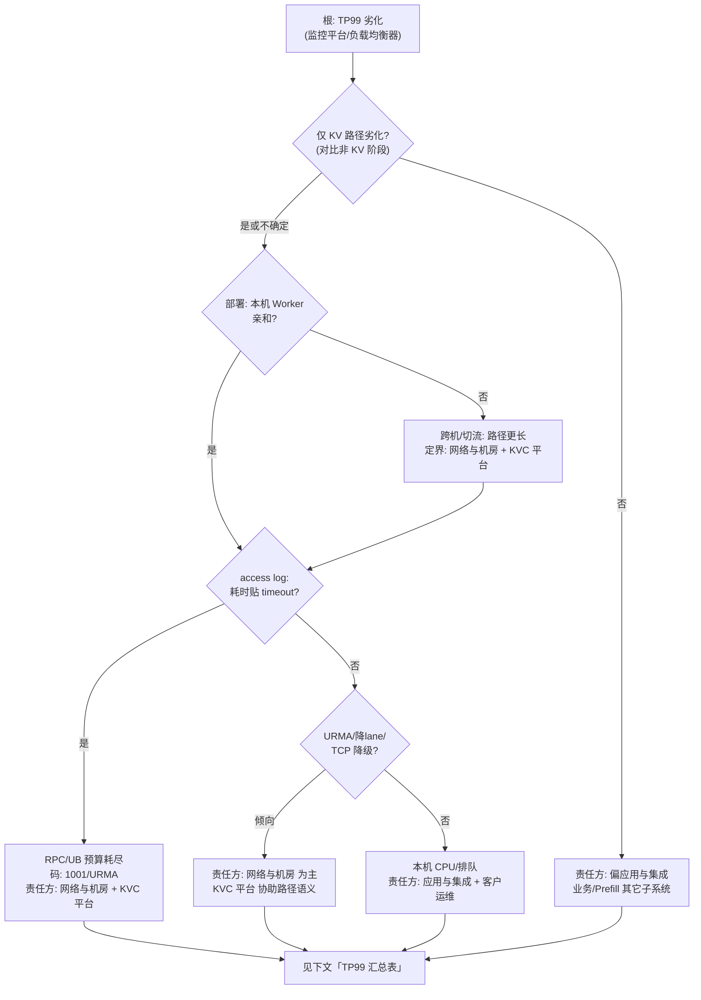
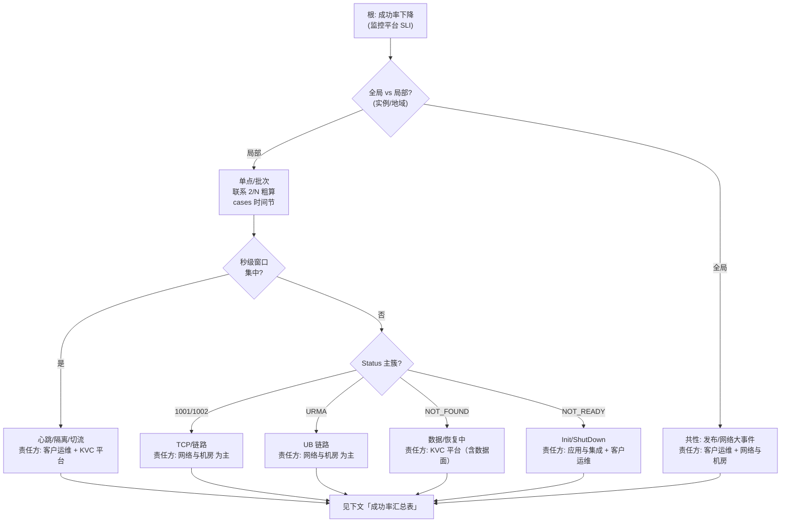

# KVC 故障检测与排查树（TP99 劣化 × 成功率下降）

本文给出 **树状** 的观测 → 定界 → **责任方** → **排查前影响** → **客户是否需措施 / 可采取措施**，与 [cases.md](./cases.md) 中 **DryRun** 逻辑（观测、定界定位）及 [KV_CLIENT_CLIENT_PERSPECTIVE_REPORTS.md](./KV_CLIENT_CLIENT_PERSPECTIVE_REPORTS.md) 部署场景对齐。

**责任方**（定界用，非法律含义，下文统一用全称，不写单字母代号）：

- **应用与集成**：客户业务与集成（应用代码、超时、线程模型）
- **客户运维**：发布、容量、主机/容器、编排与变更
- **网络与机房**：TCP/UB/交换机、广域与机房基础设施
- **KVC 平台**：Worker、SDK、etcd 元数据服务、数据面恢复、已知缺陷

**处理边界、故障定义、URMA/OS 指标分解、无法定界时的操作**：见 [KV_CLIENT_FAULT_SCOPE_AND_DEFINITIONS.md](./KV_CLIENT_FAULT_SCOPE_AND_DEFINITIONS.md)（与本文互补，**先读第三、四节** 再下树可避免无效排查）。

---

## 1. 与部署运维场景的对应（先选场景再下树）

| 部署/运维场景（见报告二 / cases 业务流程） | 读树时优先关注 |
|------------------------------------------|----------------|
| 本机有 Worker（亲和） | 先排除「跨机、切流」分支，再看本机资源与 SHM |
| 本机无 Worker / 跨节点读 | **跨机 TCP/UB**、元数据/拉取链更长，TP99 与成功率均易伤 |
| SDK 切流后连远端 | **秒级**切流窗口；责任方常需 **客户运维 + KVC 平台** 联合看心跳与路由 |
| 扩缩容 / Worker 故障恢复期 | **K_SCALING**、隔离 **2/N** 粗算；**客户运维 + 网络与机房 + KVC 平台** |
| **运维扩缩容/发布操作失败**（非单纯节点宕机） | **etcd 监控** + **access/应用日志** + **Worker/Master 日志关键词**（见 details **排查前置**）；以 **客户运维 + KVC 平台** 为主；详 [details/ops_deploy_scaling_failure_triage.md](./details/ops_deploy_scaling_failure_triage.md) 与 Playbook **「10. 运维部署与扩缩容操作失败排查」** |

---

## 2. 维度一：TP99 时延劣化（成功率可仍达标）

**典型口径**：召排、Prefill **长尾**；精排若未触发失败阈值也可能先表现为 **TP99** 变差。

### 2.1 树状流程（Mermaid）

### 2.2 分步说明（观测 → 定界 → 责任方）

| 观测顺序 | 观测 | 定界结论 | 责任方 |
|----------|------|----------|--------|
| 先 | 监控平台：KV 相关 TP99 升；负载均衡器：业务实例级时延 | 是否 **仅 KV** 阶段劣化（对比同请求内其它阶段） | 非仅 KV → **应用与集成**；仅 KV → 继续 |
| 次 | 报告二场景：本机亲和 vs 跨机/切流 | 跨机/切流 → 路径跳数与 UB 参与增加 | **网络与机房 + KVC 平台**（链路 + 平台路径） |
| 再 | `ds_client_access_*.log`：`DS_KV_CLIENT_GET` 的 **microseconds**、**timeout** 字段 | 耗时是否贴近配置 timeout | 贴 timeout → **网络与机房 + KVC 平台**（网络/UB/预算） |
| 再 | Status：`K_URMA_*`、`K_URMA_TRY_AGAIN`；基础设施 UB 指标 | UB 降 lane、Jetty、平面切换 | **网络与机房** 为主，**KVC 平台** 协助确认是否预期降级 |
| 后 | 主机/容器 CPU、排队 | 无网络特征时 CPU 打满 | **应用与集成**（线程/并发）或 **客户运维**（规格） |

### 2.3 排查前影响与客户措施（TP99 维）

| 定界结果 | 排查前对客户的影响（示例） | 是否需客户先采取措施 | 可采取措施（示例） |
|----------|----------------------------|------------------------|----------------------|
| 偏 **应用与集成**（非 KV 或应用逻辑） | 整体 E2E 长尾，KV 未必坏 | 是，先自查业务 | 拆分阶段耗时、优化非 KV 逻辑；KV 超时合理配置 |
| **网络与机房**（网络/UB） | 召排 TP99、Prefill 长尾；精排可能随后出现失败 | 视 SLA：可先 **限流/降级** 非关键读 | 配合网络侧抓包/指标；临时调大 timeout（权衡尾延迟） |
| **KVC 平台**（平台路径/切流） | 秒级切流窗口内长尾 | 一般 **等自动切流**；持续则工单 | 收集 SDK Worker IP:Port、TraceID；避免全集群盲 grep |
| **客户运维**（容量） | 实例 CPU/内存饱和导致排队 | 是 | 扩容实例、滚动发布缓解 |

---

## 3. 维度二：读写请求成功率下降

**典型口径**：精排 **E2E 失败率**；召排也可能出现 **KV Get 成功率** 独立下降。

### 3.1 树状流程（Mermaid）

### 3.2 分步说明（观测 → 定界 → 责任方）

| 观测顺序 | 观测 | 定界结论 | 责任方 |
|----------|------|----------|--------|
| 先 | 成功率曲线：**全局**下滑 vs **少数实例** | 局部 → 单点 Worker/网络端口；全局 → 发布或广域网络 | **客户运维 + 网络与机房** |
| 次 | 与 **cases** 单点粗算：是否在 **3s** 级窗口、**5s** 监控桶 | 符合 → 与隔离/切流一致 | **客户运维 + KVC 平台** |
| 再 | SDK：`K_RPC_DEADLINE_EXCEEDED` / `K_RPC_UNAVAILABLE` | TCP 路径、交换机、网卡 | **网络与机房** |
| 再 | SDK：`K_URMA_*` + Predictor 日志 URMA Error | UB 端口/芯片/交换机 | **网络与机房** |
| 再 | `K_NOT_FOUND` 批量：非 key 不存在 | 恢复中、分片未就绪 | **KVC 平台**（**客户运维** 同步观察扩容） |
| 后 | `K_NOT_READY` | 未 Init、并发 ShutDown | **应用与集成**（代码顺序）或 **客户运维**（编排） |

### 3.3 排查前影响与客户措施（成功率维）

| 定界结果 | 排查前对客户的影响（示例） | 是否需客户先采取措施 | 可采取措施（示例） |
|----------|----------------------------|------------------------|----------------------|
| **网络与机房**（TCP/UB 硬故障） | 精排 E2E 失败升；召排子路径大量失败 | 若业务可切 **降级路径**（不读 KV）可临时打开 | 网络工单；侧翼验证单网卡/UB 口 |
| **KVC 平台**（Worker/恢复） | 秒级～分钟级成功率坑 | 通常 **观察自动恢复**；超窗口则工单 | 提供 TraceID、时间窗、实例列表 |
| **客户运维**（发布/误操作） | 与发布时间对齐的陡降 | 是 | **回滚**、扩容、暂停变更 |
| **应用与集成**（未就绪） | 启动期大量失败 | 是 | 修正 Init 顺序与健康检查门禁 |

---

## 4. 汇总：影响 × 措施速查（两维共用）

| 现象根因（责任方） | 排查前典型影响 | 客户是否必须先动 | 常见措施 |
|--------------------|----------------|------------------|----------|
| **应用与集成** | 误用 API、超时过短、未 Init | 是 | 改代码/配置、对齐报告一错误码 |
| **客户运维** | 实例OOM、错误发布、维护窗口 | 视严重度 | 回滚、扩容、维护通知 |
| **网络与机房** | 双维均伤；成功率更敏感 | 常与运营商/机房协同 | 抓包、端口与交换机工单 |
| **KVC 平台** | 切流、恢复、etcd 控制面 | 多数 **观察自愈** | 工单 + 日志包（限定 Worker） |

---

## 5. 与 DryRun 模板字段的对应

| cases DryRun 字段 | 在本树中的位置 |
|-------------------|----------------|
| 观测到的现象 | **TP99 维度** / **成功率维度** 各小节「分步说明」中的「观测」列 |
| 定界（大类） | 「定界结论」+ **责任方** |
| 定位步骤 Step1–4 | 与 [cases.md](./cases.md) DryRun 样例一致，可套入两棵树叶子节点 |
| 与精排/召排差异 | **TP99 维度** / **成功率维度** 小节「排查前影响与客户措施」中的「影响」列 |

---

## 6. 相关文档

- [KV_CLIENT_FAULT_SCOPE_AND_DEFINITIONS.md](./KV_CLIENT_FAULT_SCOPE_AND_DEFINITIONS.md)：故障定义、处理约束、URMA/OS 指标、客户配合、无法定界时操作  
- [KV_CLIENT_TRIAGE_PLAYBOOK.md](./KV_CLIENT_TRIAGE_PLAYBOOK.md)：错误码与 access log 实操  
- [KV_CLIENT_CLIENT_PERSPECTIVE_REPORTS.md](./KV_CLIENT_CLIENT_PERSPECTIVE_REPORTS.md)：报告一～三  
- [cases.md](./cases.md)：业务流程、故障模式、**时间粗算**、DryRun 样例  
- [KV_CLIENT_E2E_FRAMEWORK_AND_TRIAGE.md](./KV_CLIENT_E2E_FRAMEWORK_AND_TRIAGE.md)：E2E 六项与 L1–L5  

---

## 修订记录

- 初版：双维树状排查（TP99 × 成功率）、责任方四象限、影响与措施表；与 cases DryRun 对齐。
- 补充：与 [KV_CLIENT_FAULT_SCOPE_AND_DEFINITIONS.md](./KV_CLIENT_FAULT_SCOPE_AND_DEFINITIONS.md) 交叉引用（边界、故障定义、URMA/OS 指标）。
- 修订：**责任方**与正文统一为 **应用与集成 / 客户运维 / 网络与机房 / KVC 平台** 全称，不再使用单字母代号；分步表用「先/次/再/后」替代数字步骤号指代。
