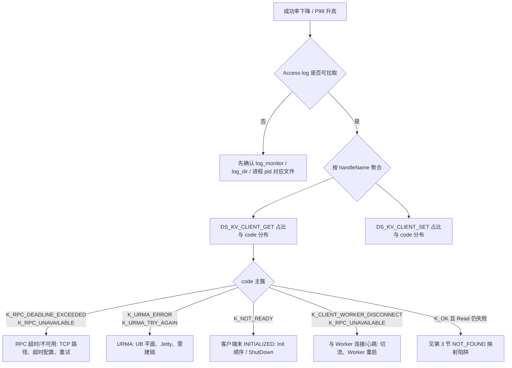

# KVClient 定位定界自导（错误码 / 观测指标 ↔ Access Log）

本文面向 **集成 KVC SDK 的业务进程**，帮助从 **Status 错误码**、**外部监控** 出发，结合 **`ds_client_access_<pid>.log`（或环境变量覆盖名）** 中的字段做定界；并标出 access log 的 **已知语义陷阱**。

**同目录归档**：PlantUML 流程图见 [diagrams/](./diagrams/)；P99/成功率与部署场景报告见 [KV_CLIENT_CLIENT_PERSPECTIVE_REPORTS.md](./KV_CLIENT_CLIENT_PERSPECTIVE_REPORTS.md)。

---

## 1. 客户端 Access Log 长什么样

### 1.1 启用条件

- 依赖 gflags：`log_monitor=true`（客户端默认倾向开启，以运行环境为准）。
- `AccessRecorderManager::Init` 成功；否则 access 记录可能不落盘或报 `AccessRecorder is not init`。

### 1.2 文件位置与命名

- 默认路径：`{log_dir}/ds_client_access_{pid}.log`
- 文件名可通过环境变量 **`DATASYSTEM_CLIENT_ACCESS_LOG_NAME`** 覆盖（见 `logging.h` 中 `ACCESS_LOG_NAME_ENV`）。
- `log_dir` 由日志模块配置（`FLAGS_log_dir`）。

### 1.3 单行格式（与代码一致）

`AccessRecorderManager::LogPerformance` 写入的文本为：

```text
<code> | <handleName> | <microseconds> | <dataSize> | <reqMsg> | <respMsg>
```

| 字段 | 含义 |
|------|------|
| `code` | 记录用的 **整型 StatusCode**（见 `include/datasystem/utils/status.h`） |
| `handleName` | 访问点枚举名字符串，KV 侧为 `DS_KV_CLIENT_GET`、`DS_KV_CLIENT_SET` 等（见 `access_point.def`） |
| `microseconds` | **该次 API 调用耗时**（客户端侧从构造 `AccessRecorder` 到 `Record`） |
| `dataSize` | 各 API 自定义：如 value 长度、批量 key 数、buffer 个数等 |
| `reqMsg` | `RequestParam::ToString()`，含 `Object_key`、`timeout`、`Write_mode`、`ttl_second`、`cacheType` 等 |
| `respMsg` | `Status::GetMsg()`，错误时多为英文短语或底层拼接信息 |

**请求参数字段拼法**见 `RequestParam::ToString()`（`access_recorder.cpp`）：非空字段以 `key:value` 形式出现在花括号内，例如：

```text
{Object_key:xxx,timeout:20,}
```

---

## 2. KV 侧 `handleName`（AccessRecorderKey）一览

定义见 `src/datasystem/common/log/access_point.def`，KV 客户端当前包含：

| handleName | 典型 API |
|------------|----------|
| `DS_KV_CLIENT_CREATE` | `KVClient::Create` |
| `DS_KV_CLIENT_MCREATE` | `KVClient::MCreate` |
| `DS_KV_CLIENT_SET` | `Set`（含 string / Buffer / GenerateKey） |
| `DS_KV_CLIENT_MSET` | `MSet(buffers)` |
| `DS_KV_CLIENT_MSETNX` | `MSetTx` / `MSet`（多 key string） |
| `DS_KV_CLIENT_GET` | 各类 `Get` / `Read` |
| `DS_KV_CLIENT_DELETE` | `Del` |
| `DS_KV_CLIENT_EXPIRE` | `Expire` |

> **注意**：`UpdateToken` / `UpdateAkSk` 在 `kv_client.cpp` 中未挂 `DS_KV_*` access 点；排障需依赖应用日志或其它埋点。

---

## 3. 必读陷阱：Get 类 API 与 `K_NOT_FOUND`

在 `kv_client.cpp` 中，多条 **Get / Read** 路径在写 access log 时把 **`K_NOT_FOUND` 映射为 `K_OK`（0）** 再 `Record`，目的是不把「业务语义上的未找到」记成错误；但 **`respMsg` 仍可能携带原始信息**。

**影响**：在 `DS_KV_CLIENT_GET` 行里 **`code` 为 `K_OK` 对应数值 `0` 时，不一定表示「读成功且 key 存在」**，也可能表示 **key 不存在**。

**自导动作**：

1. 若业务监控是「读失败率」而 access log 大量 **`K_OK`（第一列 `0`）| `DS_KV_CLIENT_GET`**，需用 **业务返回码**、**应用日志** 或 **Worker 侧** `DS_POSIX_GET` 区分「未找到」与「真成功」。
2. 区分 **链路错误**：链路错误 **不会** 被映射成 0，仍会保留 `K_RPC_DEADLINE_EXCEEDED`、`K_RPC_UNAVAILABLE`、`K_URMA_*` 等。

---

## 4. 定位定界自导流程（从现象到下一步）

### 4.1 从监控指标切入



**部署冷启动**：若现象是 **业务进程无法完成 `KVClient::Init`**、**几乎无 `DS_KV_CLIENT_*` 行**（或仅有启动期错误），不要强行依赖本图「成功率 / access log」路径；见本文 **「10. 运维部署与扩缩容操作失败排查」** 冷启动要点与 [details/ops_deploy_scaling_failure_triage.md](./details/ops_deploy_scaling_failure_triage.md) **「0. 部署冷启动」**（本机无 Worker 时需连 **远端** 或服务发现）。

### 4.2 从错误码切入（与亲和方向）

以下按 **客户端最终可见 `StatusCode` 枚举** 归类（`include/datasystem/utils/status.h`）；同一枚举值可能对应多种根因，需结合 **`microseconds`（是否贴超时）**、`timeout` 请求参数、`respMsg` 关键词。access log **第一列仍为整型数值**，与下表 **数值** 列对应。

| `StatusCode` | 数值 | 优先怀疑方向 | Access log 中看什么 |
|--------------|------|----------------|---------------------|
| `K_OK` | `0` | 成功（或 Get 被映射的 `K_NOT_FOUND`，见第 3 节） | `microseconds` 是否异常高 |
| `K_NOT_READY` | `8` | 未 `Init`、正在 ShutDown、AccessRecorder 未就绪 | 启动编排、是否并发调 API |
| `K_CLIENT_WORKER_DISCONNECT` | `23` | 首心跳失败、Worker 进程/容器退出 | 时间点与 Worker 重启是否对齐 |
| `K_RPC_DEADLINE_EXCEEDED` | `1001` | RPC 预算耗尽：网络抖动、跨节点、拥塞 | `timeout` 字段、耗时是否接近配置 |
| `K_RPC_UNAVAILABLE` | `1002` | **传输/等待类「桶」**：ZMQ 建连超时、等回复超时（部分由 `K_TRY_AGAIN` 改写）、网关报错、socket reset、强制 SHM/UDS 失败等；**不等于 URMA 根因** | **`respMsg` 关键词**（见 [details/rpc_unavailable_triggers_and_urma_vs_transport.md](./details/rpc_unavailable_triggers_and_urma_vs_transport.md)）+ Worker 日志；URMA 瞬时优先对照 **`K_URMA_TRY_AGAIN` / `K_URMA_NEED_CONNECT`** |
| `K_URMA_ERROR` | `1004` | UB/URMA 硬件或驱动路径 | Worker 侧 URMA 日志；是否需 TCP 降级 |
| `K_URMA_NEED_CONNECT` | `1006` | URMA 会话需重建 | 切流后建链窗口 |
| `K_URMA_TRY_AGAIN` | `1008` | URMA 瞬时失败可重试 | 是否与抖动监控同步 |
| `K_TRY_AGAIN` | `19` | 服务端忙、迁移中 | 是否伴随 `K_SCALING`（二者无强制绑定，见 details） |
| `K_SCALING` | `32` | 扩缩容/迁移（Worker 侧主要见 **MultiPublish 元数据路径**）；**产品语义上对用户透明**（元数据重定向、不中断） | **并非所有 API 都会在顶层 Status 出现**；`MultiPublish` 会重试 **`K_SCALING`**，`Get` 批量路径可能落在 `last_rc` 而顶层仍 `K_OK` — 推导见 [details/scaling_scale_down_client_paths.md](./details/scaling_scale_down_client_paths.md)；**业务勿当用户可见错误** — 见 **「4.3」** |
| `K_SCALE_DOWN` | `31` | 缩容、**节点退出**；**产品语义上非终端用户操作项** | **`HealthCheck` 可直接返回 `K_SCALE_DOWN`**；迁移 RPC 亦可带 **`K_SCALE_DOWN`** — 同上 details；**探活/LB 切流** — 见 **「4.3」** |
| `K_MASTER_TIMEOUT` | `25` | **Master / 远端元数据节点**不可达或会话中断（含部分 etcd 集群管理路径） | 与 **发布、扩缩容、网络分区** 对齐；详 **「10」**、[details/ops_deploy_scaling_failure_triage.md](./details/ops_deploy_scaling_failure_triage.md) |
| `K_NOT_FOUND` | `3` | key 不存在（**部分 Get 路径在 log 中记成 `K_OK`/`0`**） | 见第 3 节 |
| `K_RUNTIME_ERROR` | `5` | mmap、内部异常、`DispatchKVSync` 异常 | `respMsg` 全文 |
| `K_CLIENT_WORKER_VERSION_MISMATCH` | `28` | 二进制版本不一致 | 发布与滚动升级 |

Worker 侧 **同一次 RPC** 往往在服务端有 **`DS_POSIX_GET` / `DS_POSIX_PUBLISH`** 等 access 行，可用 **时间戳 + TraceID**（若业务打开 Trace）关联。

### 4.3 集成方 / 业务侧该怎么应对（含扩缩容产品语义）

**产品语义（与用户业务无关）**：扩缩容在逻辑上依赖 **元数据重定向**，目标是对业务 **不中断**；**`K_SCALE_DOWN` / `K_SCALING` 不应被设计成常态业务分支**（例如不要写「若 `StatusCode` 为 `K_SCALING` 则通知用户扩容」这类流程）。客户端若短暂看到相关枚举，多属于 **窗口期实现细节** 或与 **运维探活（HealthCheck）** 对齐，而不是「用户要操作」的信号。

| 场景 / `StatusCode` | 建议动作（业务 / 集成） |
|---------------------|-------------------------|
| **`K_SCALE_DOWN`** | **勿当业务错误处理**。常见于 **`HealthCheck` 探活**：应让 **负载均衡 / 路由 / 实例列表** 将流量切离正在退出的 Worker；普通读写路径若偶发，可 **换端点或短暂重试**（视部署是否多副本）。 |
| **`K_SCALING`** | **勿当业务错误处理**。`MultiPublish` 等写路径 SDK **已把 `K_SCALING` 纳入重试**；业务层一般 **无需额外分支**，只需配置合理 **超时与幂等**。读路径若仅在 **per-object `last_rc`** 出现而顶层 `K_OK`，应以 **对象级返回值** 为准，而不是 access log 顶层 `code`。 |
| **`K_RPC_DEADLINE_EXCEEDED` / `K_RPC_UNAVAILABLE` / `K_TRY_AGAIN` / `K_URMA_TRY_AGAIN`** | **有界退避重试**（指数退避 + 上限）；仍失败则结合 `respMsg`、Worker 日志与网络/UB 指标定界（见 **「4.2」**、**「7」**）。 |
| **`K_URMA_NEED_CONNECT`** | 多为 **URMA 会话重建窗口**：短暂重试；持续则查切流与 Worker URMA 日志。 |
| **`K_URMA_ERROR`** | 视为 **UB/URMA 硬错误**；可尝试 **TCP 降级路径**（若部署支持）或 **运维介入**；不建议无限盲重试。 |
| **`K_CLIENT_WORKER_DISCONNECT`** | **连接/心跳类**：检查 Worker 存活、网络、是否滚动重启；必要时 **重建客户端或重连**。 |
| **`K_NOT_READY`** | **未完成 `Init` 或正在关闭**：修正 **启动顺序**、避免 ShutDown 后仍调 API。 |
| **`K_CLIENT_WORKER_VERSION_MISMATCH`** | **版本不一致**：统一 **Client / Worker 二进制版本**。 |
| **`K_NOT_FOUND` / `K_OK`（Get 陷阱）** | **业务语义「未找到」**：勿与链路失败混谈；见 **第 3 节** `K_NOT_FOUND` 记成 `K_OK` 的 access 陷阱。 |
| **`K_RUNTIME_ERROR`** | **`respMsg` 全文** + Worker / 核心日志；多为 **内部异常**，需个案分析。 |

**小结**：对 **`K_SCALE_DOWN` / `K_SCALING`**，集成方应把精力放在 **路由与探活**、**写操作超时与幂等**，而不是向终端用户暴露「集群在扩缩容」；与 **`K_RPC_DEADLINE_EXCEEDED` / `K_RPC_UNAVAILABLE`** 等链路类枚举的应对不同。

---

## 5. 与观测指标的对应关系（建议）

| 你关心的指标 | Access log 中可佐证的内容 |
|--------------|---------------------------|
| **P99 时延** | 同一 `handleName` 的 **`microseconds` 分位数**；与 `timeout` 参数对比 |
| **读成功率** | **`DS_KV_CLIENT_GET` 的 code 分布**；注意 **NOT_FOUND→0** 陷阱 |
| **写成功率** | **`DS_KV_CLIENT_SET` / `MSET*`** 的 code 与 `respMsg` |
| **切流/远端** | 心跳相关 **`K_CLIENT_WORKER_DISCONNECT`**、RPC **`K_RPC_DEADLINE_EXCEEDED` / `K_RPC_UNAVAILABLE`** 在时间上的突发 |

---

## 6. 实用 grep / 分析示例（在 client access log 上）

以下仅示例，路径请换成本环境 `log_dir`：

```bash
# 只看 KV Get 行
grep "DS_KV_CLIENT_GET" ds_client_access_12345.log

# 统计 Get 的错误码出现次数（第一列）
grep "DS_KV_CLIENT_GET" ds_client_access_12345.log | awk -F'|' '{gsub(/^[ \t]+|[ \t]+$/,"",$1); print $1}' | sort | uniq -c | sort -nr

# 拉出 RPC 超时（日志第一列为整型：`1001` = `K_RPC_DEADLINE_EXCEEDED`）
grep "DS_KV_CLIENT_GET" ds_client_access_12345.log | grep "^1001 |"
```

---

## 7. 何时 access log 不够，需要其它手段

| 情况 | 建议 |
|------|------|
| 大量 **`K_RPC_DEADLINE_EXCEEDED` / `K_RPC_UNAVAILABLE`**（日志列多为 `1001`/`1002`）但无法区分 TCP 与 UB | 网卡/交换机/UB 端口指标；抓包；Worker 侧 URMA 明细 |
| **`K_OK`（`0`）| `DS_KV_CLIENT_GET`** 但业务仍报失败 | 第 3 节 `K_NOT_FOUND` 映射；业务返回值 |
| 仅部分 key 失败 | Worker `GetRsp` 级日志或 `DS_POSIX_GET`；元数据分片归属 |
| etcd / 控制面问题但 client 码不直观 | 运维 etcd 监控；Master 相关 **`K_MASTER_TIMEOUT`** 等 |
| **发布 / Worker 扩缩容窗口** 内写失败、**`K_SCALING`** 持续、**`K_SCALE_DOWN`** 与迁移异常、与 etcd 维护重叠 | **「10」** 与 [details/ops_deploy_scaling_failure_triage.md](./details/ops_deploy_scaling_failure_triage.md) |
| **TP99 升 / 成功率掉**，access 主簇仅为 **`K_RPC_DEADLINE_EXCEEDED` / `K_RPC_UNAVAILABLE`**，需判断 **Worker 排队、SHM、etcd、二级存储** | Worker **`resource.log`**（`log_monitor`）：线程池 **waiting**、**SHM rate**、**etcd 成功率/队列**、**OBS 成功率**、OC **命中拆分**；与 **`requestout.log`** 对齐；详见 [details/worker_resource_log_triage.md](./details/worker_resource_log_triage.md) |

---

## 8. 相关源码索引（便于核对）

| 内容 | 路径 |
|------|------|
| 单行格式 | `src/datasystem/common/log/access_recorder.cpp` → `LogPerformance` |
| `RequestParam` 序列化 | `src/datasystem/common/log/access_recorder.cpp` → `RequestParam::ToString` |
| KV 埋点与 NOT_FOUND 映射 | `src/datasystem/client/kv_cache/kv_client.cpp` |
| 枚举名 `DS_KV_CLIENT_*` | `src/datasystem/common/log/access_point.def` |
| Status 枚举 | `include/datasystem/utils/status.h` |
| **K_SCALING / K_SCALE_DOWN 客户端可见性推导** | [details/scaling_scale_down_client_paths.md](./details/scaling_scale_down_client_paths.md) 与 [details/scaling_scale_down_sequences.puml](./details/scaling_scale_down_sequences.puml) |
| **K_RPC_UNAVAILABLE 触发 Case 与 URMA 码分层** | [details/rpc_unavailable_triggers_and_urma_vs_transport.md](./details/rpc_unavailable_triggers_and_urma_vs_transport.md) |
| **运维部署 / 扩缩容操作失败排查** | [details/ops_deploy_scaling_failure_triage.md](./details/ops_deploy_scaling_failure_triage.md)（Playbook **「10」** 摘要） |
| **Worker `resource.log` 字段顺序与定界** | [details/worker_resource_log_triage.md](./details/worker_resource_log_triage.md)（对齐 [官方日志附录](https://pages.openeuler.openatom.cn/openyuanrong-datasystem/docs/zh-cn/latest/appendix/log_guide.html)） |

---

## 9. 修订记录

- 初版：基于当前仓库 `kv_client.cpp` / `access_recorder.cpp` 行为整理；**Get 路径 NOT_FOUND→access 码 0** 为排障关键前提。
- 补充 **「10」** 与 [details/ops_deploy_scaling_failure_triage.md](./details/ops_deploy_scaling_failure_triage.md)：运维扩缩容/部署失败；**以监控与日志分层为主**，实现细节见 details 正文。
- 修订：**错误码以 `StatusCode` 枚举名为准** 书写；access 第一列仍为整型，表中附 **数值** 对照。
- 补充 Worker **`resource.log`** 与官方日志附录的对照及定界用法：[details/worker_resource_log_triage.md](./details/worker_resource_log_triage.md)。

---

## 10. 运维部署与扩缩容操作失败排查（要点）

与 **有机故障**（宕机、断网）并列的一大类是：**运维主动变更未闭环** 或 **控制面在变更期异常**；另一类是 **冷启动** 时 **业务（集成 SDK）+ Worker** 的 **初始化与建链**（含 **本机无 Worker、必须访问远端 Worker**）。能力边界见 [FAULT_HANDLING_AND_DATA_RELIABILITY.md](./FAULT_HANDLING_AND_DATA_RELIABILITY.md) **「第四节」**（etcd 异常时扩缩容/隔离受阻）。**详文与流程图**：[details/ops_deploy_scaling_failure_triage.md](./details/ops_deploy_scaling_failure_triage.md)。

**冷启动（`Init` 失败、无 access log 或仅有启动日志）**

1. **Worker 是否已监听**、业务机到 **`ip:port` 是否可达**（安全组 / 跨机路由）；编排上 **Worker Ready 先于业务** 或 **重试 Init**。  
2. **拓扑**：[cases.md](./cases.md) 中 **本机无 Worker、跨节点读** 等部署时，禁止误配 **localhost**；用 **远端地址** 或 **服务发现**（`ObjectClientImpl::Init` 中 `SelectWorker`）。  
3. **`connectTimeoutMs` / `requestTimeoutMs`**：跨机首连宜留足余量。  
4. 建链细节（Register、UDS、SHM fd）：[CLIENT_WORKER_AND_WORKER_WORKER_LINK_FAILURE_ANALYSIS.md](./CLIENT_WORKER_AND_WORKER_WORKER_LINK_FAILURE_ANALYSIS.md)。

**运行中变更（与 details「运行中变更」流程图一致；一线先看文内「排查前置」分层）**

1. **对齐时间线**：发布、Worker 上下线、自愿缩容、etcd 窗口。  
2. **etcd 是否健康可写**：否 → 优先恢复 etcd；客户端现象可能「糊」，勿只在 SDK 上打转。  
3. **大量 `K_SCALING` / Master 路径 `K_MASTER_TIMEOUT`**：元数据 **moving / scaling** 与 MultiPublish、CreateMultiMeta 链 —— 查 Master、Worker 相关日志。  
4. **`K_SCALE_DOWN` / 迁移失败**：缩容退出路径 —— **LB 切离** + Worker **HashRing / scale task / migrate** 日志（如 `Scale down failed`、`del_node_info` 是否卡住）。  
5. **日志出现「无可用节点放弃自愿缩容」**：编排与集群容量 —— **客户运维 + KVC Workers**。  
6. 仍不清 → 回到 **「4.2」** 通用码表与 [KV_CLIENT_FAULT_TRIAGE_TREE.md](./KV_CLIENT_FAULT_TRIAGE_TREE.md)。

**产品语义**：业务侧仍按 **「4.3」**，不把 **`K_SCALE_DOWN` / `K_SCALING`** 当用户操作项；排障目标是 **恢复控制面与任务完成**（冷启动则是 **可达性与编排顺序**）。
