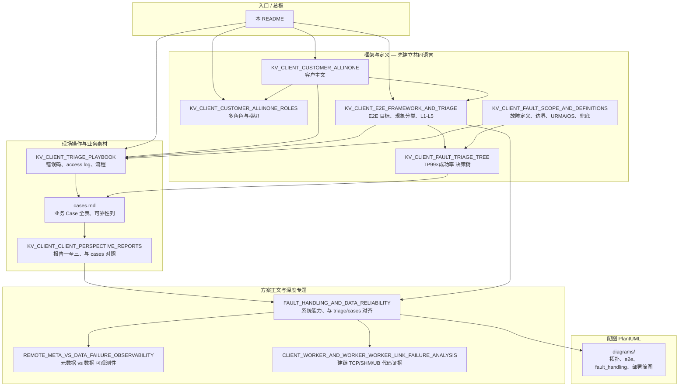

# KV 客户端可观测性与定位定界

本目录是 **KVClient / SDK 侧** 的故障定位、定界与可靠性材料合集，与业务监控（成功率、P99）、Worker 日志、基础设施指标配合使用。

---

## 先选你要做的事（30 秒）

下表 **各行独立**，无固定先后；需要「从哪读起」见下文 **推荐阅读路径**。

| 你想… | 先读 |
|--------|------|
| **客户视角 All-in-One 主文（原则、码表、Case 映射、三场景）** | [KV_CLIENT_CUSTOMER_ALLINONE.md](./KV_CLIENT_CUSTOMER_ALLINONE.md) |
| **All-in-One 配套：多角色对齐、测试映射、横切闭环** | [KV_CLIENT_CUSTOMER_ALLINONE_ROLES.md](./KV_CLIENT_CUSTOMER_ALLINONE_ROLES.md) |
| **搞清这些文档各管什么、从哪份开始** | **本文「文档关系示意图」+「推荐阅读路径」** |
| **按现象排障（TP99、成功率、错误码）** | [KV_CLIENT_TRIAGE_PLAYBOOK.md](./KV_CLIENT_TRIAGE_PLAYBOOK.md) → 需要时再查 [cases.md](./cases.md) |
| **对齐 E2E 目标与客户视角框架** | [KV_CLIENT_E2E_FRAMEWORK_AND_TRIAGE.md](./KV_CLIENT_E2E_FRAMEWORK_AND_TRIAGE.md) |
| **看业务 Case 与可靠性表** | [`docs/reliability/00-kv-client-fema-index.md`](../../docs/reliability/00-kv-client-fema-index.md)（结构化分册）；导航仍可从 [cases.md](./cases.md) 进入 + [KV_CLIENT_CLIENT_PERSPECTIVE_REPORTS.md](./KV_CLIENT_CLIENT_PERSPECTIVE_REPORTS.md) |
| **看「故障处理方案」正文与和 cases 的对齐** | [FAULT_HANDLING_AND_DATA_RELIABILITY.md](./FAULT_HANDLING_AND_DATA_RELIABILITY.md) + [diagrams/](./diagrams/) 里 `fault_handling_*.puml` |
| **抠 Client/Worker 建链、TCP/UB 代码行为** | [CLIENT_WORKER_AND_WORKER_WORKER_LINK_FAILURE_ANALYSIS.md](./CLIENT_WORKER_AND_WORKER_WORKER_LINK_FAILURE_ANALYSIS.md) |
| **定界边界、定义、URMA vs OS、兜底** | [KV_CLIENT_FAULT_SCOPE_AND_DEFINITIONS.md](./KV_CLIENT_FAULT_SCOPE_AND_DEFINITIONS.md) |
| **元数据失败 vs 数据面失败怎么区分** | [REMOTE_META_VS_DATA_FAILURE_OBSERVABILITY.md](./REMOTE_META_VS_DATA_FAILURE_OBSERVABILITY.md) |
| **TP99×成功率 树状决策** | [KV_CLIENT_FAULT_TRIAGE_TREE.md](./KV_CLIENT_FAULT_TRIAGE_TREE.md)（建议先读 SCOPE **第三、四节**：边界与指标） |

---

## 文档关系示意图（逻辑，非物理目录）

下面用 **依赖 / 扩展** 关系串起来：上层是「框架与定义」，中层是「操作与 Case」，下层是「方案正文与深度专题」，右侧是「配图」。

**读图要点**

- **L1** 解决「词是什么意思、能查到什么地步」；**L2** 解决「今天线上怎么下手」；**L3** 解决「方案承诺什么、和代码/观测差在哪」。
- **FH（故障处理方案）** 是方案主干；**CASES / REPORT** 是业务侧证据；**LINK** 是建链专题，**不替代** FH，而是补「代码里到底有没有建链失败机制」。
- **diagrams** 里的 `fault_handling_*.puml` 与 **FH「第六节」**、**cases 可靠性列** 同一故事线，适合汇报用图。

同构关系另有一份 **PlantUML**（便于只支持 puml 的工具渲染）：[diagrams/kv_client_triage_doc_map.puml](./diagrams/kv_client_triage_doc_map.puml)。

---

## 推荐阅读路径

下列 **四条路径** 按场景 **择一**；路径内用 **① → ② → ③** 表示建议先后（非编号代号）。

### 路径：客户汇报 / 一体化（可选）

① [KV_CLIENT_CUSTOMER_ALLINONE.md](./KV_CLIENT_CUSTOMER_ALLINONE.md)（主干）→ ② 开发/测试/PM 分工与横切见 [KV_CLIENT_CUSTOMER_ALLINONE_ROLES.md](./KV_CLIENT_CUSTOMER_ALLINONE_ROLES.md)。

### 路径：第一次进目录（建立心智模型）

① [KV_CLIENT_E2E_FRAMEWORK_AND_TRIAGE.md](./KV_CLIENT_E2E_FRAMEWORK_AND_TRIAGE.md)（前半：目标与分类）  
② [KV_CLIENT_FAULT_SCOPE_AND_DEFINITIONS.md](./KV_CLIENT_FAULT_SCOPE_AND_DEFINITIONS.md)（**第三、四节**：边界与指标）  
③ [FAULT_HANDLING_AND_DATA_RELIABILITY.md](./FAULT_HANDLING_AND_DATA_RELIABILITY.md)（浏览目录 + **「第五节」与 triage 对齐说明**）  
④ [cases.md](./cases.md)（扫一眼表格结构即可）

### 路径：线上排障（最短）

① [KV_CLIENT_TRIAGE_PLAYBOOK.md](./KV_CLIENT_TRIAGE_PLAYBOOK.md)  
② 需要定界时：[KV_CLIENT_FAULT_TRIAGE_TREE.md](./KV_CLIENT_FAULT_TRIAGE_TREE.md) 或 [KV_CLIENT_FAULT_SCOPE_AND_DEFINITIONS.md](./KV_CLIENT_FAULT_SCOPE_AND_DEFINITIONS.md)  
③ 需要对照业务承诺：[cases.md](./cases.md) + [FAULT_HANDLING_AND_DATA_RELIABILITY.md](./FAULT_HANDLING_AND_DATA_RELIABILITY.md)

### 路径：评审「建链 / TCP / UB / Worker 互连」

① [CLIENT_WORKER_AND_WORKER_WORKER_LINK_FAILURE_ANALYSIS.md](./CLIENT_WORKER_AND_WORKER_WORKER_LINK_FAILURE_ANALYSIS.md)  
② [FAULT_HANDLING_AND_DATA_RELIABILITY.md](./FAULT_HANDLING_AND_DATA_RELIABILITY.md)（可靠性叙事）  
③ [diagrams/fault_handling_ub_plane_and_tcp.puml](./diagrams/fault_handling_ub_plane_and_tcp.puml)

---

## 分类索引（全表）

与上文对应：**「第一次进目录」路径** 侧重下列「框架 + 方案 + cases」；**「线上排障」路径** 侧重「Playbook + cases/FH」；**「建链评审」路径** 侧重「LINK + FH + UB 配图」。

### 框架与定义

| 文档 | 说明 |
|------|------|
| [KV_CLIENT_CUSTOMER_ALLINONE.md](./KV_CLIENT_CUSTOMER_ALLINONE.md) | **客户视角 All-in-One 主文**：**第一节 1.1～1.4** 与 **cases** 编号映射、**T1～T6**、原则、码表、三场景、粗算 |
| [KV_CLIENT_CUSTOMER_ALLINONE_ROLES.md](./KV_CLIENT_CUSTOMER_ALLINONE_ROLES.md) | **配套**：客户/开发/测试/架构/周边/PM **分工**、**测试覆盖主文**、**代码—设计横切表** |
| [KV_CLIENT_E2E_FRAMEWORK_AND_TRIAGE.md](./KV_CLIENT_E2E_FRAMEWORK_AND_TRIAGE.md) | E2E 目标、六项映射、故障现象→分类→排查（L1–L5）、错误码/日志/指标 |
| [KV_CLIENT_FAULT_SCOPE_AND_DEFINITIONS.md](./KV_CLIENT_FAULT_SCOPE_AND_DEFINITIONS.md) | 故障定义、处理边界、URMA vs OS、客户配合、无法定界、**第五节·兜底** |
| [KV_CLIENT_FAULT_TRIAGE_TREE.md](./KV_CLIENT_FAULT_TRIAGE_TREE.md) | TP99 劣化 × 成功率下降 **树状** 决策；与 cases DryRun、报告对齐 |

### 操作与 Playbook

| 文档 | 说明 |
|------|------|
| [KV_CLIENT_TRIAGE_PLAYBOOK.md](./KV_CLIENT_TRIAGE_PLAYBOOK.md) | 定位定界自导：`DS_KV_CLIENT_*`、access log、NOT_FOUND、mermaid 流程 |

### 业务 Case 与对外报告

| 文档 | 说明 |
|------|------|
| [cases.md](./cases.md) | 业务场景 Case 全量：流程、故障模式、关键路径、可靠性表 |
| [KV_CLIENT_CLIENT_PERSPECTIVE_REPORTS.md](./KV_CLIENT_CLIENT_PERSPECTIVE_REPORTS.md) | 报告一至三：P99/成功率、部署 DryRun、**cases ↔ 可靠性机制** |

### 方案与深度专题

| 文档 | 说明 |
|------|------|
| [FAULT_HANDLING_AND_DATA_RELIABILITY.md](./FAULT_HANDLING_AND_DATA_RELIABILITY.md) | 故障处理与数据可靠性 **方案正文**；**「第五节」** 与 triage/cases **对齐与分歧** |
| [REMOTE_META_VS_DATA_FAILURE_OBSERVABILITY.md](./REMOTE_META_VS_DATA_FAILURE_OBSERVABILITY.md) | 远端元数据失败 vs 数据失败：现状、难区分原因、改进方向 |
| [CLIENT_WORKER_AND_WORKER_WORKER_LINK_FAILURE_ANALYSIS.md](./CLIENT_WORKER_AND_WORKER_WORKER_LINK_FAILURE_ANALYSIS.md) | Client↔Worker、Worker↔Worker：**TCP / SHM/UDS / UB** 建链与失败处理 **代码证据 + 缺口** |

### 配图

| 资源 | 说明 |
|------|------|
| [diagrams/](./diagrams/) | PlantUML：E2E 流、拓扑 Case1/2、**fault_handling_***、部署简图；索引见 [diagrams/README.md](./diagrams/README.md) |

### 推导长文（Playbook 条目 → 源码）

| 资源 | 说明 |
|------|------|
| [details/](./details/) | 如 **K_SCALING / K_SCALE_DOWN**、**1002**、**运维扩缩容失败**、**Worker resource.log 定界** 等专题推导；含 PlantUML 时序图 |

---

## 代码参考

- Access 日志：`src/datasystem/common/log/access_recorder.cpp`（`LogPerformance`）  
- KV 埋点：`src/datasystem/client/kv_cache/kv_client.cpp`（`DS_KV_CLIENT_*`）  
- 码表：`include/datasystem/utils/status.h`
