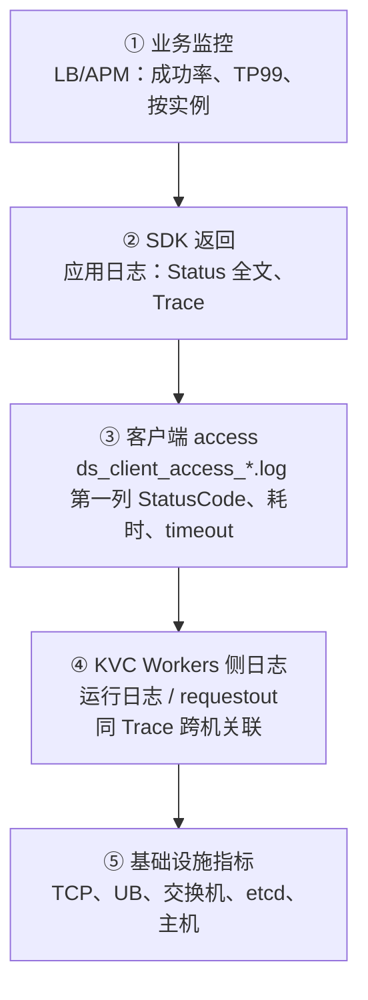
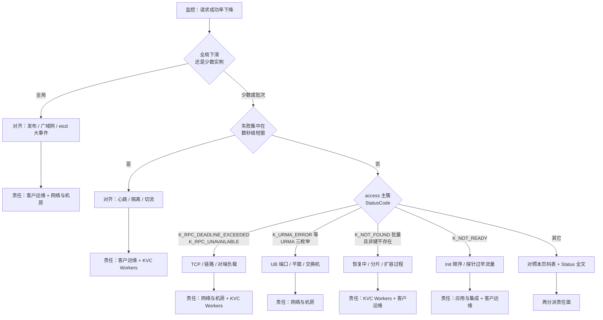
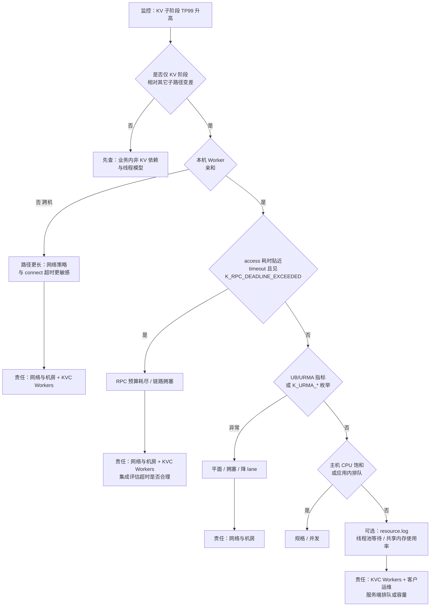

# KVC 客户侧：观测、定位定界与配合（PPT 素材 · 精简版）

> **页数**：共 **5 张幻灯片**（已去掉原「定位页」与「变更/工单」页；原观测顺序与排障节奏 **合并为一页**并加示意图）。  
> **KVC Workers** 的可靠性行为（重试、切流、etcd 等）假定 **已在其它章节讲过**，本素材 **不再展开**；此处只写 **客户侧观测链**、**运维 / 应用各自动作**、**客户端可见错误码分类**、**成功率与 TP99 分析路径图**。  
> **错误码**：`StatusCode` 见 `include/datasystem/utils/status.h`；下表仅列 **KV 路径上客户端会收到的** 常见枚举。  
> 对应大纲：`ppt_outline.md`。

---

## 幻灯片 01｜调用链、观测顺序（编号）与排障节奏

### 调用链示意图（可导出贴 PPT）

### 自上而下观测顺序（编号 **① → ⑤**）

**陷阱（与 ②③ 一起读）**：部分 **Get** 在业务语义上为 **`K_NOT_FOUND`** 时，**③** 中第一列仍可能为 **`K_OK`（数值 0）** — 必须以 **② `Status`** 与 **`respMsg`** 为准。

### 排障节奏（与上链衔接，文字即可）

- **对齐时间与范围**：告警起止、全局或少数实例、是否与 **发布 / etcd / 网络维护** 同一窗口。  
- **区分现象**：仅尾延迟、仅成功率、两者兼有，或 **Init 阶段失败**（常几乎无 access 行）。  
- **并行取证**：应用侧 **②③**；运维侧 **Pod/探针、`nc` Worker 端口、etcd 大盘、网络策略**（支撑 **④⑤**）。  
- **止损与升级并行**：限流、降级、临时调大超时（会抬高尾延迟）；材料打包升级，避免全集群盲 grep。  

---

## 幻灯片 02｜出现问题时：运维怎么做 · 应用怎么做

**不讲三方分工表**；**KVC Workers** 侧机制与自愈见 **可靠性方案** 章节。

| | **客户运维** | **应用与集成** |
|---|--------------|----------------|
| **第一时间** | 对齐 **变更工单、滚动批次、维护窗**；看 **全局 vs 批次** 是否同步陡变 | 区分 **精排 / 召排** 告警形态；确认 **KV 子阶段** 是否单独异常 |
| **基础设施与拓扑** | **Worker/Master/业务 Pod** 状态与探针；业务机 **`nc`/`telnet` 到 Worker IP:Port**；**安全组、路由**；**etcd 监控**（成员、leader、错误率/延迟） | **本机无 Worker** 时禁止只配 **localhost**；**`Init` 早于首调 KV**；跨机 **连接/请求超时留足** |
| **日志与证据** | 配合拉 **容器/主机事件**、集中日志路径上的 **access** 文件；扩缩容时 **LB 摘掉退出中节点** | 业务日志打 **`Status` 全文 + Trace**；按 **`DS_KV_CLIENT_*`** 聚合 **StatusCode**；**Init 失败** 优先看 **应用启动日志**（常早于 access） |
| **容错与产品语义** | **回滚、扩容、暂停变更**；维护可共享的 **时间线** | **有界重试**、写 **幂等**；**勿**把 **`K_SCALING` / `K_SCALE_DOWN`** 做成对 **终端用户** 的错误分支（产品语义见可靠性方案） |
| **升级工单** | 发布单、网络变更说明、**etcd 截图**、**nc 结果** | 复现时间段、实例列表、**Status/access 抽样**、**Trace**、已知 **Worker IP:Port** |

---

## 幻灯片 03｜客户端可见 `StatusCode`（按类聚合 · KV 常用）

仅列 **集成侧会在 `Status` / access 第一列中感知到**、且 **KV 排障高频** 的项；完整枚举以 **`status.h`** 为准。

| 分类 | 数值 · `StatusCode` | 客户集成侧第一印象（非唯一根因） |
|------|---------------------|----------------------------------|
| **成功与 access 陷阱** | `0` · `K_OK` | 成功；**Get 可能与「未找到」并存**，access 仍可能记 `K_OK` — 必看 **`Status` / `respMsg`** |
| **就绪与连接** | `8` · `K_NOT_READY` | 未 **`Init`**、关闭中、或记录器未就绪 |
| | `23` · `K_CLIENT_WORKER_DISCONNECT` | 与 Worker **断连 / 心跳失败** 等 |
| | `21` · `K_SHUTTING_DOWN` | 进程 **正在关闭**，不宜继续业务流量 |
| **业务语义与内部错误** | `3` · `K_NOT_FOUND` | **键或资源不存在**（业务语义） |
| | `5` · `K_RUNTIME_ERROR` | 内部异常，**必须看 `respMsg` 全文** |
| **版本与元数据路径** | `28` · `K_CLIENT_WORKER_VERSION_MISMATCH` | 客户端与 **Worker 二进制版本不一致** |
| | `25` · `K_MASTER_TIMEOUT` | **Master / 元数据路径** 不可达或会话异常 |
| **扩缩容相关（非终端用户操作项）** | `31` · `K_SCALE_DOWN` | **缩容 / 节点退出** 窗口；探活、切流侧常见 |
| | `32` · `K_SCALING` | **扩缩容 / 元数据迁移**；写路径常配合 SDK 重试语义 |
| **RPC 与可重试** | `19` · `K_TRY_AGAIN` | 可重试；多与抖动或窗口重叠 |
| | `1001` · `K_RPC_DEADLINE_EXCEEDED` | **RPC 超时**（预算耗尽） |
| | `1002` · `K_RPC_UNAVAILABLE` | **传输/等待类总桶**，**不能**单凭此码等同 URMA 根因 |
| **URMA 路径** | `1004` · `K_URMA_ERROR` | UB/URMA **错误** |
| | `1006` · `K_URMA_NEED_CONNECT` | URMA **需重连 / 会话** |
| | `1008` · `K_URMA_TRY_AGAIN` | URMA **可再试**（瞬时） |

**一句提醒**：定界 **`K_RPC_UNAVAILABLE`** 时，需与 **`K_URMA_*`**、**耗时是否贴 timeout**、**UB 指标** 交叉；同一数值 **多种根因** 时需下沉到 **⑤**。

### 按类：应用 / 集成 vs 客户运维（做什么）

| 分类（与上表对齐） | **应用 / 集成** | **客户运维** |
|-------------------|-----------------|--------------|
| **`K_OK` + Get 陷阱 / `K_NOT_FOUND`** | 用 **业务返回码**、**`Status` 全文**、**`respMsg`** 定义「真失败」；监控上 **KV 子阶段** 与 **精排/召排** 拆开 | 配合确认 **access 是否落盘**、**日志级别**；避免用 access 第一列单独算「读失败率」 |
| **就绪与连接**（`K_NOT_READY`、`K_CLIENT_WORKER_DISCONNECT`、`K_SHUTTING_DOWN`） | **`Init` 早于首调**；打 **Trace**；本机 Worker 不可用时 **勿只配 localhost**；跨机 **超时留足** | **Pod/探针** 与 **滚动批次** 对齐；**`nc` Worker 端口**；**LB 摘掉退出中节点** |
| **业务语义 / 内部**（`K_RUNTIME_ERROR` 等） | **保留 `respMsg` 全文**；可复现的 **请求参数抽样**（脱敏） | 拉 **同时间段 Worker / requestout**；必要时 **容量与发布** 窗口对齐 |
| **版本与元数据**（`K_CLIENT_WORKER_VERSION_MISMATCH`、`K_MASTER_TIMEOUT`） | 对齐 **客户端与 Worker 发布单**；元数据失败时 **勿无限重试打爆** | **etcd / Master** 监控与变更工单；**网络分区** 排查 |
| **扩缩容语义**（`K_SCALE_DOWN`、`K_SCALING`） | **勿**对终端用户暴露为硬错误；依赖 SDK **有界重试** 与 **幂等写** | **探活、切流、回滚**；与 KVC Workers 侧 **迁移窗** 对齐时间线 |
| **RPC / 可重试**（`K_TRY_AGAIN`、`K_RPC_*`） | 看 **`timeout` 与 access 耗时**；**有界重试**；区分 **用户可感知** vs **可吞掉重试** | **链路、安全组、对端负载**；抓包与 **Worker 并发** 仅在授权下进行 |
| **URMA**（`K_URMA_*`） | 业务侧记录 **是否与 UB 告警同窗**；必要时 **临时 TCP 降级**（若产品支持）由变更控制 | **UB 端口 / 平面 / 交换机** 指标；与网络值班 **升级路径** |

### 观测盲区：主簇里「缺某一类错误」时

| 现象 | **应用 / 集成** | **客户运维** |
|------|-----------------|--------------|
| **业务成功率已跌**，但 access 里 **`K_OK` 占绝大多数**（尤其 `DS_KV_CLIENT_GET`） | 按 Playbook：**Get 未找到映射为 `K_OK`**；改看 **`Status` / `respMsg` / 业务码**；补 **按错误语义** 的监控，不要只聚合 access 第一列 | 确认 **`log_monitor`、落盘路径、pid 是否对**；协助拉 **同一时间多实例** access |
| **监控有失败**，access **几乎没有对应 `StatusCode`** | 查是否 **非 KV 阶段**（上游超时先失败）；补 **Trace 贯穿** 到 SDK | 查 **Proxy → 业务 Pod** 是否 **丢日志**、**采样** 把错误行采没；集中日志 **索引延迟** |
| **只看到 `K_RPC_UNAVAILABLE` bucket**，没有 **`K_URMA_*`** | **禁止**据此判「一定不是 UB」；展开 **`respMsg` 关键词** + **耗时是否贴 timeout** | 并行拉 **UB 指标** 与 **Worker URMA 日志**（④） |

---

## 幻灯片 04｜告警：请求成功率下降 — 分析路径图

### 观测手段（建议与路径图并行，不全依赖单一大盘）

- **按实例 / 按阶段拆开**：精排、召排、KV 子阶段 **分别** 看成功率与错误占比，避免「总请求」把子阶段吃掉。  
- **入口 Proxy / 网关**：按 **Predictor 实例**（或等价的后端分组 / upstream）看 **成功数、失败数、4xx/5xx 或业务定义失败**；时间窗与下游 **SDK 日志、`ds_client_access_*`** 对齐（同一 **Trace** 或 **request id**）。  
- **SDK 侧**：应用日志 **`Status` 全文**；access **按 `DS_KV_CLIENT_*` + 第一列 `StatusCode` 聚合**；对照 **`respMsg`** 是否指向建连、超时、URMA。  
- **大类再下钻**：  
  - **网络与主机**：TCP 重传、RTT、丢包；容器 / 节点 **CPU、内存、磁盘、连接数**；是否有 **限流、 cgroup**。  
  - **KVC Workers**：同 Trace 的 **requestout / 运行日志**；有权限时 **`resource.log`**（etcd 成功率、队列等）。  
  - **UB / 平面**：端口与平面级指标，与 **`K_URMA_*`** 是否同窗。  

### 运维兜底（止损）

- 若聚合到 **某一 KVC Worker（或某节点上的 Worker 副本）** 的失败率 / `K_RPC_DEADLINE_EXCEEDED` **显著高于** 同组其它实例，优先 **LB 摘流、K8s `cordon` + `drain`、或对节点打污点（taint）** 等（按客户集群规范），避免单点拖垮全局成功率，同时把 **实例 ID / IP:Port / 时间线** 打包升级给 KVC 侧。

**摘要**：有权限时可看 **`resource.log`** 里 etcd 成功率与队列；止损可 **暂时不读 KV**（业务允许时）、观察自愈窗、回滚或暂停变更。

---

## 幻灯片 05｜告警：尾延迟 TP99 增大 — 分析路径图

### 观测手段（与 TP99 路径图配套）

- **入口侧**：Proxy / 网关按 **Predictor 实例**（或 upstream 分组）看 **P50/P95/P99** 与 **QPS**，区分是 **全实例变差** 还是 **少数实例长尾**。  
- **SDK / access**：同一阶段内对 **`DS_KV_CLIENT_*` 的 `microseconds` 做分位**；与 **`reqMsg` 里的 `timeout`** 对照 — **贴顶** 时优先怀疑 **RPC 预算与链路**（与图中 `K_RPC_DEADLINE_EXCEEDED` 分支一致）。  
- **大类再下钻**：  
  - **仅 KV 变差**：跨机路径看 **网络策略、connect 超时**；本机 Worker 看 **CPU、线程、锁**。  
  - **UB / URMA**：平面与端口指标 + **`K_URMA_*`** 是否与尾延迟同窗。  
  - **Worker 内排队**：有权限时 **`resource.log`**、线程池/共享内存等（与 Playbook **⑤** 一致）。  

### 运维兜底（止损）

- 若 **某一 KVC Worker 副本** 的 TP99 **持续独秀**（同 shard 其它副本正常），可先 **摘流 / cordon / 污点** 隔离该节点或该 Pod，再扩容或等待替换；避免尾延迟 **放大** 全链路 SLO。

**URMA / UB**：客户侧宜具备 **端口与平面级指标与告警**；感知与切换常为 **百毫秒量级**，与 **极短 RPC 超时** 叠加时可能出现 **超时早于 KVC Workers/链路完成切换** — **SLA 需事先对齐**（详见可靠性方案与 UB 章节）。

---

## 附：给自己用的备注（不必须上屏）

- Access 行格式与陷阱详解：`KV_CLIENT_TRIAGE_PLAYBOOK.md`  
- 客户主文扩展：`KV_CLIENT_CUSTOMER_ALLINONE.md`  
- **路径图出图**：第四、五页 Mermaid 粘贴 [Mermaid Live](https://mermaid.live) 导出 PNG/SVG  
