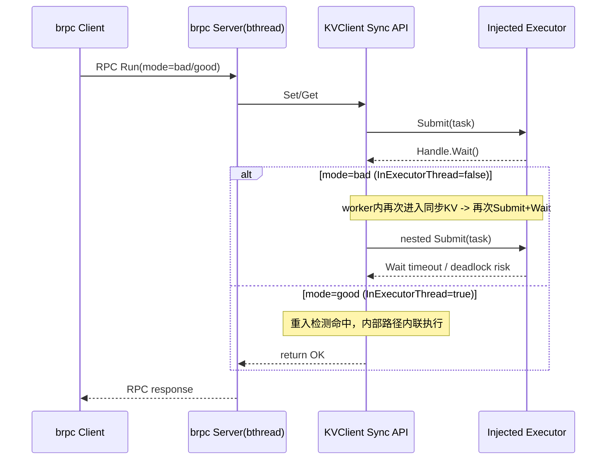
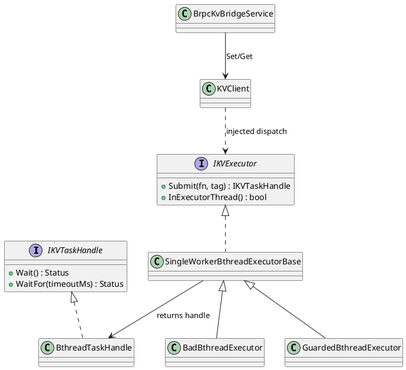

# brpc executor 注入技术细节说明

## 目标

- 在 `tests` 中构造真实 `brpc client -> server` RPC 调用。
- 在 server 端 `bthread` 回调里调用 `KVClient::Set/Get`。
- 通过注入两类 executor 对照验证：
  - `bad executor`：触发死锁/超时
  - `guarded executor`：避免死锁并成功完成调用

## 关键实现位置

- 用例：`tests/st/client/kv_cache/kv_client_brpc_bthread_reference_test.cpp`
- 测试协议：`tests/st/client/kv_cache/kv_brpc_bridge.proto`
- CMake 接入：`tests/st/CMakeLists.txt`
- 构建脚本：`scripts/build/bootstrap_brpc_st_compat.sh`
- 一键验证：`scripts/verify/validate_brpc_kv_executor.sh`

## 设计要点

- `BthreadTaskHandle`：用 `bthread_mutex + bthread_cond` 实现 `Wait/WaitFor`。
- `SingleWorkerBthreadExecutorBase`：单 worker 串行执行队列，放大“嵌套提交”死锁风险，便于稳定复现。
- `BadBthreadExecutor`：`InExecutorThread()` 恒 `false`，在 worker 内再次调用同步 KV 接口时，会再次 submit 并等待，形成环路等待。
- `GuardedBthreadExecutor`：通过线程上下文标记让 `InExecutorThread()` 返回 `true`，使内部路径走“重入短路/内联执行”，避免自锁。

## 时序图（mermaid）



## 类图（PlantUML）



## 运行与验收

```bash
bash scripts/verify/validate_brpc_kv_executor.sh
```

特性覆盖率 HTML 产出：

```bash
bash scripts/verify/validate_brpc_kv_executor.sh --build-dir build_cov --coverage-html
```

输出路径：

- `build_cov/coverage_kvexec/index.html`

验收重点：

1. `bad` 路径出现超时（死锁风险被捕获）。
2. `good` 路径成功返回，`Set/Get` 状态正常。
3. 注入逻辑仅在 `tests`，不引入 `src` 层 brpc 语义耦合。

## 当前风险与后续建议

- 当前主要风险是第三方矩阵兼容（`brpc/protobuf/absl`），与 executor 设计本身无直接冲突。
- 后续建议固定“已验证通过”的三方组合（tag + checksum），并把其写入脚本常量，减少环境漂移。

## 风险点与新增确认用例

1. **死锁风险（bad 路径）**  
   - 用例：`KVClientBrpcBthreadReferenceTest.BrpcRpcBthreadKvDeadlockContrast`  
   - 期望：`bad` 模式触发超时，`good` 模式返回 `K_OK`。

2. **配置误用风险（mode 拼写错误被静默放行）**  
   - 用例：`KVClientBrpcBthreadReferenceTest.BrpcRpcShouldRejectUnsupportedMode`  
   - 修复：`BrpcKvBridgeService::Run` 对非 `bad/good` 输入返回 `K_INVALID`，并写入错误信息。

3. **三方矩阵漂移风险（brpc/protobuf/absl）**  
   - 验证路径：`scripts/build/bootstrap_brpc_st_compat.sh` + `scripts/verify/validate_brpc_kv_executor.sh` 全链路构建/运行。  
   - 目标：同一套工具链下重复构建与用例执行稳定通过。

4. **同步接口性能损耗风险（Set/Get）**  
   - 用例：`KVClientExecutorRuntimeE2ETest.PerfSetGetInlineVsInjectedExecutor`  
   - 采集脚本：`scripts/perf/kv_executor_perf_analysis.py`（多轮采样 + matplotlib 画图）。  
   - 当前样本（3 runs, 80 ops）：`set_ratio_mean=1.0477`，`get_ratio_mean=1.1037`，说明注入 executor 的平均开销约 5%~10%。

## brpc 与 SDK 集成建议（executor）

推荐在 `brpc` 服务处理函数内按以下顺序使用：

1. **进入 RPC 回调（bthread）后先确定 executor 策略**  
   - 正常路径使用 `Guarded` 风格 executor（实现 `InExecutorThread()` 正确返回 true）。
2. **每次请求开始时注册 executor**  
   - `RegisterKVExecutor(exec)`，确保后续 `KVClient::Set/Get` 走统一的 submit+wait 模式。
3. **仅调用 SDK 同步接口**  
   - 例如 `KVClient::Set/Get`，不要在锁内做会触发 yield 的 I/O。
4. **返回前将结果转换为 RPC 响应**  
   - 业务失败写入 `status_code/message`，网络层按需设置 controller fail。

对应 smoke 用例：

- `KVClientBrpcBthreadReferenceTest.BrpcSdkExecutorSmokeGoodPathBatch`
  - 连续 20 次 `good` RPC（server 侧 bthread 调 SDK Set/Get）
  - 验证每次都返回 `K_OK`，用于快速确认集成稳定性。
