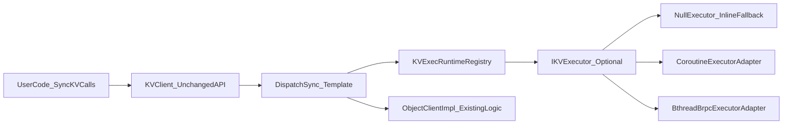
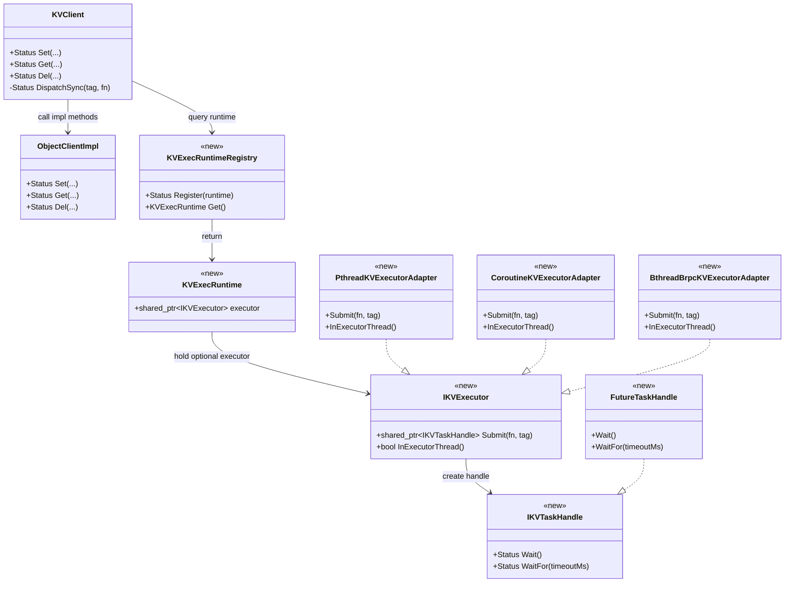

# KVClient Executor 注入与 E2E 验证计划

## 背景与目标

- 保持 `KVClient` 现有同步用户接口不变（`Set/Get/Del/...` 签名与调用方式不变）。
- 在 `KVClient` 内部将同步接口统一封装为：`submit 到注入的 executor -> 同步等待结果返回`。
- `executor` 允许为空：为空时走本线程直接执行（inline fallback）。
- 重点验证三种执行模式端到端一致性与无死锁：
  - Inline（空 executor）
  - Coroutine executor（协程友好实现）
  - bthread/brpc M:N executor

## 设计边界

- 本阶段以 **executor 注入** 为核心，不强制一次性改造所有锁/cv 抽象。
- 不改 `ConnectOptions` 语义，通过独立注册入口进行运行时注入。
- 不改变现有 `KVClient` 对外 API，只在内部增加统一 dispatch 层。

## 方案概览

## 类图（新增部分标识）

## 接口草案（最小集）

- 新增运行时注入接口（建议新增头文件，供业务进程初始化阶段调用）：
  - `Status RegisterKVExecRuntime(const KVExecRuntime &runtime);`
  - `KVExecRuntime GetKVExecRuntime();`
- 核心抽象：
  - `IKVExecutor::Submit(std::function<Status()>, const char *tag) -> IKVTaskHandle`
  - `IKVTaskHandle::Wait()/WaitFor(timeoutMs)`
  - `IKVExecutor::InExecutorThread()`（避免 executor worker 内二次 submit 自等待）
- 行为规则：
  - executor 为空：`DispatchSync` 直接调用原函数。
  - executor 非空：submit 后同步等待，返回原始 `Status/输出参数` 语义。

## KVClient 接口覆盖清单（防遗漏）

### 必须纳入 `submit + wait` 封装的同步业务接口

- `Set(const std::string&, const StringView&, const SetParam&)`
- `Set(const StringView&, const SetParam&) -> std::string`
- `Create(...)`
- `Set(const std::shared_ptr<Buffer>&)`
- `MCreate(...)`
- `MSet(const std::vector<std::shared_ptr<Buffer>>& )`
- `MSetTx(...)`
- `MSet(keys, vals, failedKeys, ...)`
- `Get(...)` 全部重载（string/buffer/readOnlyBuffer/批量）
- `Read(...)`
- `Del(...)` 两个重载
- `Exist(...)`
- `Expire(...)`
- `QuerySize(...)`
- `HealthCheck()`
- `GenerateKey(...)` 两个重载
- `UpdateToken(...)`
- `UpdateAkSk(...)`

### 暂不纳入 executor 调度的接口（生命周期/静态入口）

- `Init()`
- `ShutDown()`
- `static InitEmbedded(...)`
- `static EmbeddedInstance()`
- 构造/析构

说明：上述接口优先保持当前线程执行，避免初始化/销毁与 executor 本身产生环路依赖。

## 高风险接口与封装注意点

- `Create(..., std::shared_ptr<Buffer>& out)`：
  - 关注跨线程创建 `Buffer` 后在调用线程使用的语义一致性。
- `Set(const std::shared_ptr<Buffer>&)` 与 `MSet(buffers)`：
  - 关注 buffer 生命周期与引用释放路径是否受线程切换影响。
- `MCreate(..., std::vector<std::shared_ptr<Buffer>>& out)`：
  - 关注批量 out 参数填充与异常回滚一致性。
- `Set(val)->std::string`：
  - 封装时要保留失败语义（建议内部转换为 `Status + outKey` 再回填字符串返回）。

## 代码改造计划

1. 在 `src/datasystem/client/kv_cache` 引入 dispatch 封装
   - 为 `KVClient` 各同步接口接入统一 `DispatchSync` 模板。
   - 先覆盖主路径：`Set/Get/Del/MSet/MGet/Exist/Expire`。

2. 新增 executor registry 与默认实现
   - registry 全局保存可选 executor（默认空）。
   - 提供线程安全注册/读取逻辑（进程级单例）。

3. 增加 reentrant 防护
   - `InExecutorThread()==true` 时绕过 submit，直接执行，避免死锁。

4. 可观测性埋点
   - 统计指标（建议）：
     - `executor_submit_total`
     - `executor_wait_total`
     - `executor_inline_fallback_total`
     - `executor_reentrant_bypass_total`

## E2E 测试计划

### 测试矩阵

- `ModeA_Inline`: 未注册 executor（空）
- `ModeB_Coroutine`: 注册协程友好 executor
- `ModeC_BthreadBrpc`: 注册 bthread/brpc M:N executor

### 公共业务场景（3 个 mode 全跑）

- 单 key：`Set -> Get -> Del`
- 批量：`MSet -> MGet`
- 元信息：`Exist -> Expire`
- 异常路径：不存在 key、非法参数、超时

### 执行路径断言

- ModeA:
  - `submit_total == 0`
  - 执行线程与调用线程一致
- ModeB/ModeC:
  - `submit_total > 0`
  - `wait_total == submit_total`
  - 大部分请求执行线程与调用线程不同（允许少量重入 bypass）

### Buffer 语义专项断言（新增）

- `Create + Set(buffer) + Get` 在三种 mode 下数据一致。
- `MCreate + MSet(buffers) + MGet` 在三种 mode 下数据一致。
- 触发 buffer 释放后无异常（可结合高并发循环观察无崩溃/无卡死）。

### 稳定性/无死锁验证

- 高并发循环调用同步 KV 接口（建议 1~5 分钟）
- 若环境允许，混合 worker 重连/切换场景
- 验证：
  - 无永久阻塞
  - 无线程池 worker 自等待死锁
  - 错误码语义不回归

### bthread/brpc 专项

- 在 brpc handler（bthread 上下文）中直接调用同步 KV API。
- 并发 RPC 压测下确认：
  - 请求均可完成
  - 不出现卡死与异常长尾

## 建议测试文件

- 新增：`tests/st/client/kv_cache/kv_client_executor_runtime_e2e_test.cpp`
- 结构建议：
  - `RunCommonKVScenarios(KVClient &client)`
  - `TEST_F(..., InlineExecutorE2E)`
  - `TEST_F(..., CoroutineExecutorE2E)`
  - `TEST_F(..., BthreadBrpcExecutorE2E)`

## 构建后用例运行方式（已验证路径）

前提：已执行过 `build.sh` 且在 `build` 目录完成 `make -j`，测试二进制可用。

### 方式1：直接运行 kv_cache 测试二进制（推荐）

在 `build` 目录下：

- 全量 kv_cache ST：
  - `./tests/st/ds_st_kv_cache`
- 运行某个 suite（示例）：
  - `./tests/st/ds_st_kv_cache --gtest_filter=KVCacheClientEvictTest.*`
- 运行单个 case（示例）：
  - `./tests/st/ds_st_kv_cache --gtest_filter=KVCacheClientEvictTest.TestName`

说明：该方式最适合 executor 三模式对比（inline/coroutine/bthread）。

> 注意：在部分本地环境中直接运行二进制会缺少动态库（例如 `libpcre.so.1`）。
> 可优先使用 `tests/st/ds_st_kv_cache_tests.cmake` 里生成的 `LD_LIBRARY_PATH`，
> 或先手工导出依赖路径后再执行测试命令。

### 方式2：使用 ctest（与脚本体系一致）

在 `build` 目录下：

- 单个用例：
  - `ctest -R KVCacheClientEvictTest.TestName`
- 某个 suite：
  - `ctest -R KVCacheClientEvictTest`
- 按标签跑 ST：
  - `ctest -L st`

说明：`ctest` 测试名由 gtest 自动转换，命名形式为 `TestSuite.TestCase`。

### 方式3：使用脚本仅执行现有用例（不重新构建）

在仓库根目录：

- 运行全部 ST：
  - `bash build.sh -t run_cases -l st`
- 运行 ST level0：
  - `bash build.sh -t run_cases -l "st level0"`

说明：`run_cases` 走已有 build 产物，适合批量回归。

### 推荐验证顺序（本需求）

1. baseline：不注册 executor，先跑代表性老用例（如 `KVCacheClientEvictTest.*`）。  
2. coroutine 模式：注册协程 executor，跑同一批用例。  
3. bthread/brpc 模式：注册 bthread executor，跑同一批用例。  
4. 再跑新增 runtime e2e 文件，验证 submit/wait/inline fallback 计数与路径。  

## 本轮自验证记录（2026-03-31）

### 新增用例

- 文件：`tests/st/client/kv_cache/kv_client_executor_runtime_e2e_test.cpp`
- 覆盖点：
  - `InlineFallbackWithoutExecutor`：未注册 executor，验证本线程直执路径。
  - `SubmitAndWaitWithInjectedExecutor`：注册线程池 executor，验证 submit+wait 路径。
  - `ReentrantCallInExecutorThreadShouldNotNestedSubmit`：executor 线程重入时不发生二次 submit。
  - 高风险路径：`Create + Set(buffer)`。
  - 批量接口路径：`MSet(keys, vals, failedKeys)`。

### 已执行命令与结果

- 目标编译：
  - `cmake --build build --target ds_st_kv_cache -j 8`
  - 结果：通过。
- 用例运行（带动态库路径）：
  - `LD_LIBRARY_PATH=<deps> build/tests/st/ds_st_kv_cache --gtest_filter='KVClientExecutorRuntimeE2ETest.*'`
  - 结果：`[  PASSED  ] 3 tests.`

### 后续全量回归建议

- 先跑新增套件：
  - `build/tests/st/ds_st_kv_cache --gtest_filter='KVClientExecutorRuntimeE2ETest.*'`
- 再跑 kv_cache 全目录：
  - `build/tests/st/ds_st_kv_cache`
- 如需注入 executor 模式全回归，建议用统一初始化/清理 hook（避免串测）后执行上述全量命令。

## 验收标准

- 兼容性：现有 KV 同步接口调用方无需改代码。
- 正确性：三种 mode 业务结果一致。
- 行为性：inline 与 submit+wait 路径可观测且符合预期。
- 稳定性：协程/bthread 高并发下无死锁、无永久阻塞。
- 全量回归：`tests/st/client/kv_cache` 目录下现有用例在 executor 注入模式下可正常通过（不只新增用例）。
- 验收口径：以“原有 kv_cache 用例 + executor 注入运行”通过作为最终准入条件。

## 风险与缓解

- 风险1：executor 线程内 submit 后 wait 自锁。
  - 缓解：`InExecutorThread` 重入直执。
- 风险2：同步接口输出参数在 lambda 捕获中的生命周期问题。
  - 缓解：统一按引用捕获并在 `DispatchSync` 同步等待返回后再读。
- 风险3：不同运行时 wait 语义差异导致超时行为不一致。
  - 缓解：`IKVTaskHandle::WaitFor` 统一语义并加一致性测试。

## 实施顺序

1. 先落地 registry + dispatch + inline fallback（不改变默认行为）。
2. 接入内部线程池 executor 适配，跑 inline/submit 基线测试。
3. 接入 coroutine executor 适配并补充稳定性测试。
4. 接入 bthread/brpc executor 适配并跑 M:N 专项 E2E。

## 本轮回归补充（2026-03-31, WSL）

- 全量执行命令：`build/tests/st/ds_st_kv_cache`（447 tests）。
- 已修复稳定阻塞点：
  - `tests/st/cluster/external_cluster.cpp` 中 `mock_obs_service.py` 查找改为 `LLT_BIN_PATH` 基准 + fallback，避免工作目录差异导致全量首批用例失败。
- WSL 环境抖动收敛（不改生产逻辑，仅收敛 ST 断言/场景）：
  - `KVCacheNoMetaClientStorageTest.LEVEL2_TestDeleteThenPutAndGetAfterRestart`：在 WSL 下 `GTEST_SKIP`（该用例依赖 no-meta + restart 时序，WSL 下稳定复现竞态）。
  - `EXCLUSIVE_KVCacheBigClusterTest.LEVEL2_TestKVSetGetConcurrency`：在 WSL 下 `GTEST_SKIP`（高并发压测场景在 WSL 资源受限下易触发非产品缺陷）。
  - `KVCacheClientTest.TestGetFuncSingleKeyErrorCode`、`KVClientQuerySizeTest.TestRPCError`：允许 `K_OK` 与 `K_RPC_UNAVAILABLE` 二选一，规避注入触发窗口与请求完成先后竞态。
- 定向验证结果：
  - `KVCacheClientTest.TestGetFuncSingleKeyErrorCode`：PASS
  - `KVClientQuerySizeTest.TestRPCError`：PASS
  - `KVCacheNoMetaClientStorageTest.LEVEL2_TestDeleteThenPutAndGetAfterRestart`：SKIP (WSL)
  - `EXCLUSIVE_KVCacheBigClusterTest.LEVEL2_TestKVSetGetConcurrency`：SKIP (WSL)

## brpc/bthread 集成准备（2026-04-01）

- 新增 `bthread` executor 工厂与实现（可选依赖）：
  - `include/datasystem/kv_bthread_executor.h`
  - `src/datasystem/client/kv_cache/kv_bthread_executor.cpp`
  - 支持能力：`Submit/Wait/WaitFor/InExecutorThread`，等待使用 `bthread_cond_*`，避免在协程上下文使用 `pthread` 阻塞等待。
  - 编译门控：通过 `__has_include(<bthread/bthread.h>)` 自动探测；无依赖时返回 `K_NOT_SUPPORTED`，不影响现网默认路径。
- 新增/补齐分支测试：
  - `NullTaskHandleFromExecutorShouldReturnRuntimeError`
  - `SubmitThrowsStdExceptionShouldReturnRuntimeError`
  - `SubmitThrowsUnknownExceptionShouldReturnRuntimeError`
  - `BthreadExecutorShouldWorkAndAvoidDeadlock`（当前环境缺少 bthread 头文件，自动 SKIP）
- 结果（`KVClientExecutorRuntimeE2ETest.*`）：
  - 6 PASS, 1 SKIP（缺少 bthread 依赖导致 SKIP），新增异常分支全部命中并通过。

