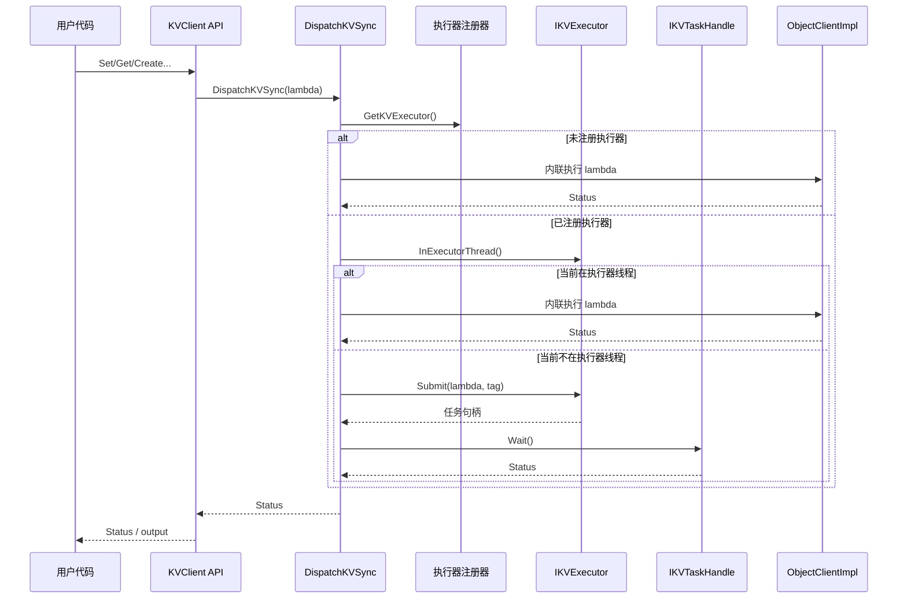
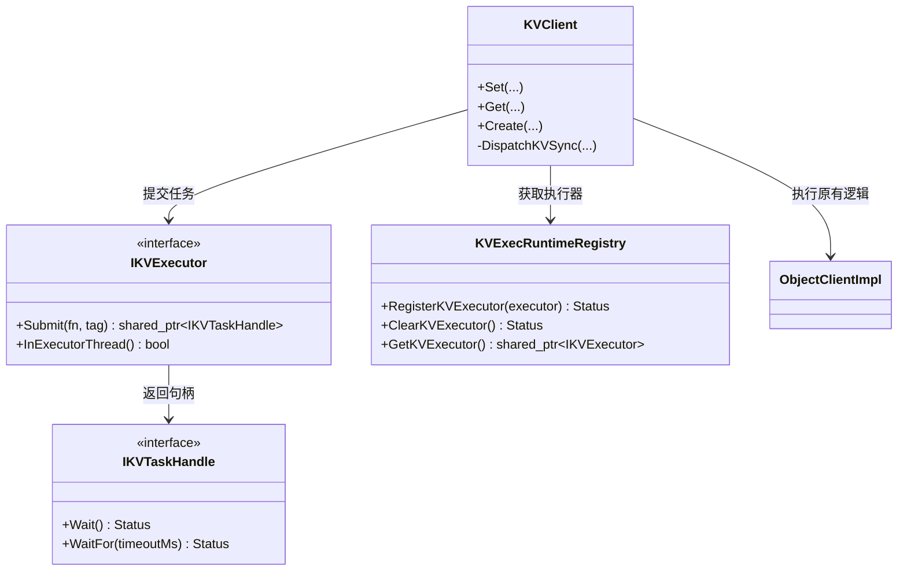

# KVClient 执行器注入 - 问题讨论稿

## 1）要解决的问题

- 当前 `KVClient` 同步接口默认在调用线程直接执行。
- 在协程/混合调度场景下，阻塞等待与锁交互叠加时，可能放大卡顿甚至死锁风险。
- 同时 `KVClient` 已被广泛使用，不能通过修改用户接口来推动大规模改造。

## 2）目标

- 保持 `KVClient` 对外方法签名不变。
- 增加“可选”的运行时执行器注入能力，用于同步接口分发执行。
- 保持默认兼容：未注册执行器时，仍采用内联执行（历史行为）。
- 对执行器异常/异常返回提供稳定的错误收敛。

## 3）接口变更范围

### 新增公开抽象

- `include/datasystem/kv_executor.h`
  - `IKVTaskHandle`
  - `IKVExecutor`
  - `RegisterKVExecutor(...)`
  - `ClearKVExecutor()`
  - `GetKVExecutor()`

### 业务接口不变

- `KVClient` 现有方法（`Set/Get/Create/MSet/...`）签名与调用方式保持不变。

### 对外接口清理

- 删除 `include/datasystem/kv_bthread_executor.h`（无客户侧直接使用意义，避免接口污染）。

## 4）核心实现思路

对所有同步入口统一走内部分发逻辑：

1. 从注册器读取当前执行器。
2. 若执行器不存在，则内联执行。
3. 若执行器存在且当前已在执行器线程，则内联执行（避免嵌套提交）。
4. 否则执行 `Submit + Wait`。
5. 提交/等待阶段抛出的异常统一收敛为稳定运行时错误码。

## 5）执行时序图

## 6）类图（逻辑关系）

## 7）为什么采用这个方案

- **兼容优先**：无需改用户接口和调用方式。
- **运行时可插拔**：支持动态注册/清理执行器。
- **安全性**：通过重入内联分支规避嵌套调度死锁风险。
- **实现隔离**：主实现仅依赖抽象接口，不耦合特定运行时术语。

## 8）验证结论快照

- 构建目标 `ds_st_kv_cache` 已通过。
- `KVClientExecutorRuntimeE2ETest.*` 已覆盖：
  - 无执行器内联回退
  - 注入执行器的提交/等待
  - 重入时不嵌套提交
  - 返回空句柄
  - 标准异常 / 未知异常
- `src` 目录关键字审计（`brpc/bthread`）已通过（无命中）。

## 9）建议在架构评审重点讨论

- 当前抽象边界（`IKVExecutor` + `IKVTaskHandle`）是否足以覆盖后续运行时接入？
- 是否需要在框架层统一 `WaitFor(...)` 超时策略与默认值？
- 注册器作用域是否长期保持进程级，后续是否演进为实例级隔离？
