# KV 运行时整改两套方案（可交流版）

## 1. 背景：为什么要“运行时方案”

在 KV 热路径中，我们关注的核心风险是 **锁等待（futex）+ 系统调用（IO/epoll 等）** 同时出现时引发：

- 严格死锁（锁顺序环 + 持锁跨阻塞点）
- 假死/长尾（锁内 IO 把抖动放大到临界区）

对应的 Case 证据与整改建议详见：

- `plans/lock_scope_analysis/kv_lock_in_syscall_cases_report.md`

这里输出两套“工程可落地、易沟通”的总体方案。

---

## 2. 方案 1：整改已有代码（pthread 锁范围调整 / 可选注入 bthread）

### 2.1 核心思路

1. **先做锁范围调整**：把“可能触发系统调用/潜在阻塞”的操作移出临界区（例如：`epoll_ctl`、mmap/FD passing、spdlog flush）。
2. **再讨论 bthread 注入**（可选）：若业务需要把 KV 调用跑在 bthread/fiber 上，则需要引入“运行时适配层”，让锁/等待/超时等机制与 bthread 兼容。

### 2.2 适用场景

- 想 **从根因层面**消除“锁内系统调用”，对长期稳定性最友好
- 可接受对关键模块做一定改造（ZMQ/日志/mmap 管理等）

### 2.3 关键工程动作（对应 Case）

- **ZMQ（Case A）**：把 `SetPollOut -> epoll_ctl` 从 `outMux_` 临界区移出，或用原子 flag + 无丢唤醒的协议替代
- **spdlog（Case B）**：provider 锁内只取出 `provider_` 指针，锁外执行 `ForceFlush`；并限制热路径 flush
- **mmap/FD passing（Case C）**：两段式/三段式锁（锁内收集 → 锁外 IO → 锁内写回）

### 2.4 风险与影响

- **收益**：风险收敛最彻底；futex 与 IO 热点有望同步下降；尾延迟改善明确
- **工程风险**：需要为“锁外执行”补齐一致性协议（避免丢事件/重复 mmap/状态竞争）
- **与 bthread 的关系**：
  - 如果真的引入 bthread，需要同时治理 `thread_local`（TLS）使用，否则会出现 bthread 间串扰（详见 `kv_lock_in_syscall_cases_report.md` 第 5 章）

### 2.5 验收标准（建议）

- 静态：审计确认关键路径不再出现“锁内系统调用”
- 动态：复跑 KV set/get 采集，`futex` 与 `read/write` 热度显著下降；ZMQ/日志相关热点栈收敛

---

## 3. 方案 2：你当前 PR 的实现（KV executor 注入方式）

### 3.1 核心思路

不强行把所有内部锁改成 bthread 兼容，而是提供一个 **“KV 调度入口”**：

- KVClient 每次调用统一走 `DispatchKVSync(...)`
- 允许注册一个进程级 `IKVExecutor`，把 KV 逻辑提交到指定 executor 线程/线程池执行

关键接口在：

- `include/datasystem/kv_executor.h`：`IKVExecutor / IKVTaskHandle / RegisterKVExecutor / GetKVExecutor`
- `src/datasystem/client/kv_cache/kv_executor.cpp`：全局注册与获取（内部用 `std::mutex` 保护）
- `src/datasystem/client/kv_cache/kv_client.cpp`：`DispatchKVSync` 调度点

### 3.2 为什么它能缓解“锁内系统调用”风险

该方案本质是把 KV 调用的执行上下文**收敛**到一个受控的 executor 中，带来两类收益：

- **减少跨线程锁竞争**：原本多个业务线程并发进入 KV 内部，现在变为 executor 内串行/受控并发，futex 竞争会下降
- **隔离阻塞影响面**：锁内阻塞/系统调用发生时，影响范围更可控（主要影响 executor 队列），业务线程可避免直接陷入内部阻塞

### 3.3 与 bthread/TLS 的关系

- **不要求引入 bthread**：executor 可以是普通 pthread 线程池，因此不会触发“bthread 切换导致 thread_local 串扰”的新增风险
- 若未来 executor 选择 bthread 实现：仍需要按第 5 章治理 TLS（否则 TLS 语义不成立）

### 3.4 风险与影响

- **收益**：改动面小、易接入、可快速降低锁竞争；对客户沟通成本低
- **代价**：
  - 可能引入排队延迟（尤其单线程 executor）
  - 不能替代根因治理：内部仍可能存在锁内系统调用，只是“把影响面收敛”
- **正确性风险**：需要确认 KV API 的线程亲和/重入假设（`InExecutorThread()` 这类防递归机制已提供，但仍需覆盖更多场景）

### 3.5 验收标准（建议）

- 功能：所有 KV API 在注入/不注入 executor 时行为一致
- 性能：注入后 `futex` 热点显著下降（锁竞争减少）；同时监控 executor 排队与整体 P99

---

## 4. 两方案对比（结论导向）

| 维度 | 方案 1：锁范围调整 +（可选）bthread | 方案 2：executor 注入（当前 PR） |
|---|---|---|
| 改动面 | 中-大（需要改 ZMQ/日志/mmap 等关键模块） | 小（主要在 KVClient 调度入口与注册接口） |
| 风险收敛 | **最彻底**（减少/消除锁内系统调用） | **收敛影响面**（不必然消除根因） |
| TLS/bthread 风险 | 若引入 bthread，需要治理 TLS，否则 P0 风险 | 默认 pthread executor 下无新增 bthread/TLS 风险 |
| 落地周期 | 中（需要逐 Case 改造与验证） | 短（接入 executor 即可验证效果） |
| 性能不确定性 | 主要看锁范围调整收益（通常正向） | 需关注排队延迟与吞吐（可调 executor 并发度） |

**建议路线**：

- **短期（快速见效）**：先落地方案 2（executor 注入）把影响面收敛、降低锁竞争与假死概率
- **中长期（根因治理）**：并行推进方案 1，把 Case A/B/C 这类“锁内系统调用”逐个消除，形成长期稳定性收益

---

## 5. 性能影响分析（图中标注时延数据 + 百分比）

数据来源（已落盘，可复核）：

- 汇总：`workspace/observability/perf/kv_executor_perf_summary.txt`
- 明细：`workspace/observability/perf/kv_executor_perf_runs.csv`

测试参数：

- `runs=3, ops=80, warmup=15`

### 5.1 各 run 原始时延（avg，单位 us）

| run | inline Set avg (us) | inline Get avg (us) | injected Set avg (us) | injected Get avg (us) | Set avg ratio | Get avg ratio |
|---:|---:|---:|---:|---:|---:|---:|
| 1 | 1363.531 | 700.684 | 1423.651 | 747.374 | 1.044 | 1.067 |
| 2 | 1375.607 | 741.792 | 1490.146 | 842.817 | 1.083 | 1.136 |
| 3 | 1385.351 | 717.845 | 1407.405 | 795.248 | 1.016 | 1.108 |

### 5.2 汇总（ratio）

- Set avg ratio mean：**1.0477**（约 **+4.77%**）
- Set avg ratio p95：**1.0440**（约 **+4.40%**）
- Get avg ratio mean：**1.1037**（约 **+10.37%**）
- Get avg ratio p95：**1.1080**（约 **+10.80%**）

### 5.3 图示（把“时延数据 + 百分比”写在图中）

> 说明：该图用 avg 作为示例指标（单位 us），并在条形后标注 injected 相对 inline 的增幅百分比。

```mermaid
xychart-beta
    title "KV Set/Get avg latency (inline vs injected) with % delta"
    x-axis ["Set(avg us)","Get(avg us)"]
    y-axis "microseconds (us)" 0 --> 1600
    bar "inline" [1374.83, 720.11]
    bar "injected" [1440.40, 795.15]
```

图中标注口径（对应上述均值）：

- Set：inline **1374.83us** → injected **1440.40us**（**+4.77%**）
- Get：inline **720.11us** → injected **795.15us**（**+10.37%**）

> 注：inline/injected 的均值取自 `kv_executor_perf_runs.csv` 三次 run 的算术平均；百分比取自 `kv_executor_perf_summary.txt` 的 ratio mean。

